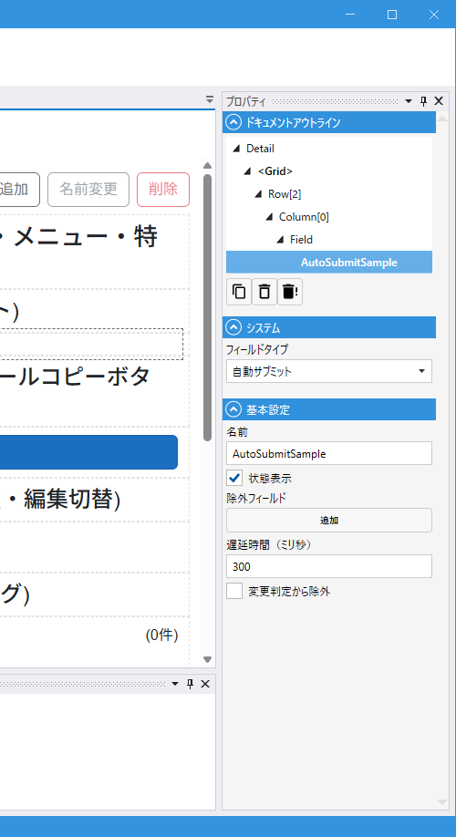

# AutoSubmitField (自動サブミット)

## これは何か

**モジュール内の Field が変更されると自動で Submit するフィールド**。Module に 1 つ配置しておくと、ユーザーが項目を編集するたびに遅延後に自動保存され、明示的な登録ボタンの操作が不要になります。

内部的には軽量版の Submit (`Module.SubmitLightweightAsync`) を使用し、処理中の状態表示（成功・失敗アイコン）も可能です。

## いつ使うか

- 小さな変更を逐次保存したい画面（例: 設定画面、リアルタイムで変更を反映したい業務系画面）
- 一部の Field は自動保存の対象外にしたい（`ExcludeFields` で除外）
- Submit ボタンを省略して UI をシンプルにしたい時

---

## デザイナでの設定



### プロパティ一覧

#### システム

| C#名 | 日本語表示名 | 説明 |
|---|---|---|
| - | フィールドタイプ | `自動サブミット` 固定 |

#### 基本設定

| C#名 | 日本語表示名 | 型 | 既定値 | 説明 |
|---|---|---|---|---|
| **Name** | 名前 | string | `""` | フィールド識別子 |
| **ShowStatus** | 状態表示 | bool | `true` | 保存中・成功・失敗の状態をアイコン表示 |
| **ExcludeFields** | 除外フィールド | List\<string\> | `[]` | 自動サブミットのトリガーから除外する Field 名 |
| **DelayMilliseconds** | 遅延時間（ミリ秒） | int | `300` | 最後の変更から何ミリ秒経過したら Submit するか（最小 50ms） |
| **IgnoreModification** | 変更判定から除外 | bool | `false` | 変更検知から除外 |

---

## 動作の仕組み

1. Module 内のどれかの Field が変更されると `OnExternalFieldChangedAsync` が発火
2. `ExcludeFields` に含まれる Field 名なら無視
3. それ以外なら `DelayMilliseconds` ミリ秒のタイマーを設定（既に動いているタイマーはキャンセルして再設定 = デバウンス）
4. タイマー満了で **入力検証 (`Module.ValidateInput()`) を実行**
5. 検証失敗の場合は保存せずエラー表示（成功時の保存は行わない）
6. 検証成功なら `Module.SubmitLightweightAsync()` を呼び出し
7. Submit 中に別の変更が来たら、完了後に再スケジュール
8. 成功・失敗時は `ShowStatus: true` なら一時的にアイコン表示（3 秒後に自動で消える）

> 検証フローは [Field 共通プロパティの「入力検証」](common_properties.md#入力検証-onvalidateinput) と同じ。各 Field の組込検査と `OnValidateInput` スクリプトが走る。

---

## スクリプトから

### メソッド

| 名前 | 戻り値 | 説明 |
|---|---|---|
| `ScheduleSubmit()` | void | 次の Submit を手動でスケジュール（他 Field の変更を待たず即座にタイマー起動） |

共通プロパティは [Field 共通プロパティ](common_properties.md) を参照。

### よく使う例

```csharp
// 独自ロジックで即座に自動保存をトリガー
AutoSave.ScheduleSubmit();
```

---

## 関連項目

- [Field 共通プロパティ](common_properties.md)
- [SubmitButton](SubmitButton.md) — 明示的な保存ボタン
- [CopyModuleButton](CopyModuleButton.md) — コピー後に AutoSubmit があれば自動保存される
