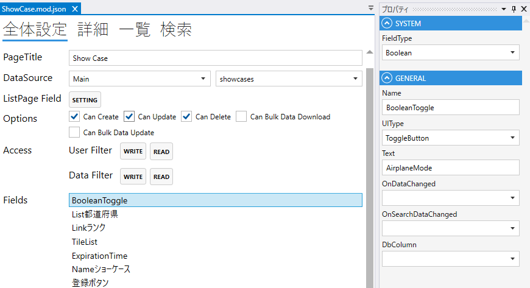

# Boolean

真偽値をあらわすフィールド．

## プロパティ

| プロパティ名        | 説明                                    |
|---------------|---------------------------------------| 
| FieldType     | Booleanを設定する                          |
| Name          | フィールド名を設定する                           |
| UIType        | `CheckBox`, `Switch`, `Toggle` から選択する |
| Text          | 表示するテキストを設定する.                        |
| OnDataChanged | 変更時のスクリプトを設定する.                       |
| DbColumn      | データベースのカラムを設定する.                      |

## スクリプト
| プロパティ名          | 型       | 説明               |
|-----------------|---------|------------------|
| Value           | bool?   | Fieldの値          |
| SearchValue     | string? | 検索条件のフィールドのvalue |
| BackgroundColor | string? | Fieldの背景色        | 
| Color           | string? | Fieldの色          |
| IsEnabled       | bool    | Fieldの有効/無効      |
| IsVisible       | bool    | Fieldの表示/非表示     |
| IsViewOnly      | bool    | Fieldの編集可/編集不可   |
| IsModified      | bool    | Fieldが変更されたどうか   |
