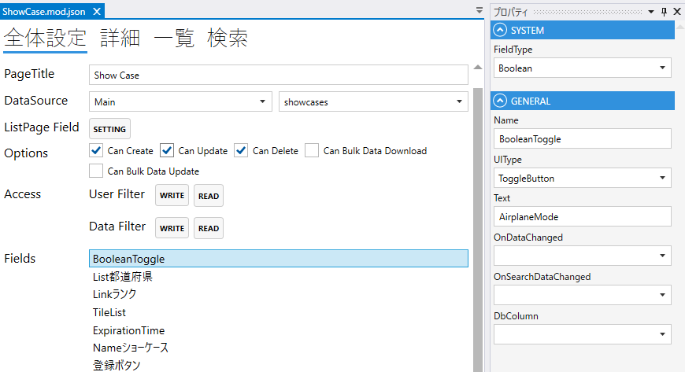

# BooleanField

## これは何か

**真偽値（はい／いいえ）を入力・表示するフィールド**。チェックボックス・スイッチ・トグルボタンなど UI のバリエーションがあります。



## いつ使うか

- 有効 / 無効、公開 / 非公開、受信する / しない など二者択一の入力
- DB の bool カラムの表示・編集

---

## デザイナでの設定

### 固有プロパティ

| プロパティ | 型 | 既定値 | 説明 |
|---|---|---|---|
| **Text** | string | `"Boolean"` | ラベル文字 |
| **DbColumn** | string | `""` | 対応する DB 列名 |
| **UIType** | enum | `CheckBox` | 表示スタイル（`CheckBox` / `Switch` / `ToggleButton`） |
| **TrueText** | string | `""` | 真（オン）時の表示文字 |
| **FalseText** | string | `""` | 偽（オフ）時の表示文字 |

共通プロパティは [Field 共通プロパティ](common_properties.md) を参照。

---

## スクリプトから

### プロパティ

| 名前 | 型 | 説明 |
|---|---|---|
| `Value` | bool? | 入力値 |
| `SearchValue` | bool? | 検索値 |
| `SearchIsEmpty` | bool? | 「空」を検索条件にする |

共通プロパティは [Field 共通プロパティ](common_properties.md) を参照。

### よく使う例

```csharp
// トグルに応じて別の Field を表示切替
PasswordField.IsVisible = !IsAnonymous.Value;

// 値を設定
IsActive.Value = true;

// 検索条件を設定
await IsPublished.SetSearchValueAsync(true);
```

---

## 関連項目

- [Field 共通プロパティ](common_properties.md)
- [RadioGroup](RadioGroup.md) — 3 つ以上の候補から選ばせたい場合
- [スクリプト概要](../overview/script.md)
