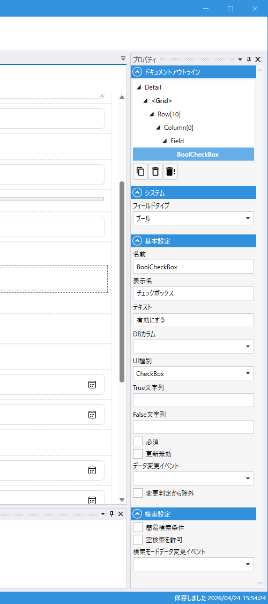

# BooleanField (ブール)

## これは何か

**真偽値（はい／いいえ）を入力・表示するフィールド**。チェックボックス・スイッチ・トグルボタンなど UI のバリエーションがあります。

## いつ使うか

- 有効 / 無効、公開 / 非公開、受信する / しない など二者択一の入力
- DB の bool カラムの表示・編集

---

## デザイナでの設定



### プロパティ一覧

#### システム

| C#名 | 日本語表示名 | 説明 |
|---|---|---|
| - | フィールドタイプ | `ブール` 固定 |

#### 基本設定

| C#名 | 日本語表示名 | 型 | 既定値 | 説明 |
|---|---|---|---|---|
| **Name** | 名前 | string | `""` | フィールド識別子 |
| **DisplayName** | 表示名 | string | `""` | 画面表示用の名前 |
| **Text** | テキスト | string | `"Boolean"` | チェックボックス横などに表示されるラベル |
| **DbColumn** | DBカラム | string | `""` | 対応する DB 列名 |
| **UIType** | UI種別 | enum | `CheckBox` | 表示スタイル（`CheckBox` / `Switch` / `ToggleButton`） |
| **TrueText** | True文字列 | string | `""` | 真（オン）時の表示文字（主に ToggleButton 用） |
| **FalseText** | False文字列 | string | `""` | 偽（オフ）時の表示文字（主に ToggleButton 用） |
| **IsRequired** | 必須 | bool | `false` | 入力必須 |
| **IsUpdateProtected** | 更新無効 | bool | `false` | 更新時に値を変更できないようにする |
| **OnDataChanged** | データ変更イベント | string | `""` | 値変更時のスクリプトイベント |
| **IgnoreModification** | 変更判定から除外 | bool | `false` | 変更検知（IsModified）から除外 |

#### 検索設定

| C#名 | 日本語表示名 | 型 | 既定値 | 説明 |
|---|---|---|---|---|
| **IsSimpleSearchParameter** | 簡易検索条件 | bool | `false` | 簡易検索の対象にする |
| **AllowEmptySearch** | 空検索を許可 | bool | `false` | 空での検索を許可する |
| **OnSearchDataChanged** | 検索モードデータ変更イベント | string | `""` | 検索条件が変更された時のスクリプトイベント |

---

## UI種別（UIType）のバリエーション

UIType プロパティで見た目を 3 パターンから選べます。

| UIType | 見た目 | 用途 |
|---|---|---|
| **CheckBox** | 標準的なチェックボックス | 一般的な ON/OFF |
| **Switch** | スイッチ風のトグル | モダンな見た目、モバイル UI 風 |
| **ToggleButton** | ボタン形状のトグル（`TrueText` / `FalseText` が表示される） | 状態が文字で見えた方が良い場合 |

`TrueText` / `FalseText` は ToggleButton で特に使われます。空のままでもアイコン表示は機能します。

---

## スクリプトから

### プロパティ

| 名前 | 型 | 説明 |
|---|---|---|
| `Value` | bool? | 入力値 |
| `SearchValue` | bool? | 検索値 |
| `SearchIsEmpty` | bool? | 「空」を検索条件にする |

共通プロパティは [Field 共通プロパティ](common_properties.md) を参照。

### よく使う例

```csharp
// トグルに応じて別の Field を表示切替
PasswordField.IsVisible = !IsAnonymous.Value;

// 値を設定
IsActive.Value = true;

// 検索条件を設定
await IsPublished.SetSearchValueAsync(true);
```

---

## 検索での挙動

検索フォームでは **常にドロップダウン** で選択します（簡易／詳細問わず）。

| 設定 | 選択肢 |
|---|---|
| `IsSimpleSearchParameter=true`（簡易） | （未指定）／ True ／ False |
| `IsSimpleSearchParameter=false`（詳細）+ `AllowEmptySearch=false` | 同上 |
| `IsSimpleSearchParameter=false`（詳細）+ `AllowEmptySearch=true` | 上記 + **空** ／ **空以外** |

`TrueText` / `FalseText` を設定していると、ドロップダウンの表示テキストもそれが使われます。

> ⚠ Boolean は **詳細にしないと空検索モードが出ません**。NULL を含めた絞り込みをしたい時は `IsSimpleSearchParameter=false` + `AllowEmptySearch=true` にします。

### スクリプトから

```csharp
// 検索値を設定（True / False / null）
IsActive.SearchValue = true;

// 「空」モード
await IsActive.SetSearchIsEmptyAsync(true);   // 空
await IsActive.SetSearchIsEmptyAsync(false);  // 空以外
await IsActive.SetSearchIsEmptyAsync(null);   // 通常モード
```

検索全体の仕組みは [SearchField](Search.md#検索の仕組み) を参照。

---

## 関連項目

- [Field 共通プロパティ](common_properties.md)
- [RadioGroup](RadioGroup.md) — 3 つ以上の候補から選ばせたい場合
- [SearchField](Search.md) — 検索全体の仕組み
- [スクリプト概要](../overview/script.md)
