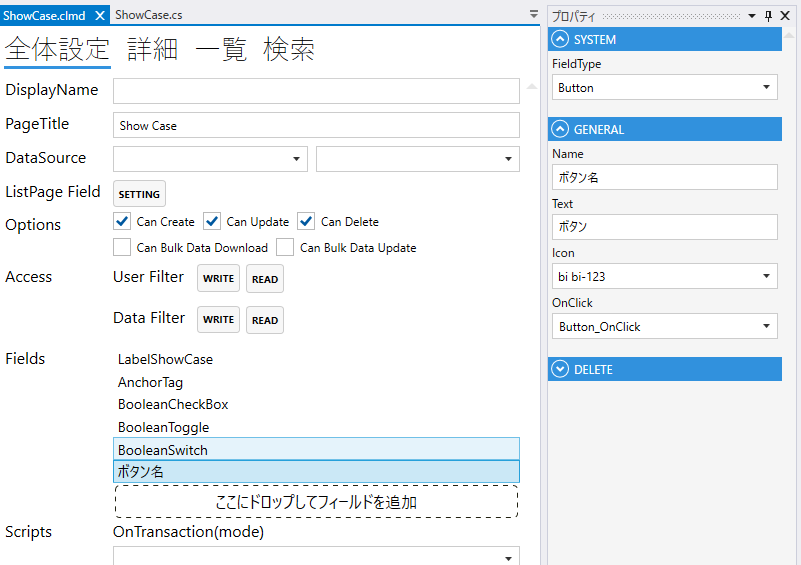

# Button

ボタンのフィールド.

## プロパティ
| プロパティ名    | 説明                   |
|-----------|----------------------| 
| FieldType | Buttonを設定する          |
| Name      | フィールド名を設定する          |
| Text      | 表示するテキストを設定する.       |
| Icon      | アイコンを設定する.           |
| OnClick   | ボタンクリック時のスクリプトを設定する. |

## スクリプト
| プロパティ名          | 型       | 説明             |
|-----------------|---------|----------------|
| BackgroundColor | string? | Fieldの背景色      | 
| Color           | string? | Fieldの色        |
| IsEnabled       | bool    | Fieldの有効/無効    |
| IsVisible       | bool    | Fieldの表示/非表示   |
| IsViewOnly      | bool    | Fieldの編集可/編集不可 |
| IsModified      | bool    | Fieldが変更されたどうか |
