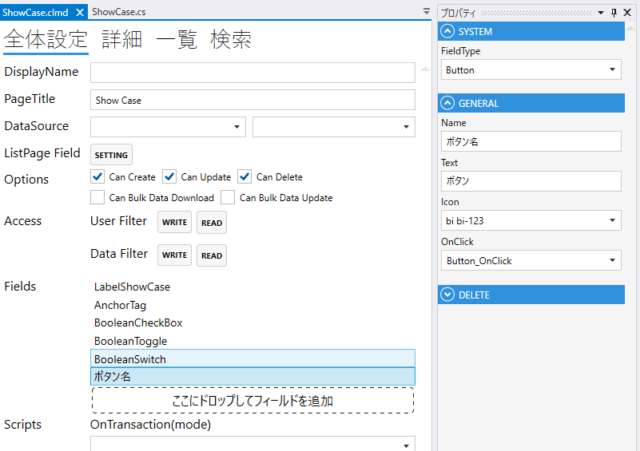

# ButtonField

## これは何か

**クリックでスクリプトを実行するボタン**。



## いつ使うか

- 画面上で独自の処理をトリガーしたい時（データ計算、外部 API 呼び出しなど）
- 画面遷移（`NavigationService.NavigateTo`）
- Submit の前後に処理を挟みたい時（標準 Submit の代わりに Button + `await Submit()` を使う）

---

## デザイナでの設定

### 固有プロパティ

| プロパティ | 型 | 既定値 | 説明 |
|---|---|---|---|
| **Text** | string | `"Button"` | ボタンに表示する文字 |
| **Icon** | string | `""` | 表示するアイコン（Material Icons） |
| **Variant** | enum | `Primary` | ボタンの見た目（`Primary` / `Secondary` / `Outline` 等） |
| **ImageResourceSet** | object | - | 画像ボタンとして使う場合の画像セット |
| **OnClick** | string | `""` | クリック時のスクリプトイベント |
| **ShowTextInToolTip** | bool | `false` | Text をツールチップに表示 |

共通プロパティ（Name など）は [Field 共通プロパティ](common_properties.md) を参照。

> ButtonField は値を持たないため、`DisplayName` / `IsRequired` / `DbColumn` はありません。

---

## スクリプトから

### プロパティ・メソッド

| 名前 | 型・戻り値 | 説明 |
|---|---|---|
| `Text` | string | ボタン文字の取得・設定 |
| `InvokeOnClick()` | Task | プログラム的にクリックを発動 |

共通プロパティ（IsEnabled / IsVisible など）は [Field 共通プロパティ](common_properties.md) を参照。

### よく使う例

```csharp
// OnClick の基本形
void SaveButton_OnClick()
{
    if (await Submit())
    {
        Toaster.Success("保存しました");
    }
}

// 動的にボタンの有効・無効を切り替える
SaveButton.IsEnabled = ValidateInput();

// ボタンのテキストを変える
SaveButton.Text = IsNewData ? "登録" : "更新";

// 画面遷移
void NavigateButton_OnClick()
{
    NavigationService.NavigateTo("Customer/List");
}
```

---

## 関連項目

- [Field 共通プロパティ](common_properties.md)
- [SubmitButton](SubmitButton.md) — 標準の登録・更新ボタン
- [チュートリアル: スクリプトの基本](../tutorials/tutorial_script.md)
