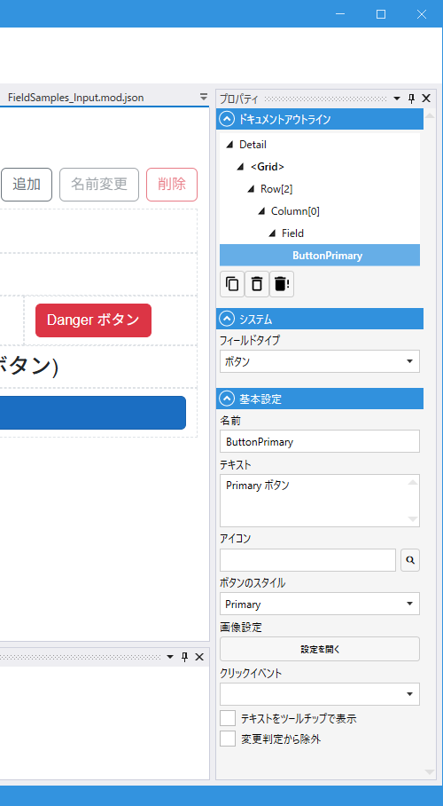

# ButtonField (ボタン)

## これは何か

**クリックでスクリプトを実行するボタン**。ボタンの見た目（Variant）やアイコン、画像を指定できます。

## いつ使うか

- 画面上で独自の処理をトリガーしたい時（データ計算、外部 API 呼び出しなど）
- 画面遷移（`NavigationService.NavigateTo`）
- Submit の前後に処理を挟みたい時（標準 Submit の代わりに Button + `await Submit()` を使う）

---

## デザイナでの設定



### プロパティ一覧

#### システム

| C#名 | 日本語表示名 | 説明 |
|---|---|---|
| - | フィールドタイプ | `ボタン` 固定 |

#### 基本設定

| C#名 | 日本語表示名 | 型 | 既定値 | 説明 |
|---|---|---|---|---|
| **Name** | 名前 | string | `""` | フィールド識別子 |
| **Text** | テキスト | string | `"Button"` | ボタンに表示する文字（複数行可） |
| **Icon** | アイコン | string | `""` | アイコン |
| **Variant** | ボタンのスタイル | enum | `Primary` | Bootstrap 準拠のスタイル |
| **ImageResourceSet** | 画像設定 | ButtonImageSet | - | 状態別の画像リソース |
| **OnClick** | クリックイベント | string | `""` | クリック時のスクリプト |
| **ShowTextInToolTip** | テキストをツールチップで表示 | bool | `false` | `Text` をツールチップに表示 |
| **IgnoreModification** | 変更判定から除外 | bool | `false` | 変更検知から除外 |

> ButtonField は値を持たないため、`表示名` / `必須` / `DBカラム` はありません。

---

## Variant（ボタンのスタイル）

| 値 | 色 | 用途 |
|---|---|---|
| **Primary** | 青 | 標準アクション |
| **Secondary** | グレー | 補助アクション |
| **Success** | 緑 | 成功・確定系 |
| **Danger** | 赤 | 削除・破壊的操作 |
| **Warning** | 黄 | 注意・警告 |
| **Info** | 水色 | 情報表示 |
| **Light** | 白系 | 目立たせたくない時 |
| **Dark** | 黒系 | コントラスト重視 |
| **Link** | 青文字 | テキストリンク風 |

---

## ImageResourceSet（画像設定）

ボタンに状態別の画像を指定します（画像がある場合は画像ボタンとして描画）。

| プロパティ | 用途 |
|---|---|
| **Default** | 通常時 |
| **Focus** | フォーカス時 |
| **Active** | 押下中 |
| **Hover** | マウスホバー時 |
| **Disabled** | 無効時 |

全てのパスを指定する必要はなく、指定したもののみ差し替わります。

---

## スクリプトから

### プロパティ

| 名前 | 型 | 説明 |
|---|---|---|
| `Text` | string | ボタン文字の取得・設定 |

共通プロパティ（`IsEnabled` / `IsVisible` / `Color` など）は [Field 共通プロパティ](common_properties.md) を参照。

> ボタンのクリックは**デザイナ設定の `OnClick` スクリプトから発火する**ことを前提に設計されており、スクリプト側から `InvokeOnClick()` を呼び出して発火させることはできません（`[ScriptHide]`）。

### よく使う例

```csharp
// OnClick の基本形（デザイナで OnClick を設定したときの中身）
void SaveButton_OnClick()
{
    if (await Submit())
    {
        Toaster.Success("保存しました");
    }
}

// 動的にボタンの有効・無効を切り替える
SaveButton.IsEnabled = ValidateInput();

// ボタンのテキストを変える
SaveButton.Text = IsNewData ? "登録" : "更新";

// 画面遷移
void NavigateButton_OnClick()
{
    NavigationService.NavigateTo("Customer/List");
}
```

---

## 関連項目

- [Field 共通プロパティ](common_properties.md)
- [SubmitButton](SubmitButton.md) — 標準の登録・更新ボタン
- [チュートリアル: スクリプトの基本](../tutorials/tutorial_script.md)
