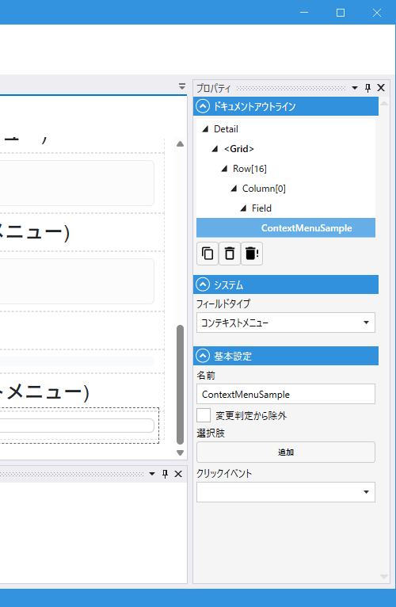

# ContextMenuField (コンテキストメニュー)

## これは何か

**右クリックメニューを提供する Field**。配置したモジュール／レイアウトの範囲で右クリックすると、指定したメニュー項目がポップアップ表示され、選択された項目のラベルを引数にしてスクリプトが実行されます。

## いつ使うか

- 一覧画面で行を右クリックして「編集」「削除」「複製」等のメニューを出したい
- 標準の UI にないカスタム操作を、画面上の要素に右クリックで紐付けたい

---

## デザイナでの設定



### プロパティ一覧

#### システム

| C#名 | 日本語表示名 | 説明 |
|---|---|---|
| - | フィールドタイプ | `コンテキストメニュー` 固定 |

#### 基本設定

| C#名 | 日本語表示名 | 型 | 既定値 | 説明 |
|---|---|---|---|---|
| **Name** | 名前 | string | `""` | フィールド識別子 |
| **Items** | 選択肢 | List\<string\> | `[]` | メニューに表示する項目ラベルの一覧 |
| **OnClick** | クリックイベント | string | `""` | 項目クリック時のスクリプト（引数 `string item` にクリックされたラベルが渡る） |
| **IgnoreModification** | 変更判定から除外 | bool | `false` | 変更検知から除外 |

---

## スクリプトイベントの書き方

OnClick のシグネチャは以下のようになります（引数 `string item`）:

```csharp
void MyContextMenu_OnClick(string item)
{
    switch (item)
    {
        case "編集":
            // 編集処理
            break;
        case "削除":
            // 削除処理
            break;
        case "複製":
            // 複製処理
            break;
    }
}
```

---

## スクリプトから

この Field 自体にスクリプト公開メンバーはありません（全 `[ScriptHide]`）。メニューの反応はデザイナ設定の `OnClick` スクリプトで記述します。

共通プロパティは [Field 共通プロパティ](common_properties.md) を参照。

---

## 関連項目

- [Field 共通プロパティ](common_properties.md)
- [Button](Button.md) — 明示的なボタン操作
