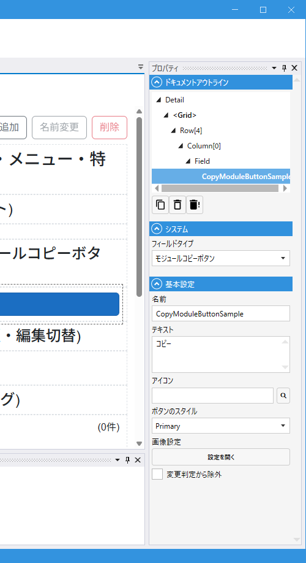

# CopyModuleButtonField (モジュールコピーボタン)

## これは何か

**現在表示中のモジュールデータをコピーして新しいデータとして作成するボタン**。
「このレコードと同じ内容で新規作成」という操作を 1 クリックで行えます。

## いつ使うか

- 既存データをテンプレートとして、少しだけ変更した新規データを作りたい
- 見積書・注文書など、前回と似た内容を登録するシーン

同じモジュール内に [AutoSubmitField](AutoSubmit.md) があれば、コピー後に**自動保存**まで行われます。

---

## デザイナでの設定

### プロパティ一覧

#### システム

| C#名 | 日本語表示名 | 説明 |
|---|---|---|
| - | フィールドタイプ | `モジュールコピーボタン` 固定 |

#### 基本設定

| C#名 | 日本語表示名 | 型 | 既定値 | 説明 |
|---|---|---|---|---|
| **Name** | 名前 | string | `""` | フィールド識別子 |
| **Text** | テキスト | string | `"Copy"` | ボタンに表示する文字（複数行可） |
| **Icon** | アイコン | string | `""` | アイコン |
| **Variant** | ボタンのスタイル | enum | `Primary` | [Button の Variant](Button.md#variantボタンのスタイル) 参照 |
| **ImageResourceSet** | 画像設定 | ButtonImageSet | - | 状態別の画像リソース |
| **IgnoreModification** | 変更判定から除外 | bool | `false` | 変更検知から除外 |

> `IsBlock` は固定 `true`（横幅いっぱい）です。

---

## 動作の仕組み

1. クリック → `Module.CopyModuleAsync()` を呼び出し（現在のデータをコピーして新規モジュールインスタンスとして保持）
2. 同じモジュール内に [AutoSubmitField](AutoSubmit.md) が配置されていれば、`ScheduleSubmit()` を呼んで自動保存
3. AutoSubmit がなければコピー完了のトースト通知のみ（ユーザーはそのあと手動で保存）

---

## スクリプトから

スクリプト公開メンバーは共通プロパティ（`IsEnabled` / `IsVisible` / `Color` / `Text` など）のみです。
[Field 共通プロパティ](common_properties.md) を参照。

---

## 関連項目

- [Field 共通プロパティ](common_properties.md)
- [Button](Button.md) — 独自処理を実行するボタン
- [AutoSubmitField](AutoSubmit.md) — コピー後の自動保存
- [ViewEditToggleButtonField](ViewEditToggleButton.md) — 参照 / 編集モード切替と併用しやすい
