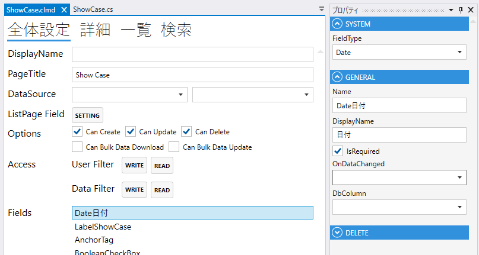

# Date

日付のフィールド

## プロパティ
| プロパティ名        | 説明               |
|---------------|------------------| 
| FieldType     | Dateを設定する        |
| Name          | フィールド名を設定する      |
| DisplayName   | 表示するテキストを設定する.   |
| IsRequired    | 登録時，必須にする.       |
| OnDataChanged | 変更時のスクリプトを設定する.  |
| DbColumn      | データベースのカラムを設定する. |

## スクリプト
| プロパティ名          | 型         | 説明             |
|-----------------|-----------|----------------|
| Value           | DateOnly? | Fieldの値        |
| BackgroundColor | string?   | Fieldの背景色      | 
| Color           | string?   | Fieldの色        |
| IsEnabled       | bool      | Fieldの有効/無効    |
| IsVisible       | bool      | Fieldの表示/非表示   |
| IsViewOnly      | bool      | Fieldの編集可/編集不可 |
| IsModified      | bool      | Fieldが変更されたどうか |
| SearchMax       | DateOnly? | 検索条件の日付の最大値    |
| SearchMin       | DateOnly? | 検索条件の日付の最小値    |
