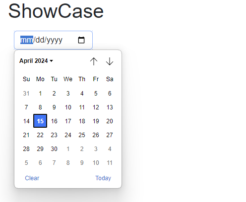
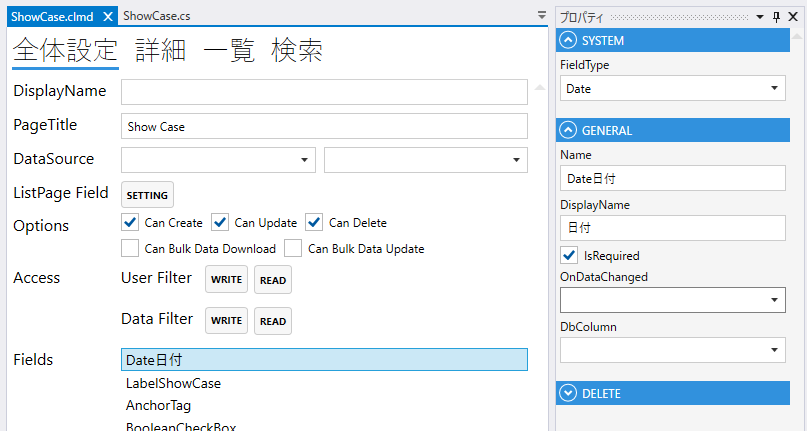
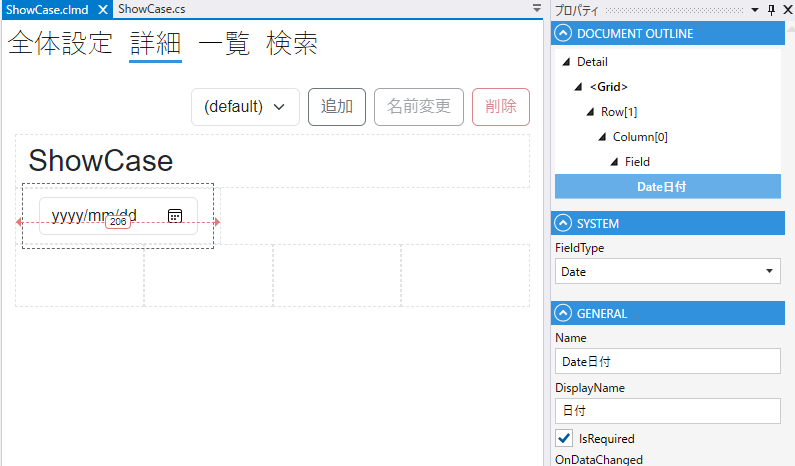

# DateField

## これは何か

**日付を入力・表示するフィールド**。時刻は持たない純粋な日付（`DateOnly`）型です。



## いつ使うか

- 生年月日・開始日・終了日など時刻を含まない日付の入力
- 年月のみの入力（`IsYearMonthOnly` をオン）
- DB の `DATE` カラムの表示・編集

時刻まで扱いたい場合は [DateTime](DateTime.md)、時刻だけ扱いたい場合は [Time](Time.md) を使ってください。

---

## デザイナでの設定



### 固有プロパティ

| プロパティ | 型 | 既定値 | 説明 |
|---|---|---|---|
| **DbColumn** | string | `""` | 対応する DB 列名 |
| **Format** | string | `""` | 表示フォーマット（例: `yyyy/MM/dd`） |
| **IsYearMonthOnly** | bool | `false` | 年月のみを扱う |

共通プロパティ（Name, DisplayName, IsRequired, OnDataChanged など）は [Field 共通プロパティ](common_properties.md) を参照。



---

## スクリプトから

### プロパティ

| 名前 | 型 | 説明 |
|---|---|---|
| `Value` | DateOnly? | 日付の値 |
| `SearchMin` | DateOnly? | 検索の最小日付 |
| `SearchMax` | DateOnly? | 検索の最大日付 |
| `SearchIsEmpty` | bool? | 「空」を検索条件にする |

共通プロパティは [Field 共通プロパティ](common_properties.md) を参照。

### よく使う例

```csharp
// 今日の日付を設定
OrderDate.Value = DateOnly.FromDateTime(DateTime.Today);

// 今月のデータを検索
var today = DateOnly.FromDateTime(DateTime.Today);
await OrderDate.SetSearchMinAsync(new DateOnly(today.Year, today.Month, 1));
await OrderDate.SetSearchMaxAsync(today);
```

---

## 関連項目

- [Field 共通プロパティ](common_properties.md)
- [DateTime](DateTime.md) — 日時
- [Time](Time.md) — 時刻
