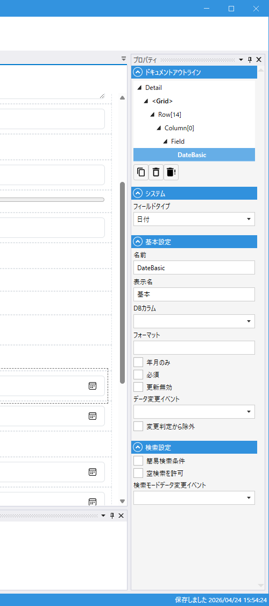

# DateField (日付)

## これは何か

**日付を入力・表示するフィールド**。時刻は持たない純粋な日付（`DateOnly`）型です。

## いつ使うか

- 生年月日・開始日・終了日など時刻を含まない日付の入力
- 年月のみの入力（`年月のみ` をオン）
- DB の `DATE` カラムの表示・編集

時刻まで扱いたい場合は [DateTime](DateTime.md)、時刻だけ扱いたい場合は [Time](Time.md) を使ってください。

---

## デザイナでの設定



### プロパティ一覧

#### システム

| C#名 | 日本語表示名 | 説明 |
|---|---|---|
| - | フィールドタイプ | `日付` 固定 |

#### 基本設定

| C#名 | 日本語表示名 | 型 | 既定値 | 説明 |
|---|---|---|---|---|
| **Name** | 名前 | string | `""` | フィールド識別子 |
| **DisplayName** | 表示名 | string | `""` | 画面表示用の名前 |
| **DbColumn** | DBカラム | string | `""` | 対応する DB 列名 |
| **Format** | フォーマット | string | `""` | 表示フォーマット（例: `yyyy/MM/dd`） |
| **IsYearMonthOnly** | 年月のみ | bool | `false` | 年月までを扱う（日は不要） |
| **IsRequired** | 必須 | bool | `false` | 入力必須 |
| **IsUpdateProtected** | 更新無効 | bool | `false` | 更新時に値を変更できないようにする |
| **OnDataChanged** | データ変更イベント | string | `""` | 値変更時のスクリプトイベント |
| **IgnoreModification** | 変更判定から除外 | bool | `false` | 変更検知（IsModified）から除外 |

#### 検索設定

| C#名 | 日本語表示名 | 型 | 既定値 | 説明 |
|---|---|---|---|---|
| **IsSimpleSearchParameter** | 簡易検索条件 | bool | `false` | 簡易検索の対象にする |
| **AllowEmptySearch** | 空検索を許可 | bool | `false` | 空での検索を許可する |
| **OnSearchDataChanged** | 検索モードデータ変更イベント | string | `""` | 検索条件が変更された時のスクリプトイベント |

---

## スクリプトから

### プロパティ

| 名前 | 型 | 説明 |
|---|---|---|
| `Value` | DateOnly? | 日付の値 |
| `SearchMin` | DateOnly? | 検索の最小日付 |
| `SearchMax` | DateOnly? | 検索の最大日付 |
| `SearchIsEmpty` | bool? | 「空」を検索条件にする |

共通プロパティは [Field 共通プロパティ](common_properties.md) を参照。

### よく使う例

```csharp
// 今日の日付を設定
OrderDate.Value = DateOnly.FromDateTime(DateTime.Today);

// 今月のデータを検索
var today = DateOnly.FromDateTime(DateTime.Today);
await OrderDate.SetSearchMinAsync(new DateOnly(today.Year, today.Month, 1));
await OrderDate.SetSearchMaxAsync(today);
```

---

## バリエーション

### 基本（年月日）

通常の日付入力。

### 年月のみ（`IsYearMonthOnly: true`, `Format: "yyyy/MM"`）

「日」を表示せず、年月までを扱う。
`Format` を `yyyy/MM` にするなどで表示も揃えるのが一般的。

---

## 検索での挙動

日付の検索は **範囲（開始日 ～ 終了日）** が基本です。NumberField の範囲検索とほぼ同じふるまいです。

### 簡易検索（`IsSimpleSearchParameter=true`）

日付ピッカーが 1 つだけ表示されます。指定日**以降**（`≥`）のデータが対象。

### 詳細検索（`IsSimpleSearchParameter=false`）

開始日 ～ 終了日の **2 つのピッカー** と、間に **モード切替（`～` ボタン）** が出ます。

| モード | 挙動 |
|---|---|
| **範囲（既定）** | 開始・終了のうち入っている方の制約を適用<br>例: 開始 2025-01-01 + 終了 2025-12-31 → 2025 年内 |
| **空** | `NULL` のデータ（`AllowEmptySearch=true` の時） |
| **空以外** | 何か日付が入っているデータ（`AllowEmptySearch=true` の時） |

> 終了日を指定したときは「**その日を含む**」検索になります（`≤ 2025-12-31` で 12/31 のデータも対象）。

### スクリプトから検索条件を操作

```csharp
// 開始日（以降）
await BirthDate.SetSearchMinAsync(new DateOnly(1980, 1, 1));

// 終了日（以前）
await BirthDate.SetSearchMaxAsync(new DateOnly(1989, 12, 31));

// 「空」モードに切り替え
await BirthDate.SetSearchIsEmptyAsync(true);
```

検索全体の仕組みは [SearchField](Search.md#検索の仕組み) を参照。

---

## 関連項目

- [Field 共通プロパティ](common_properties.md)
- [DateTime](DateTime.md) — 日時
- [Time](Time.md) — 時刻
- [SearchField](Search.md) — 検索全体の仕組み
