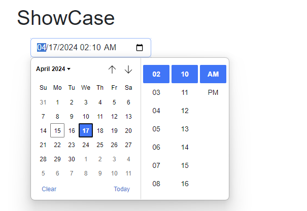
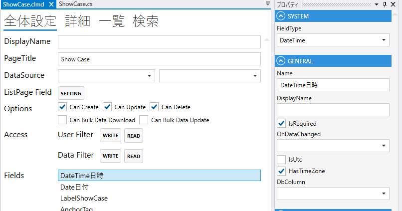
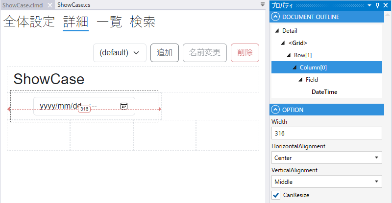

# DateTimeField

## これは何か

**日時（年月日＋時刻）を入力・表示するフィールド**。



## いつ使うか

- 作成日時・更新日時のタイムスタンプ
- イベント開始日時・予約日時など時刻まで指定する場面
- UTC 保存でタイムゾーンを意識した運用（`SaveAsUtc`）

日付だけなら [Date](Date.md)、時刻だけなら [Time](Time.md) を使ってください。

---

## デザイナでの設定



### 固有プロパティ

| プロパティ | 型 | 既定値 | 説明 |
|---|---|---|---|
| **DbColumn** | string | `""` | 対応する DB 列名 |
| **Format** | string | `""` | 表示フォーマット（例: `yyyy/MM/dd HH:mm`） |
| **SaveAsUtc** | bool | `false` | DB に UTC で保存する（表示は現地時刻） |

共通プロパティは [Field 共通プロパティ](common_properties.md) を参照。



---

## スクリプトから

### プロパティ

| 名前 | 型 | 説明 |
|---|---|---|
| `Value` | DateTime? | 日時の値 |
| `SearchMin` | DateTime? | 検索の最小日時 |
| `SearchMax` | DateTime? | 検索の最大日時 |
| `SearchIsEmpty` | bool? | 「空」を検索条件にする |

共通プロパティは [Field 共通プロパティ](common_properties.md) を参照。

### よく使う例

```csharp
// 現在日時を設定
CreatedAt.Value = DateTime.Now;

// 過去 24 時間を検索
await CreatedAt.SetSearchMinAsync(DateTime.Now.AddDays(-1));
await CreatedAt.SetSearchMaxAsync(DateTime.Now);
```

---

## 関連項目

- [Field 共通プロパティ](common_properties.md)
- [Date](Date.md) — 日付のみ
- [Time](Time.md) — 時刻のみ
