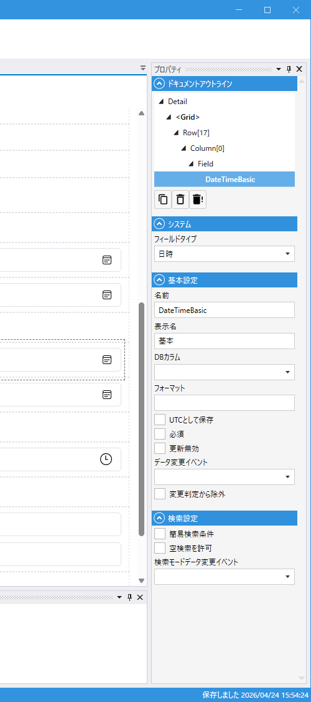

# DateTimeField (日時)

## これは何か

**日時（年月日＋時刻）を入力・表示するフィールド**。

## いつ使うか

- 作成日時・更新日時のタイムスタンプ
- イベント開始日時・予約日時など時刻まで指定する場面
- UTC 保存でタイムゾーンを意識した運用（`UTCとして保存`）

日付だけなら [Date](Date.md)、時刻だけなら [Time](Time.md) を使ってください。

---

## デザイナでの設定



### プロパティ一覧

#### システム

| C#名 | 日本語表示名 | 説明 |
|---|---|---|
| - | フィールドタイプ | `日時` 固定 |

#### 基本設定

| C#名 | 日本語表示名 | 型 | 既定値 | 説明 |
|---|---|---|---|---|
| **Name** | 名前 | string | `""` | フィールド識別子 |
| **DisplayName** | 表示名 | string | `""` | 画面表示用の名前 |
| **DbColumn** | DBカラム | string | `""` | 対応する DB 列名 |
| **Format** | フォーマット | string | `""` | 表示フォーマット（例: `yyyy/MM/dd HH:mm`） |
| **SaveAsUtc** | UTCとして保存 | bool | `false` | DB に UTC で保存する（表示は現地時刻） |
| **IsRequired** | 必須 | bool | `false` | 入力必須 |
| **IsUpdateProtected** | 更新無効 | bool | `false` | 更新時に値を変更できないようにする |
| **OnDataChanged** | データ変更イベント | string | `""` | 値変更時のスクリプトイベント |
| **IgnoreModification** | 変更判定から除外 | bool | `false` | 変更検知（IsModified）から除外 |

#### 検索設定

| C#名 | 日本語表示名 | 型 | 既定値 | 説明 |
|---|---|---|---|---|
| **IsSimpleSearchParameter** | 簡易検索条件 | bool | `false` | 簡易検索の対象にする |
| **AllowEmptySearch** | 空検索を許可 | bool | `false` | 空での検索を許可する |
| **OnSearchDataChanged** | 検索モードデータ変更イベント | string | `""` | 検索条件が変更された時のスクリプトイベント |

---

## スクリプトから

### プロパティ

| 名前 | 型 | 説明 |
|---|---|---|
| `Value` | DateTime? | 日時の値 |
| `SearchMin` | DateTime? | 検索の最小日時 |
| `SearchMax` | DateTime? | 検索の最大日時 |
| `SearchIsEmpty` | bool? | 「空」を検索条件にする |

共通プロパティは [Field 共通プロパティ](common_properties.md) を参照。

### よく使う例

```csharp
// 現在日時を設定
CreatedAt.Value = DateTime.Now;

// 過去 24 時間を検索
await CreatedAt.SetSearchMinAsync(DateTime.Now.AddDays(-1));
await CreatedAt.SetSearchMaxAsync(DateTime.Now);
```

---

## バリエーション

### 基本

現地時刻でそのまま保存・表示。

### UTC 保存（`SaveAsUtc: true`）

DB には UTC で保存され、画面表示時には現地時刻に変換される。
海外拠点がある、サーバーとクライアントのタイムゾーンが異なる場合に選ぶ。

---

## 検索での挙動

[DateField](Date.md#検索での挙動) と同じ **範囲検索**（時刻まで含めた範囲）。

### 簡易検索（`IsSimpleSearchParameter=true`）

日時ピッカーが 1 つだけ表示されます。指定日時**以降**（`≥`）のデータが対象。

### 詳細検索（`IsSimpleSearchParameter=false`）

開始日時 ～ 終了日時の **2 つのピッカー** と、間に **モード切替（`～` ボタン）** が出ます。範囲 / 空白 / 空白でない の 3 モード（空白系は `AllowEmptySearch=true` の時のみ）。

### スクリプトから

```csharp
await CreatedAt.SetSearchMinAsync(new DateTime(2025, 1, 1, 0, 0, 0));
await CreatedAt.SetSearchMaxAsync(new DateTime(2025, 12, 31, 23, 59, 59));
await CreatedAt.SetSearchIsEmptyAsync(true);  // 空白モード
```

検索全体の仕組みは [SearchField](Search.md#検索の仕組み) を参照。

---

## 関連項目

- [Field 共通プロパティ](common_properties.md)
- [Date](Date.md) — 日付のみ
- [Time](Time.md) — 時刻のみ
- [SearchField](Search.md) — 検索全体の仕組み
