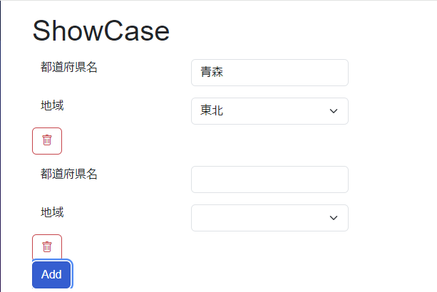
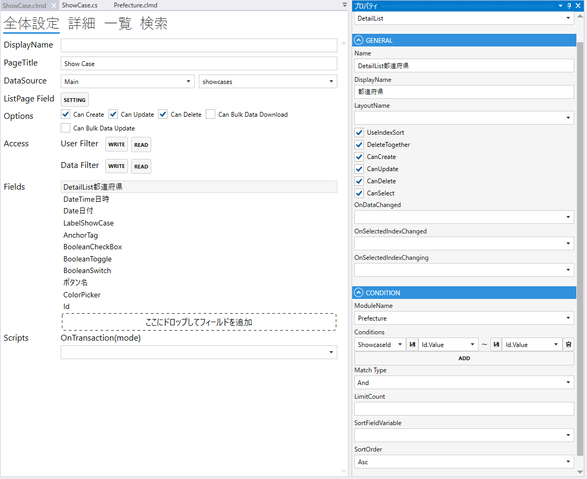
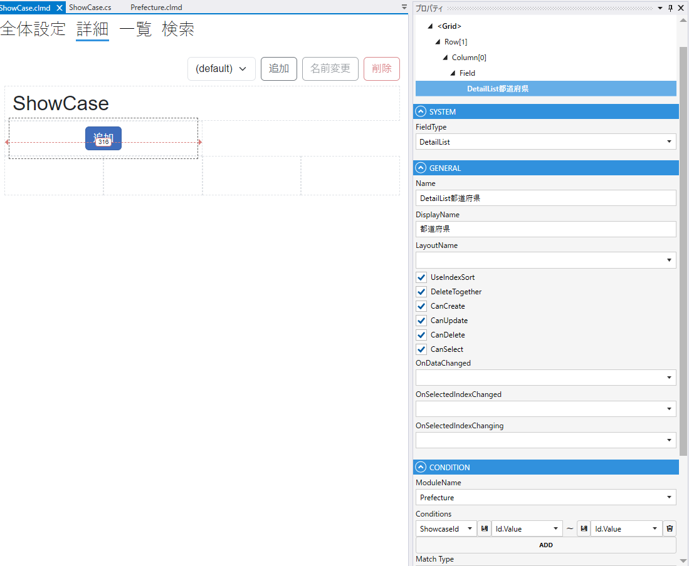

# DetailListField

## これは何か

**複数件のデータをカード形式で縦に並べて表示するフィールド**。各行が詳細レイアウトで描画されます。

## いつ使うか

- 行ごとに複数の情報を表示したい時（表では横に収まらない場合）
- 写真・説明文・価格など、リッチな行を並べる場合
- カード型 UI で見栄えを整えたい場合

表形式なら [List](List.md)、タイル状なら [TileList](TileList.md) を使います。

---

## デザイナでの設定

### 固有プロパティ

| プロパティ | 型 | 既定値 | 説明 |
|---|---|---|---|
| **LayoutName** | string | `""` | 表示に使う Detail レイアウト名 |
| **PagerPosition** | enum | `Top` | ページャーの位置 |
| **UseIndexSort** | bool | `false` | 表示順を Index として保存 |
| **DeleteTogether** | bool | `false` | 親データ削除時に一括削除 |
| **CanCreate** | bool | `false` | 親画面から新規作成 |
| **CanUpdate** | bool | `false` | 親画面から編集 |
| **CanDelete** | bool | `false` | 親画面から削除 |
| **CanSelect** | bool | `false` | 行選択を許可 |
| **OnDataChanged** | string | `""` | データ変更時のスクリプト |
| **OnSelectedIndexChanged** | string | `""` | 選択行変更時のスクリプト |

共通プロパティは [Field 共通プロパティ](common_properties.md) を参照。

### CONDITION

表示データの絞り込みは [List の CONDITION](List.md#condition表示データの絞り込み) と同じです。

---

## スクリプトから

プロパティ・メソッドは [List](List.md#スクリプトから) と同じです:

- `Rows` / `RowCount` / `SelectedIndex` / `Page` / `Limit`
- `AddRow()` / `UpdateRow()` / `DeleteRow()` / `DeleteAllRows()`
- `Reload()` / `SetAdditionalCondition(ModuleSearcher)`

共通プロパティは [Field 共通プロパティ](common_properties.md) を参照。

---

## 関連項目

- [List](List.md) — 表形式
- [TileList](TileList.md) — タイル形式
- [Field 共通プロパティ](common_properties.md)
