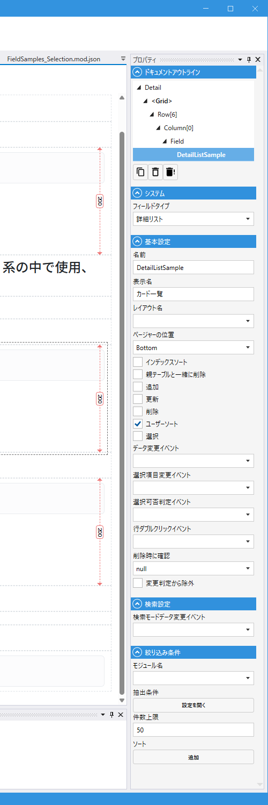

# DetailListField (詳細リスト)

## これは何か

**複数件のデータをカード形式（各行を詳細レイアウトで描画）で縦に並べて表示するフィールド**。各行を詳細レイアウトで描画するため、1 行あたり複数の情報をリッチに表示できます。

## いつ使うか

- 行ごとに複数の情報を表示したい時（表では横に収まらない場合）
- 写真・説明文・価格など、リッチな行を並べる場合
- カード型 UI で見栄えを整えたい場合

表形式なら [List](List.md)、タイル状なら [TileList](TileList.md) を使います。

---

## デザイナでの設定

### プロパティ一覧

#### システム

| C#名 | 日本語表示名 | 説明 |
|---|---|---|
| - | フィールドタイプ | `詳細リスト` 固定 |

#### 基本設定

| C#名 | 日本語表示名 | 型 | 既定値 | 説明 |
|---|---|---|---|---|
| **Name** | 名前 | string | `""` | フィールド識別子 |
| **DisplayName** | 表示名 | string | `""` | 画面表示用の名前 |
| **LayoutName** | レイアウト名 | string | `""` | 各行に使う Detail レイアウト名 |
| **PagerPosition** | ページャーの位置 | enum | `Top` | ページャーの位置（`Top` / `Bottom`） |
| **UseIndexSort** | インデックスソート | bool | `false` | 表示順を Index として保存 |
| **DeleteTogether** | 親テーブルと一緒に削除 | bool | `false` | 親データ削除時に一括削除 |
| **CanCreate** | 追加 | bool | `false` | 親画面から新規作成を許可 |
| **CanUpdate** | 更新 | bool | `false` | 親画面から編集を許可 |
| **CanDelete** | 削除 | bool | `false` | 親画面から削除を許可 |
| **CanUserSort** | ユーザーソート | bool | `true` | ユーザーソートを許可 |
| **CanSelect** | 選択 | bool | `false` | 行選択を許可 |
| **OnDataChanged** | データ変更イベント | string | `""` | データ変更時のスクリプト |
| **OnSelectedIndexChanged** | 選択項目変更イベント | string | `""` | 選択行変更時のスクリプト |
| **OnSelectedIndexChanging** | 選択可否判定イベント | string | `""` | 選択行変更前のスクリプト（引数 `int index` → `bool`） |
| **OnDoubleClickRow** | 行ダブルクリックイベント | string | `""` | 行ダブルクリック時のスクリプト（引数 `int index`） |
| **ConfirmBeforeDelete** | 削除時に確認 | bool? | null | 削除前に確認ダイアログを出す |
| **IgnoreModification** | 変更判定から除外 | bool | `false` | 変更検知（IsModified）から除外 |

#### 検索設定

| C#名 | 日本語表示名 | 型 | 既定値 | 説明 |
|---|---|---|---|---|
| **OnSearchDataChanged** | 検索モードデータ変更イベント | string | `""` | 検索条件が変更された時のスクリプト |

#### 絞り込み条件（表示データ）

| C#名 | 日本語表示名 | 型 | 既定値 | 説明 |
|---|---|---|---|---|
| **SearchCondition.ModuleName** | モジュール名 | string | `""` | 表示するデータのモジュール |
| **SearchCondition.Condition** | 抽出条件 | MultiMatchCondition | - | 絞り込み条件 |
| **SearchCondition.LimitCount** | 件数上限 | int | `50` | 表示する最大件数 |
| **SearchCondition.SortConditions** | ソート | List | `[]` | ソート順 |

> List にある `CanCustomizeColumns` / `CanNavigateToDetail` / `FormControlStyle` / `ApplyBackgroundToBoxInput` / `NavigateModuleUrlSegment` は DetailList にはありません（列の概念がカードにはないため）。

---

## スクリプトから

スクリプト API は [List](List.md#スクリプトから) と共通です（内部的にも同じ `ListField` ランタイムクラスを使用）。

- プロパティ: `Rows` / `RowCount` / `SelectedIndex` / `Page` / `PageCount` / `TotalCount` / `Limit` / `AllowLoad` / `SearchComparison`
- メソッド: `AddRow` / `AddRows` / `InsertRow` / `InsertRows` / `UpdateRow` / `DeleteRow` / `DeleteAllRows` / `Reload` / `SetAdditionalCondition` / `SetSelectedIndexAsync` / `SetSearchComparisonAsync` / `ShowCustomDialog`

共通プロパティは [Field 共通プロパティ](common_properties.md) を参照。

---

## 関連項目

- [List](List.md) — 表形式
- [TileList](TileList.md) — タイル形式
- [Field 共通プロパティ](common_properties.md)
