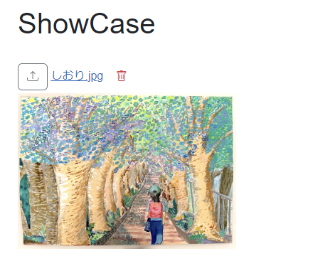
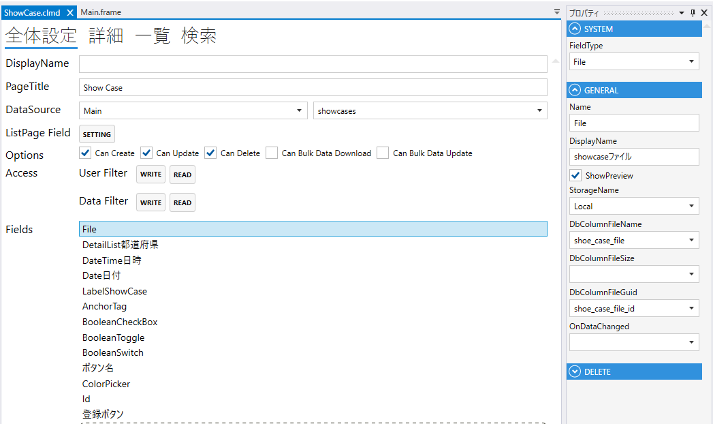
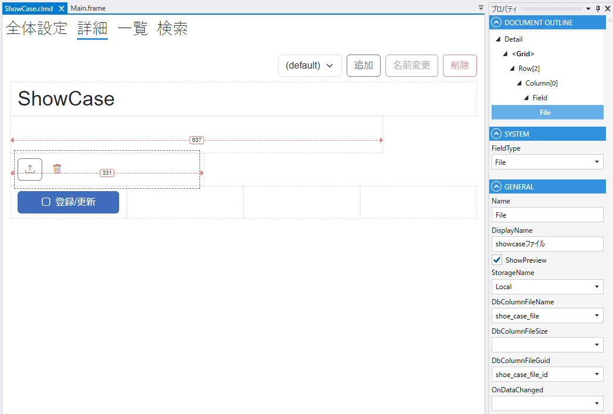

# File

Fileのアップロードを行うComponent





下記テーブルが必要
```sql
create table temporary_files
(
    id bigint generated by default as identity primary key,
    guid uuid not null,
    created_date_time timestamp
);
```
1. FieldType
    - Fileを設定する
2. Name
    - フィールド名の設定. 全体設定時に表示される.
3. DisplayDane
    - TBD
4. StorageName
      - designer.settings.jsonに設定を記載する
      ```json
      "FileStorages": 
       [
       {
        "FileStorageType": "FileSystem",
        "Name": "Local"
       }
       ]
5. DbColumnFileName
    - テーブルのカラムの設定
6. DbColumnFileSize
    - テーブルのカラムの設定
7. OnDataChanged
    - File変更時のスクリプト




| プロパティ名             | 型               | 説明               |
|--------------------|-----------------|------------------|
| AllowLoad          | bool            | ロードの可否           |
| BackgroundColor    | string?         | Fieldの背景色        | 
| Color              | string?         | Fieldの色          |
| FileName           | string?         | ファイル名            |
| FileNameComparison | MatchComparison | ファイル名の検索条件の条件区分  |
| IsEnabled          | bool            | Fieldの有効/無効      |
| IsVisible          | bool            | Fieldの表示/非表示     |
| IsViewOnly         | bool            | Fieldの編集可/編集不可   |
| IsModified         | bool            | Fieldが変更されたどうか   |
| SearchFileName     | int?            | 検索条件のファイル名       |
| SearchFileSizeMax  | List<Module>    | 検索条件のファイルサイズの最大値 |
| SearchFileSizeMin  | int             | 検索条件のファイルサイズの最小値 |

| メソッド名             | 戻り値           | 説明             |
|-------------------|---------------|----------------|
| Download()        | なし            | ダウンロードする       |
| GetMemoryStream() | MemoryStream? | メモリーストリームを取得する |
