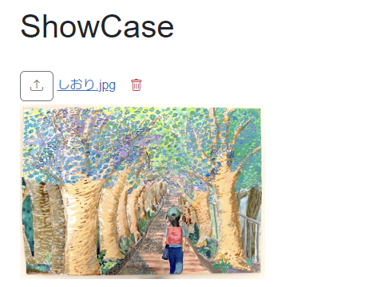
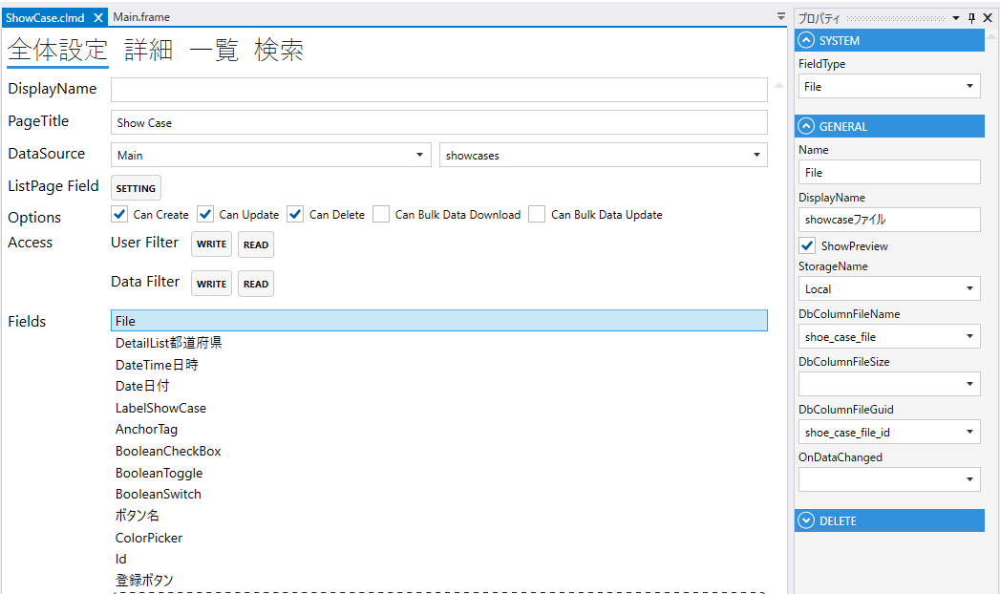
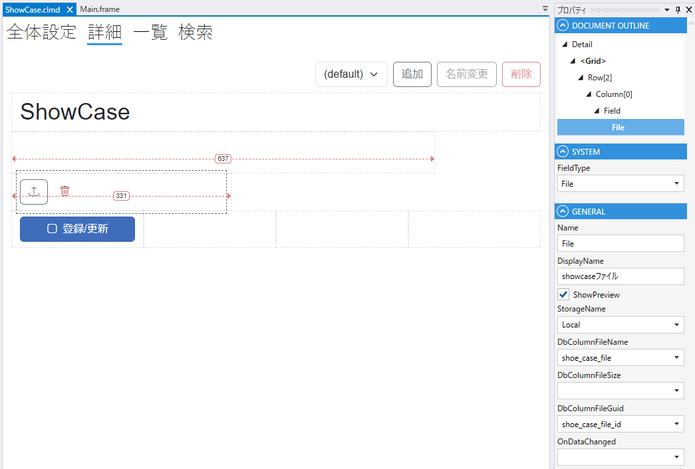

# FileField

## これは何か

**ファイルのアップロード・ダウンロードを扱うフィールド**。画像のプレビュー表示にも対応します。



## いつ使うか

- 画像・PDF・Excel など添付ファイルの登録
- アバター画像のアップロード・プレビュー
- ファイル実体とメタ情報（ファイル名・サイズ・GUID）を DB で管理したい場合

---

## デザイナでの設定



### 固有プロパティ

| プロパティ | 型 | 既定値 | 説明 |
|---|---|---|---|
| **DbColumnFileName** | string | `""` | ファイル名を保存する DB 列 |
| **DbColumnFileSize** | string | `""` | ファイルサイズを保存する DB 列 |
| **DbColumnFileGuid** | string | `""` | ファイル識別 GUID を保存する DB 列 |
| **StorageName** | string | `""` | 保存先の File Storage 名 |
| **MaxAllowedSize** | long? | `500MB` | 許容する最大サイズ |
| **ShowPreview** | bool | `false` | 画像のプレビュー表示 |
| **ObjectFit** | enum | `Contain` | プレビュー画像のフィット方式 |
| **IsUpdateProtected** | bool | `false` | 更新不可にする |

共通プロパティは [Field 共通プロパティ](common_properties.md) を参照。



### ファイル保存の仕組み

FileField は 3 つの情報を DB に保存します:

- **FileName** — 元のファイル名
- **FileSize** — バイトサイズ
- **FileGuid** — ストレージ上の識別子

ファイル実体は File Storage（ローカルファイルシステム／クラウドストレージなど）に保存され、DB には GUID だけが残ります。

File Storage は `designer.settings.json` の `FileStorages` で設定します:

```json
"FileStorages": [
  {
    "FileStorageType": "FileSystem",
    "Name": "Local"
  }
]
```

### 一時ファイル管理テーブル

アップロード中の一時ファイルを管理するテーブルが必要です:

```sql
create table temporary_files
(
    id bigint generated by default as identity primary key,
    guid uuid not null,
    created_date_time timestamp
);
```

---

## スクリプトから

### プロパティ・メソッド

| 名前 | 型・戻り値 | 説明 |
|---|---|---|
| `FileName` | string? | ファイル名 |
| `SearchFileName` | string? | 検索用ファイル名 |
| `SearchFileSizeMin` / `SearchFileSizeMax` | long? | サイズの範囲検索 |
| `SetFile(fileName, StreamContent)` | Task | ファイルをプログラム的に設定 |
| `ClearFile()` | Task | ファイルをクリア |
| `GetMemoryStream()` | Task<MemoryStream?> | ファイル内容を取得 |
| `Download()` | Task | ダウンロードを促す |

共通プロパティは [Field 共通プロパティ](common_properties.md) を参照。

### よく使う例

```csharp
// ボタンでファイルをダウンロードさせる
void DownloadButton_OnClick()
{
    await Attachment.Download();
}

// ファイルの中身を読み取って処理する
var stream = await Attachment.GetMemoryStream();
if (stream != null)
{
    // stream を使った処理
}
```

---

## 関連項目

- [Field 共通プロパティ](common_properties.md)
- [ImageViewer](ImageViewer.md) — 画像の表示だけしたい場合
