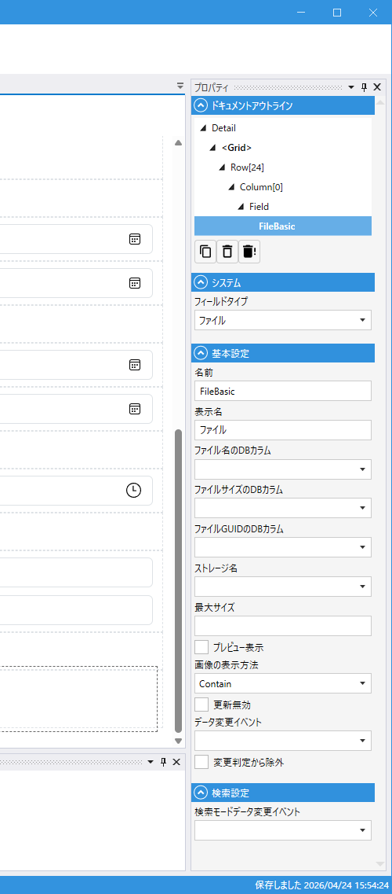

# FileField (ファイル)

## これは何か

**ファイルのアップロード・ダウンロードを扱うフィールド**。画像のプレビュー表示にも対応します。

## いつ使うか

- 画像・PDF・Excel など添付ファイルの登録
- アバター画像のアップロード・プレビュー
- ファイル実体とメタ情報（ファイル名・サイズ・GUID）を DB で管理したい場合

---

## デザイナでの設定



### プロパティ一覧

#### システム

| C#名 | 日本語表示名 | 説明 |
|---|---|---|
| - | フィールドタイプ | `ファイル` 固定 |

#### 基本設定

| C#名 | 日本語表示名 | 型 | 既定値 | 説明 |
|---|---|---|---|---|
| **Name** | 名前 | string | `""` | フィールド識別子 |
| **DisplayName** | 表示名 | string | `""` | 画面表示用の名前 |
| **DbColumnFileName** | ファイル名のDBカラム | string | `""` | ファイル名を保存する DB 列 |
| **DbColumnFileSize** | ファイルサイズのDBカラム | string | `""` | ファイルサイズ（バイト）を保存する DB 列 |
| **DbColumnFileGuid** | ファイルGUIDのDBカラム | string | `""` | ストレージ上の識別 GUID を保存する DB 列 |
| **StorageName** | ストレージ名 | string | `""` | 保存先の File Storage 名（`designer.settings.json` で定義） |
| **MaxAllowedSize** | 最大サイズ | long? | `500MB`（未指定時） | 許容する最大バイト数 |
| **ShowPreview** | プレビュー表示 | bool | `false` | 画像の場合にプレビューを表示 |
| **ObjectFit** | 画像の表示方法 | enum | `Contain` | プレビュー画像のフィット方式（`Contain` / `Cover` / `Fill` など） |
| **IsUpdateProtected** | 更新無効 | bool | `false` | 更新時に値を変更できないようにする |
| **OnDataChanged** | データ変更イベント | string | `""` | 値変更時のスクリプトイベント |
| **IgnoreModification** | 変更判定から除外 | bool | `false` | 変更検知（IsModified）から除外 |

#### 検索設定

| C#名 | 日本語表示名 | 型 | 既定値 | 説明 |
|---|---|---|---|---|
| **OnSearchDataChanged** | 検索モードデータ変更イベント | string | `""` | 検索条件が変更された時のスクリプトイベント |

> FileField は `必須` / `簡易検索条件` / `空検索を許可` のプロパティを持ちません。

---

## ファイル保存の仕組み

FileField は 3 つの情報を DB に保存します:

- **FileName** — 元のファイル名
- **FileSize** — バイトサイズ
- **FileGuid** — ストレージ上の識別子

ファイル実体は **File Storage**（ローカルファイルシステム／クラウドストレージなど）に保存され、DB には GUID だけが残ります。

### File Storage の設定

`designer.settings.json` の `FileStorages` でストレージを定義します:

```json
"FileStorages": [
  {
    "FileStorageType": "FileSystem",
    "Name": "Local"
  }
]
```

FileField の `StorageName` にここで定義した名前を指定します。

### 一時ファイル管理テーブル

アップロード中の一時ファイルを管理するテーブルが必要です:

```sql
create table temporary_files
(
    id bigint generated by default as identity primary key,
    guid uuid not null,
    created_date_time timestamp
);
```

---

## スクリプトから

### プロパティ・メソッド

| 名前 | 型・戻り値 | 説明 |
|---|---|---|
| `FileName` | string? | ファイル名 |
| `SearchFileName` | string? | 検索用ファイル名 |
| `SearchFileNameComparison` | MatchComparison | ファイル名検索の比較方法（既定 `Like`） |
| `SearchFileSizeMin` / `SearchFileSizeMax` | decimal? | サイズの範囲検索 |
| `SetFile(fileName, StreamContent)` | Task | ファイルをプログラム的に設定 |
| `ClearFile()` | Task | ファイルをクリア |
| `GetMemoryStream()` | Task<MemoryStream?> | ファイル内容を取得 |
| `Download()` | Task | ダウンロードを促す |

共通プロパティは [Field 共通プロパティ](common_properties.md) を参照。

### よく使う例

```csharp
// ボタンでファイルをダウンロードさせる
void DownloadButton_OnClick()
{
    await Attachment.Download();
}

// ファイルの中身を読み取って処理する
var stream = await Attachment.GetMemoryStream();
if (stream != null)
{
    // stream を使った処理
}

// プログラム的にファイルをセット（外部 API の応答ファイルなど）
await Attachment.SetFile("report.pdf", streamContent);
```

---

## 関連項目

- [Field 共通プロパティ](common_properties.md)
- [ImageViewer](ImageViewer.md) — 画像の表示だけしたい場合
- [designer.settings](../designer/designer_settings.md) — File Storage の定義
