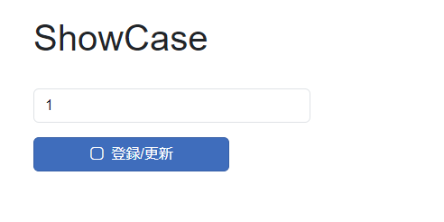
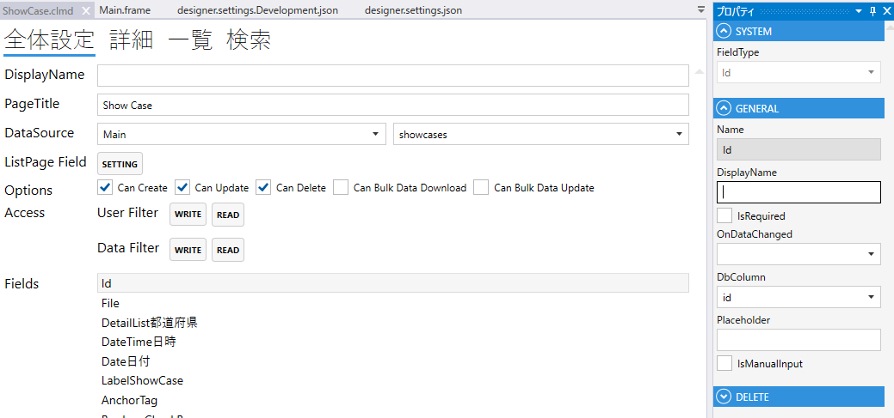
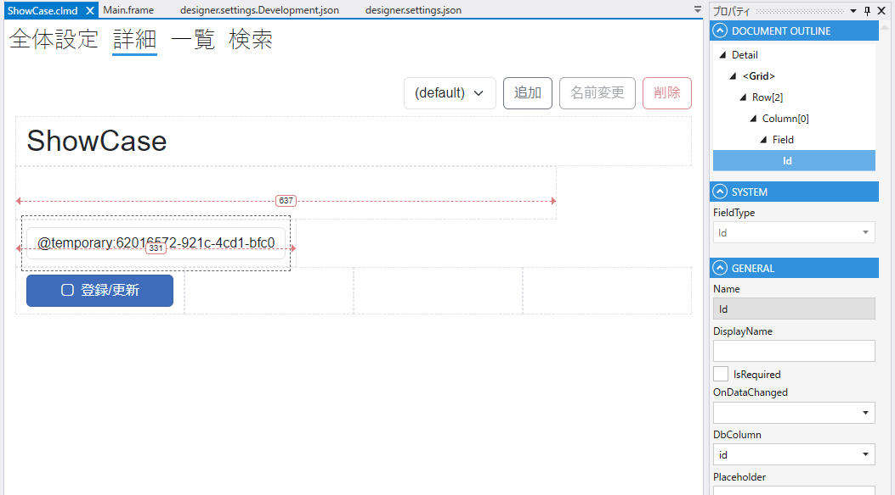

# Id

Idを表すField

1. FieldType
    - Idを設定する
2. Name
    - フィールド名の設定. 全体設定時に表示される.
3. DisplayDane
    - TBD
4. IsRequired
    - 登録時，必須にする
5. OnDataChanged
    - データ変更時のスクリプト
6. DbColumn
    - テーブルのカラムの設定

## スクリプト
| プロパティ名          | 型       | 説明                    |
|-----------------|---------|-----------------------|
| Value           | string? | Fieldの値               |
| BackgroundColor | string? | Fieldの背景色             | 
| Color           | string? | Fieldの色               |
| IsEnabled       | bool    | Fieldの有効/無効           |
| IsVisible       | bool    | Fieldの表示/非表示          |
| IsViewOnly      | bool    | Fieldの編集可/編集不可        |
| IsModified      | bool    | Fieldが変更されたどうか        |

## システムフィールドIdと一般フィールドIdの違いについて
Idはシステムフィールドと一般フィールドの2種類があります。
- システムフィールド: DBへデータの追加・更新するには、必ずモジュール内に存在する必要があります。名前がIdで固定となり、変更できません。
- 一般フィールド: 他のモジュールへリンク等する際に使います。名前変更ができます。

例：`見積書`のモジュールに`Id`(見積書Id=システムField)と`顧客Id`(一般Field)があります。`顧客Id`は`顧客`モジュールとリンクする際の紐づけに使用されます。