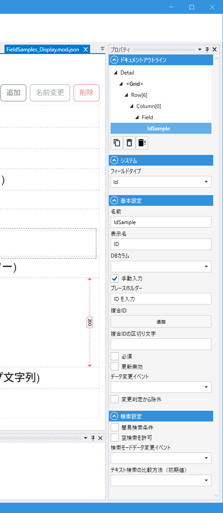
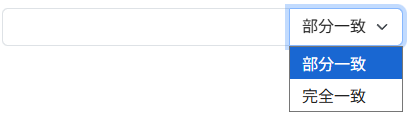
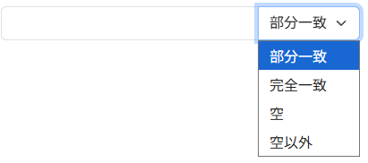

# IdField (ID)

## これは何か

**データを一意に識別するキー**となるフィールド。Module には System Field として `Id` が 1 つ必要です（追加・更新・削除の対象となるデータを特定するため）。

## いつ使うか

- System Field として: Module のデータの主キー（**追加・更新・削除をするなら必須**）
- 一般 Field として: 別テーブルの Id を保持する外部キー的な用途

System Field の Id と一般 Field の Id の違いは本ページ下部の「[System Field の Id と一般 Field の Id](#system-field-の-id-と一般-field-の-id)」を参照してください。

---

## 3 つの生成方式

Id の値をどう決めるかで 3 つの方式があります。

| 方式 | 設定 | 用途 |
|---|---|---|
| **DB 自動生成** | `手動入力: false` + DB 側で AUTO_INCREMENT / SERIAL / IDENTITY | 連番の ID |
| **ユーザー入力** | `手動入力: true` | 見積番号・商品コードなど、人間が決める ID |
| **複合 Id** | `複合ID` + `複合IDの区切り文字` | 複数 Field を結合した ID（例: 姓 + 名） |

---

## デザイナでの設定



### プロパティ一覧

#### システム

| C#名 | 日本語表示名 | 説明 |
|---|---|---|
| - | フィールドタイプ | `Id` 固定 |

#### 基本設定

| C#名 | 日本語表示名 | 型 | 既定値 | 説明 |
|---|---|---|---|---|
| **Name** | 名前 | string | `""` | フィールド識別子 |
| **DisplayName** | 表示名 | string | `""` | 画面表示用の名前 |
| **DbColumn** | DBカラム | string | `""` | 対応する DB 列名 |
| **IsManualInput** | 手動入力 | bool | `false` | ユーザー入力にする（オフなら DB 自動生成を期待） |
| **Placeholder** | プレースホルダー | string | `""` | 未入力時の案内文 |
| **CompositeIdVariables** | 複合ID | List\<string\> | `[]` | 複合 Id を構成する他 Field 名 |
| **CompositeIdSeparator** | 複合IDの区切り文字 | string | `""` | 複合 Id の区切り文字 |
| **IsRequired** | 必須 | bool | `false` | 入力必須 |
| **IsUpdateProtected** | 更新無効 | bool | `false` | 更新時に値を変更できないようにする |
| **OnDataChanged** | データ変更イベント | string | `""` | 値変更時のスクリプトイベント |
| **IgnoreModification** | 変更判定から除外 | bool | `false` | 変更検知（IsModified）から除外 |

#### 検索設定

| C#名 | 日本語表示名 | 型 | 既定値 | 説明 |
|---|---|---|---|---|
| **IsSimpleSearchParameter** | 簡易検索条件 | bool | `false` | 簡易検索の対象にする |
| **AllowEmptySearch** | 空検索を許可 | bool | `false` | 空での検索を許可する |
| **OnSearchDataChanged** | 検索モードデータ変更イベント | string | `""` | 検索条件が変更された時のスクリプトイベント |
| **SearchComparisonDefaultValue** | テキスト検索の比較方法（初期値） | enum? | null | 検索の既定比較（`Equal` / `Like`） |

> **注意**: System Field の Id は **Name を "Id" から変更できません**。DB 列の名前が異なる場合は `DbColumn` プロパティで調整してください。

---

## スクリプトから

### プロパティ

| 名前 | 型 | 説明 |
|---|---|---|
| `Value` | string? | Id の値 |
| `SearchValue` | string? | 検索値 |
| `SearchComparison` | MatchComparison | 検索比較（`Equal` / `Like`） |

共通プロパティは [Field 共通プロパティ](common_properties.md) を参照。

### よく使う例

```csharp
// Id 検索条件を動的に設定
await this.Id.SetSearchValueAsync("CUS-0001");
await this.Id.SetSearchComparisonAsync(MatchComparison.Like);

// ModuleSearcher で Id を条件にする
var searcher = new ModuleSearcher<Customer>();
searcher.AddEquals(c => c.Id.Value, selectedId);
var result = searcher.Execute();
```

---

## System Field の Id と一般 Field の Id

Id には 2 種類があります。

### System Field の Id

- Module の**主キー**。追加・更新・削除の際にこの値でデータを特定する
- Name は `"Id"` で固定（変更不可）
- **1 Module に必ず 1 つ必要**（DB 操作をする場合）

### 一般 Field の Id

- 主キーではなく、**別テーブルの Id を保持する用途**
- Name は自由に変更可能（例: `CustomerId`, `AuthorId`）
- 他モジュールと紐付けるための外部キーとして使う

### 具体例

`見積書` モジュールの場合:

| Field 名 | 種類 | 用途 |
|---|---|---|
| `Id` | System Field | 見積書を特定する主キー |
| `CustomerId` | 一般 Field（Id 型） | どの顧客の見積書かを指す外部キー |

`CustomerId` は `顧客` モジュールと紐づけるためのキーで、主キーではありません。

---

## 検索での挙動

IdField の検索 UI は TextField と同じ挙動です。簡易／詳細 + 空検索許可 で UI が 3 段階に変わります。

### 簡易検索（`IsSimpleSearchParameter=true`）


入力欄のみが描画されます。**常に部分一致**（`LIKE %入力値%` 相当）で検索されます。

### 詳細検索（`IsSimpleSearchParameter=false`）



入力欄の右側に **比較演算子ドロップダウン** が出ます。

| 演算子 | 挙動 |
|---|---|
| **部分一致**（既定） | `LIKE %値%` で含むものを検索 |
| **完全一致** | `= 値` で完全一致 |

### 詳細検索 + 空検索を許可（`IsSimpleSearchParameter=false`, `AllowEmptySearch=true`）



ドロップダウンに **空** / **空以外** が追加されます。

| 演算子 | 挙動 |
|---|---|
| **部分一致**（既定） | `LIKE %値%` |
| **完全一致** | `= 値` |
| **空** | `NULL` または空文字 |
| **空以外** | 何か値がある |

> ID は通常システムが付番するので、検索では「ID の一部を覚えていてリスト先頭から探す」用途で部分一致が便利です。

検索全体の仕組みは [SearchField](Search.md#検索の仕組み) を参照。

---

## 関連項目

- [Field 共通プロパティ](common_properties.md)
- [Field 全体](field.md) — System Field の一覧
- [Link](Link.md) — 他モジュールの Id を選択する GUI を提供
- [SearchField](Search.md) — 検索全体の仕組み
- [チュートリアル: はじめてのモジュール作成](../quickstart/first_module.md)
