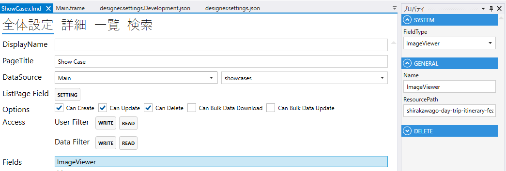
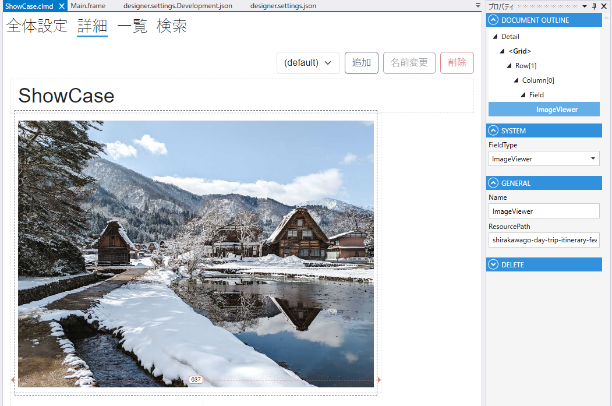

# ImageViewerField

## これは何か

**画像を表示するフィールド**。入力は受けず、表示専用です。画像のソースはリソースパスでも、プログラム的に設定する Base64 やメモリストリームでも構いません。


## いつ使うか

- 固定画像（ロゴ・説明図）の表示
- 動的に生成する画像の表示（グラフ・QR コードなど）
- ファイルアップロードなしで画像を見せるだけの場面

アップロードが必要なら [File](File.md) の `ShowPreview` を使います。

---

## デザイナでの設定



### 固有プロパティ

| プロパティ | 型 | 既定値 | 説明 |
|---|---|---|---|
| **ResourcePath** | string | `""` | 画像リソースのパス（`${APPLICATION_HOME}/Resource` からの相対パス） |
| **ObjectFit** | enum | `Contain` | 画像の収め方（`Contain` / `Cover` / `Fill` など） |
| **OnClick** | string | `""` | クリック時のスクリプト |

共通プロパティは [Field 共通プロパティ](common_properties.md) を参照。



---

## スクリプトから

### プロパティ・メソッド

| 名前 | 型・戻り値 | 説明 |
|---|---|---|
| `ResourcePath` | string | 画像リソースパス |
| `ImageExtension` | string | 画像の拡張子 |
| `Base64Data` | string | Base64 エンコードされた画像データ |
| `SetBase64Data(fileName, value)` | void | Base64 データで画像を設定 |
| `SetMemoryStream(fileName, MemoryStream)` | void | MemoryStream で画像を設定 |

共通プロパティは [Field 共通プロパティ](common_properties.md) を参照。

### よく使う例

```csharp
// 動的に画像を切り替える
Logo.ResourcePath = IsDarkMode.Value ? "logo-dark.png" : "logo-light.png";

// MemoryStream で画像を差し替える
var stream = await GenerateChartAsync();
Chart.SetMemoryStream("chart.png", stream);

// クリックで拡大表示など
void Thumbnail_OnClick()
{
    // 独自のダイアログで拡大
}
```

---

## 関連項目

- [Field 共通プロパティ](common_properties.md)
- [File](File.md) — アップロードが必要な場合
- [AnchorTag](AnchorTag.md) — 画像付きリンク
