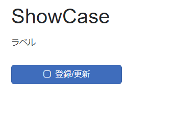
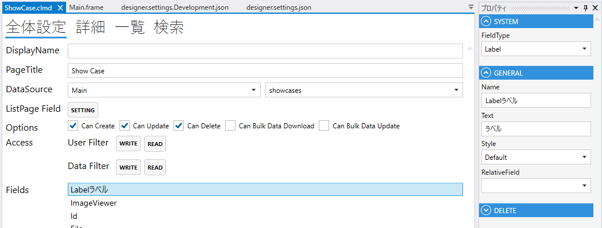
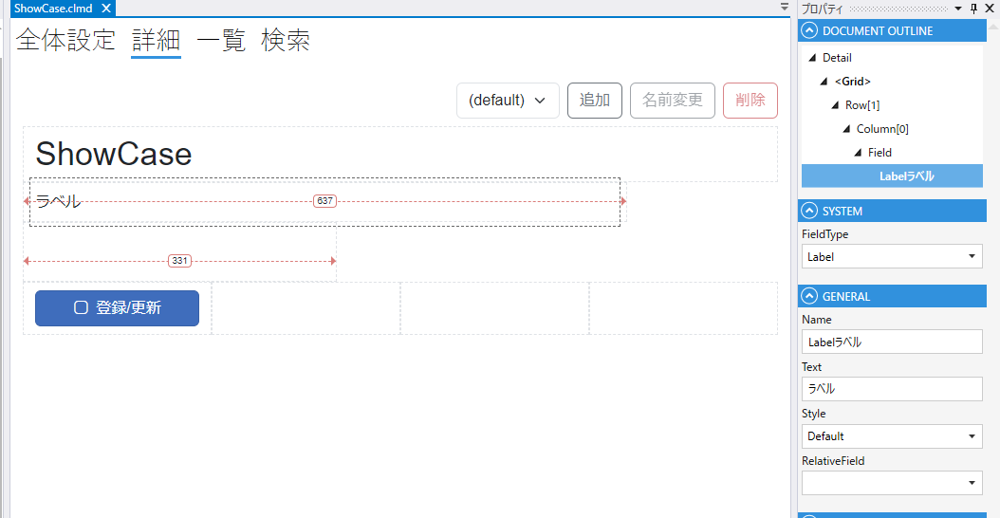
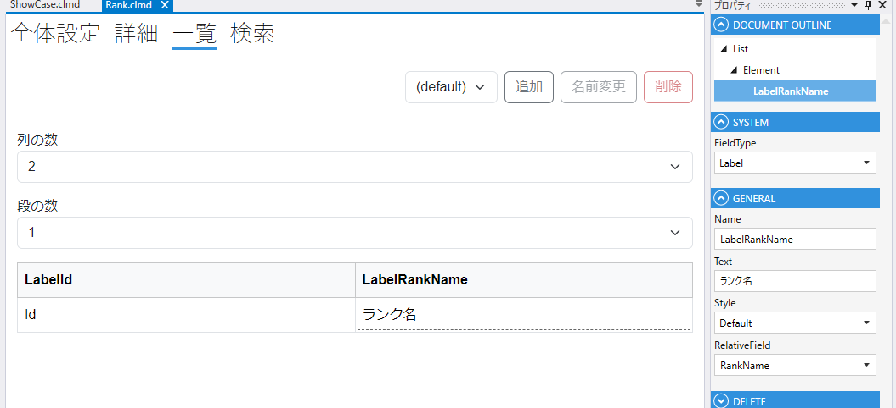

# LabelField

## これは何か

**文字列を表示するためのフィールド**。ユーザーからの入力を受けず、表示専用です。



## いつ使うか

- 画面上の見出し・セクションタイトル
- 入力 Field の横に表示するキャプション（`RelativeField` で連動）
- スタイルを変えた小見出し

---

## デザイナでの設定



### 固有プロパティ

| プロパティ | 型 | 既定値 | 説明 |
|---|---|---|---|
| **Style** | enum | `Default` | 見た目スタイル（見出しレベルなど） |
| **Text** | string | `"Label"` | 表示文字（複数行可） |
| **Icon** | string | `""` | 表示アイコン |
| **RelativeField** | string | `""` | 関連付ける Field の Name。必須マークやクリック連動が効くようになる |
| **OnClick** | string | `""` | クリック時のスクリプト |

共通プロパティは [Field 共通プロパティ](common_properties.md) を参照。

> `RelativeField` を設定すると、関連 Field が `IsRequired = true` の時に自動で「*」マークが付く、クリックで関連 Field にフォーカスが移る、といった挙動になります。





---

## スクリプトから

### プロパティ

| 名前 | 型 | 説明 |
|---|---|---|
| `Text` | string | 表示文字の取得・設定 |

共通プロパティは [Field 共通プロパティ](common_properties.md) を参照。

### よく使う例

```csharp
// 動的にラベルを変える
void Status_OnDataChanged()
{
    StatusLabel.Text = $"現在のステータス: {Status.DisplayText}";
}

// クリック時
void TitleLabel_OnClick()
{
    NavigationService.NavigateTo("Home");
}
```

---

## 関連項目

- [Field 共通プロパティ](common_properties.md)
- [MarkupString](MarkupString.md) — HTML を表示したい場合
- [AnchorTag](AnchorTag.md) — リンクとして使いたい場合
