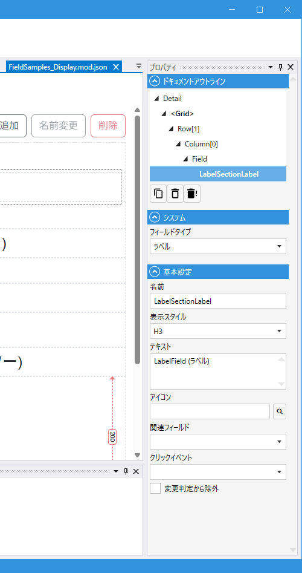

# LabelField (ラベル)

## これは何か

**文字列を表示するためのフィールド**。ユーザーからの入力を受けず、表示専用です。

## いつ使うか

- 画面上の見出し・セクションタイトル
- 入力 Field の横に表示するキャプション（`関連フィールド` で連動）
- スタイルを変えた小見出し

---

## デザイナでの設定



### プロパティ一覧

#### システム

| C#名 | 日本語表示名 | 説明 |
|---|---|---|
| - | フィールドタイプ | `ラベル` 固定 |

#### 基本設定

| C#名 | 日本語表示名 | 型 | 既定値 | 説明 |
|---|---|---|---|---|
| **Name** | 名前 | string | `""` | フィールド識別子 |
| **Style** | 表示スタイル | enum | `Default` | 見た目（`Default` / `H1` / `H2` / `H3` / `H4` / `H5` / `H6`） |
| **Text** | テキスト | string | `"Label"` | 表示文字（複数行可） |
| **Icon** | アイコン | string | `""` | 表示するアイコン |
| **RelativeField** | 関連フィールド | string | `""` | 関連付ける Field の Name（必須マーク連動・クリックフォーカスが効く） |
| **OnClick** | クリックイベント | string | `""` | クリック時のスクリプト |
| **IgnoreModification** | 変更判定から除外 | bool | `false` | 変更検知（IsModified）から除外 |

> LabelField は値を持たないため、`表示名` / `DBカラム` / `必須` などのプロパティはありません。

---

## Style（表示スタイル）のバリエーション

| 値 | 用途 |
|---|---|
| **Default** | 通常テキスト |
| **H1** 〜 **H6** | 見出しレベル（HTML の `<h1>` 〜 `<h6>` 相当） |

---

## RelativeField（関連フィールド）

他の Field の Name を指定すると、**ラベルと Field が視覚的に紐付きます**:

- 関連 Field が `IsRequired = true` の場合、ラベルに自動で「*」マークが付く
- ラベルをクリックすると、関連 Field にフォーカスが移る

入力項目の横に説明ラベルを配置する時に便利です。

---

## スクリプトから

### プロパティ

| 名前 | 型 | 説明 |
|---|---|---|
| `Text` | string | 表示文字の取得・設定 |

共通プロパティは [Field 共通プロパティ](common_properties.md) を参照。

### よく使う例

```csharp
// 動的にラベルを変える
void Status_OnDataChanged()
{
    StatusLabel.Text = $"現在のステータス: {Status.DisplayText}";
}

// クリック時
void TitleLabel_OnClick()
{
    NavigationService.NavigateTo("Home");
}
```

---

## 関連項目

- [Field 共通プロパティ](common_properties.md)
- [MarkupString](MarkupString.md) — HTML を表示したい場合
- [AnchorTag](AnchorTag.md) — リンクとして使いたい場合
