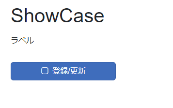
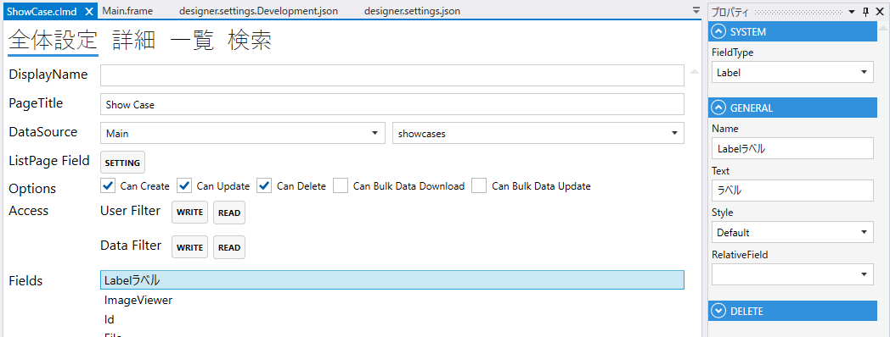
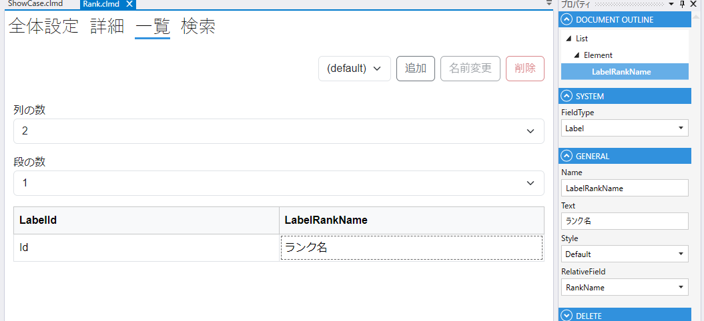
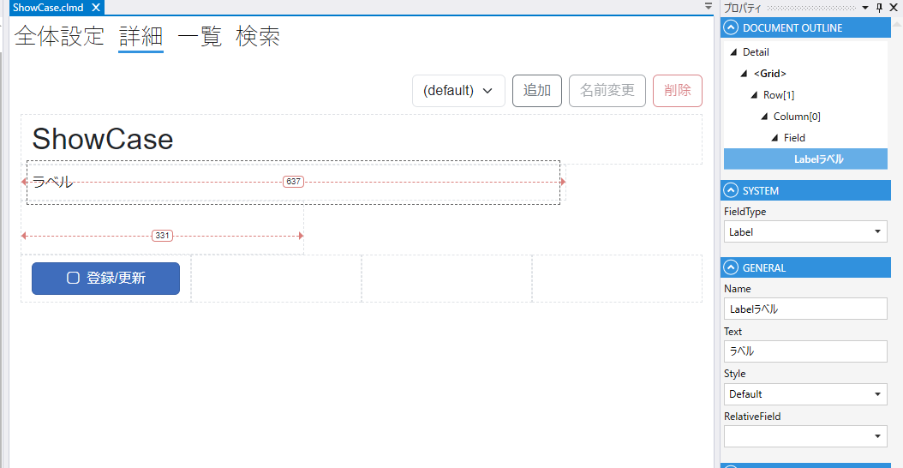

# Label

ラベルを表示するField

1. FieldType
    - Labelを設定する
2. Name
    - フィールド名の設定. 全体設定時に表示される.
3. Text
    - Labelに表示するテキストを設定する.
4. Style
    - H1～H6から選択する
5. RelativeField
    - 関連するFieldをしていする
    - 一覧でLabelのD&DでLabel,Fieldを設定できる
    - 

## スクリプト
| プロパティ名          | 型               | 説明                                            |
|-----------------|-----------------|-----------------------------------------------|
| BackgroundColor | string?         | Fieldの背景色                                     | 
| Color           | string?         | Fieldの色                                       |
| IsEnabled       | bool            | Fieldの有効/無効                                   |
| IsVisible       | bool            | Fieldの表示/非表示                                  |
| IsViewOnly      | bool            | Fieldの編集可/編集不可                                |
| Text            | string          | ラベルのテキスト                                      |