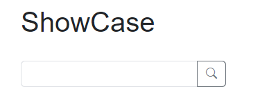
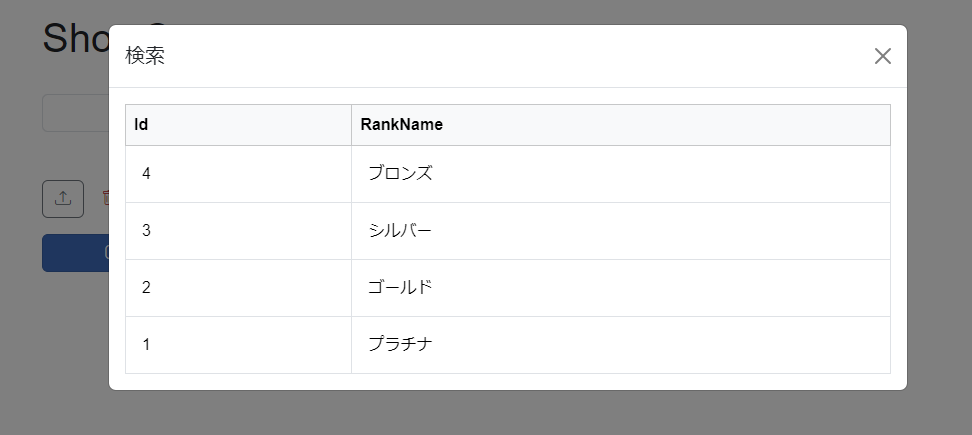
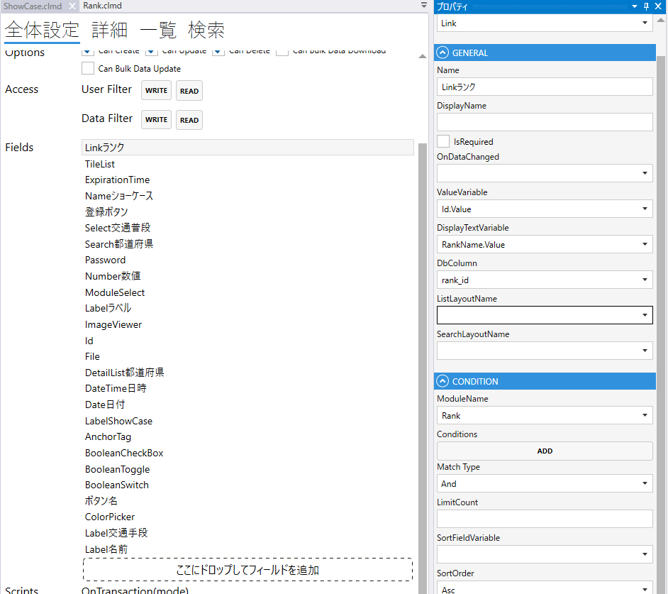

# Link

他のモジュールへのリンクのフィールド

### GENERAL
1. FieldType
    - Linkを設定する
2. Name
    - フィールド名の設定. 全体設定時に表示される.
3. DisplayDane
    - TBD
4. UseIndexSort
5. DeleteTogether
    - 親データの削除時に削除する
6. OnDataChanged
    - 変更のスクリプト
7. ValueVariable
    - 値に使用するカラム
8. DisplayTextVariable
    - 検索欄に表示するカラム
    - 空白にすると検索欄に直接値を入力して検索することが可能
9. DbColumn
    - テーブルの列
10. ListLayoutName
    - テーブルの列
11. SelectLayoutName

### CONDITION
- ModuleName
    - Moduleを指定する.
- Conditions
    - 表示する条件を指定する.
- MatchType
    - 複数の条件がある場合に，`And` or `Or` を指定する.
- LimitCount
    - 表示する上限
- SortFieldVariable
    - ソートに使用する項目
- SortOrder
    - ソート順（`Asc` or `Desc`）
      

