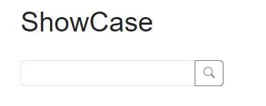
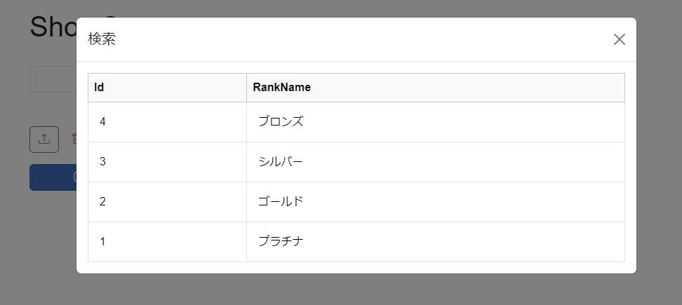
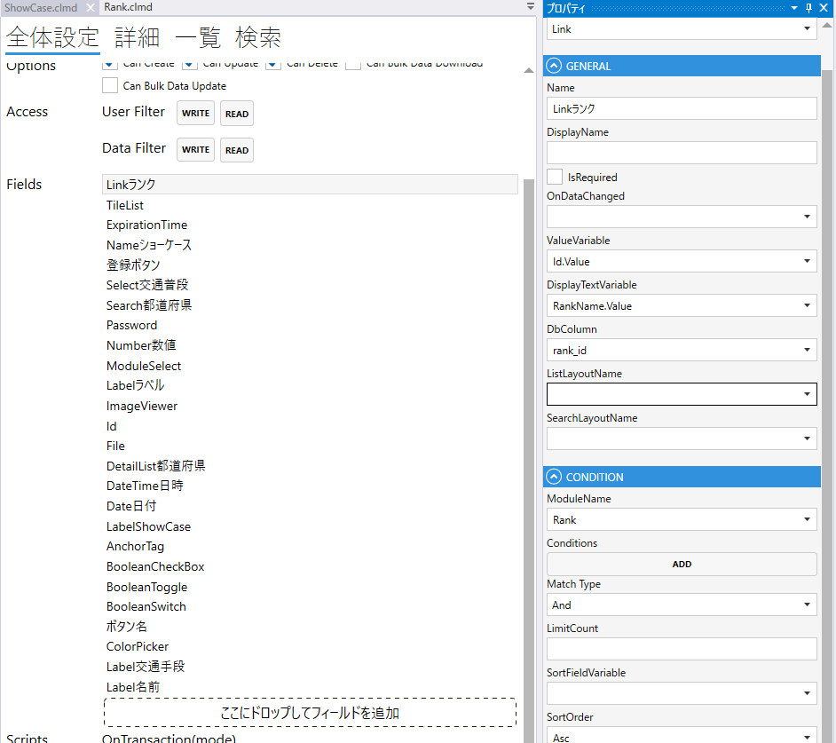

# LinkField

## これは何か

**他のモジュールのデータを選んで参照するフィールド**。入力欄＋検索ダイアログ＋表示文字のセットで提供され、外部キー的な使い方ができます。




## いつ使うか

- 顧客モジュールと注文モジュールのように、**他モジュールの 1 件を参照したい**場合
- 候補が多くて [Select](Select.md) のプルダウンに収まらない場合
- 検索ダイアログで絞り込んで選びたい場合

---

## デザイナでの設定



### 固有プロパティ

| プロパティ | 型 | 既定値 | 説明 |
|---|---|---|---|
| **DbColumn** | string | `""` | 対応する DB 列名（参照先の Id を保存） |
| **ListLayoutName** | string | `""` | 検索結果として表示するリンク先の List レイアウト |
| **SearchLayoutName** | string | `""` | 検索ダイアログのリンク先 Search レイアウト |
| **ValueVariable** | string | `""` | リンク先で「値」として使う Field 名 |
| **DisplayTextVariable** | string | `""` | リンク先で「表示文字」として使う Field 名 |
| **SearchCondition** | SearchCondition | - | リンク先への絞り込み条件 |
| **OnSearchButtonClicked** | string | `""` | 検索ボタンクリック時のスクリプト |

共通プロパティは [Field 共通プロパティ](common_properties.md) を参照。

### CONDITION（リンク先絞り込み）

`SearchCondition` では以下を指定します:

- **ModuleName** — リンク先モジュール名
- **Conditions** — 絞り込み条件
- **MatchType** — 条件の結合（`And` / `Or`）
- **LimitCount** — 表示上限
- **SortFieldVariable** — ソートキー
- **SortOrder** — 昇順・降順

---

## 使い方の流れ

1. リンク先モジュールに **List レイアウト**と**Search レイアウト**を用意する
2. LinkField の `ListLayoutName` / `SearchLayoutName` にそれらを指定
3. `ValueVariable` にリンク先の Id、`DisplayTextVariable` に表示用の Field を指定
4. 画面でリンク先を選ぶと、LinkField に Id が格納される

---

## スクリプトから

### プロパティ・メソッド

| 名前 | 型・戻り値 | 説明 |
|---|---|---|
| `Value` | string? | 選択されたリンク先の Id |
| `DisplayText` | string? | 選択されたリンク先の表示文字 |
| `SearchValue` | string? | 検索値 |
| `SearchIsEmpty` | bool? | 空検索 |
| `SetValueAsync(string?)` | Task | 値を設定 |
| `SetAdditionalCondition(ModuleSearcher)` | void | 検索の絞り込み条件を追加 |
| `GetSearchConditionAssignedValue()` | object? | 現在の検索条件の値 |

共通プロパティは [Field 共通プロパティ](common_properties.md) を参照。

### よく使う例

```csharp
// 別 Field の選択に応じて、Link の候補を絞り込む
void Category_OnDataChanged()
{
    var cond = new ModuleSearcher<Product>();
    cond.AddEquals(p => p.CategoryId.Value, Category.Value);
    Product.SetAdditionalCondition(cond);
}

// プログラム的に値を設定
await Customer.SetValueAsync(customerId);
```

---

## 関連項目

- [Field 共通プロパティ](common_properties.md)
- [Select](Select.md) — プルダウン形式
- [Module](Module.md) — 参照先の内容を画面内に埋め込む場合
- [チュートリアル: モジュール連携](../tutorials/tutorial_modules.md)
