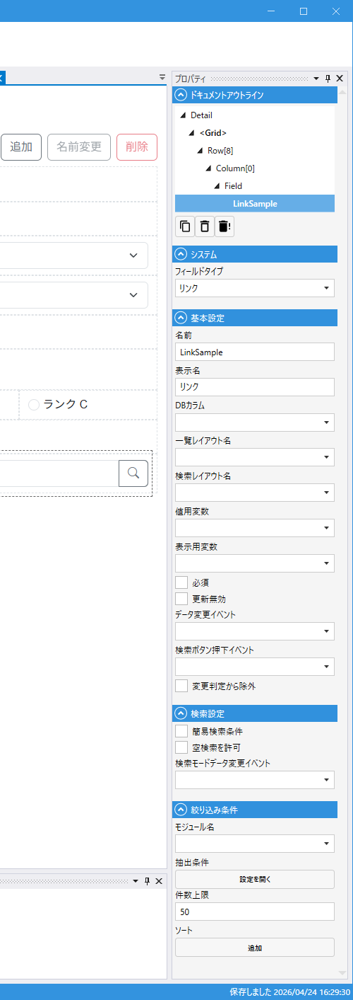

# LinkField (リンク)

## これは何か

**他のモジュールのデータを選んで参照するフィールド**。入力欄＋検索ダイアログ＋表示文字のセットで提供され、外部キー的な使い方ができます。

## いつ使うか

- 顧客モジュールと注文モジュールのように、**他モジュールの 1 件を参照したい**場合
- 候補が多くて [Select](Select.md) のプルダウンに収まらない場合
- 検索ダイアログで絞り込んで選びたい場合

---

## デザイナでの設定



### プロパティ一覧

#### システム

| C#名 | 日本語表示名 | 説明 |
|---|---|---|
| - | フィールドタイプ | `リンク` 固定 |

#### 基本設定

| C#名 | 日本語表示名 | 型 | 既定値 | 説明 |
|---|---|---|---|---|
| **Name** | 名前 | string | `""` | フィールド識別子 |
| **DisplayName** | 表示名 | string | `""` | 画面表示用の名前 |
| **DbColumn** | DBカラム | string | `""` | 対応する DB 列名（参照先の Id を保存） |
| **ListLayoutName** | 一覧レイアウト名 | string | `""` | 検索結果として表示するリンク先の List レイアウト |
| **SearchLayoutName** | 検索レイアウト名 | string | `""` | 検索ダイアログのリンク先 Search レイアウト |
| **ValueVariable** | 値用変数 | string | `""` | リンク先で「値」として使う Field 名 |
| **DisplayTextVariable** | 表示用変数 | string | `""` | リンク先で「表示文字」として使う Field 名 |
| **IsRequired** | 必須 | bool | `false` | 入力必須 |
| **IsUpdateProtected** | 更新無効 | bool | `false` | 更新時に値を変更できないようにする |
| **OnDataChanged** | データ変更イベント | string | `""` | 値変更時のスクリプトイベント |
| **OnSearchButtonClicked** | 検索ボタン押下イベント | string | `""` | 検索ボタンクリック時のスクリプト |
| **IgnoreModification** | 変更判定から除外 | bool | `false` | 変更検知（IsModified）から除外 |

#### 検索設定

| C#名 | 日本語表示名 | 型 | 既定値 | 説明 |
|---|---|---|---|---|
| **IsSimpleSearchParameter** | 簡易検索条件 | bool | `false` | 簡易検索の対象にする |
| **AllowEmptySearch** | 空検索を許可 | bool | `false` | 空での検索を許可する |
| **OnSearchDataChanged** | 検索モードデータ変更イベント | string | `""` | 検索条件が変更された時のスクリプトイベント |

#### 絞り込み条件

リンク先モジュールへの絞り込み条件を指定します。

| C#名 | 日本語表示名 | 型 | 既定値 | 説明 |
|---|---|---|---|---|
| **SearchCondition.ModuleName** | モジュール名 | string | `""` | リンク先のモジュール名 |
| **SearchCondition.Condition** | 抽出条件 | MultiMatchCondition | - | 絞り込み条件（「設定を開く」から編集） |
| **SearchCondition.LimitCount** | 件数上限 | int | `50` | 検索結果の最大件数 |
| **SearchCondition.SortConditions** | ソート | List | `[]` | 検索結果の表示順 |

---

## 使い方の流れ

1. リンク先モジュールに **List レイアウト**と**Search レイアウト**を用意する
2. LinkField の `ListLayoutName` / `SearchLayoutName` にそれらを指定
3. `絞り込み条件.モジュール名` にリンク先のモジュール名を設定
4. `ValueVariable` にリンク先の Id、`DisplayTextVariable` に表示用の Field を指定
5. 画面でリンク先を選ぶと、LinkField に Id が格納される

---

## スクリプトから

### プロパティ・メソッド

| 名前 | 型・戻り値 | 説明 |
|---|---|---|
| `Value` | string? | 選択されたリンク先の Id |
| `DisplayText` | string? | 選択されたリンク先の表示文字 |
| `SearchValue` | string? | 検索値 |
| `SearchIsEmpty` | bool? | 空検索 |
| `AllowReloadLinkData` | bool | リンク先データの自動再読込を許可 |
| `SetValueAsync(string?)` | Task | 値を設定 |
| `SetAdditionalCondition(ModuleSearcher)` | void | 検索の絞り込み条件を追加 |
| `GetSearchConditionAssignedValue()` | SearchCondition | 変数を解決済みの検索条件を取得 |

共通プロパティは [Field 共通プロパティ](common_properties.md) を参照。

### よく使う例

```csharp
// 別 Field の選択に応じて、Link の候補を絞り込む
void Category_OnDataChanged()
{
    var cond = new ModuleSearcher<Product>();
    cond.AddEquals(p => p.CategoryId.Value, Category.Value);
    Product.SetAdditionalCondition(cond);
}

// プログラム的に値を設定
await Customer.SetValueAsync(customerId);
```

---

## 検索での挙動

LinkField の検索 UI は **テキスト入力 + 検索ダイアログを開くアイコン** の組み合わせです。

| モード | 挙動 |
|---|---|
| **簡易**（`IsSimpleSearchParameter=true`） | テキスト入力（部分一致）または 検索アイコンから関連モジュールを開いて 1 件選択 |
| **詳細**（`IsSimpleSearchParameter=false`） | 上記 + 比較演算子ドロップダウン（一致／部分一致／空白／空白でない） |

選択された行の ID で **完全一致** 検索。テキスト入力に直接書いた場合は表示テキスト側で部分一致検索になります（参照先の `DisplayTextField` の値を `LIKE` で比較）。

### 空検索（`AllowEmptySearch=true`）

詳細モードで「**空白**」「**空白でない**」が選べるようになります。外部キーが NULL のレコードを絞り込みたい時に使用。

### スクリプトから

```csharp
// ID で直接設定
Customer.SearchValue = "10";

// 空白モード
await Customer.SetSearchIsEmptyAsync(true);
```

検索全体の仕組みは [SearchField](Search.md#検索の仕組み) を参照。

---

## 関連項目

- [Field 共通プロパティ](common_properties.md)
- [Select](Select.md) — プルダウン形式
- [Module](Module.md) — 参照先の内容を画面内に埋め込む場合
- [SearchField](Search.md) — 検索全体の仕組み
- [チュートリアル: モジュール連携](../tutorials/tutorial_modules.md)
