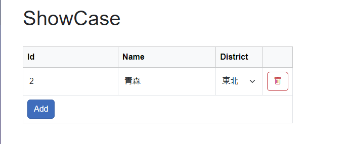
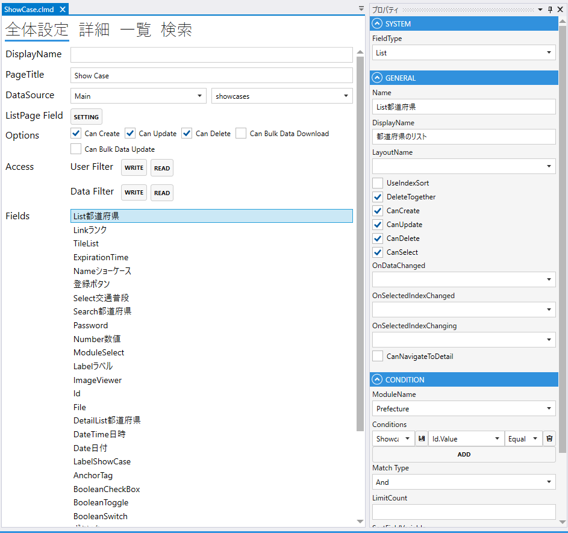

# List

Listでmoduleを表示する.

### GENERAL
1. FieldType
    - Listを設定する
2. Name
    - フィールド名の設定. 全体設定時に表示される.
3. DisplayDane
    - TBD
4. UseIndexSort
5. DeleteTogether
    - 親データの削除時に削除する
6. CanCreate
    - 親画面で作成する
7. CanUpdate
    - 親画面で更新する
8. CanDelete
    - 親画面で削除する
9. CanSelect
    - 親画面で選択する
10. CnNavigateToDetail
    - 詳細への遷移

### CONDITION
- ModuleName
    - Moduleを指定する.
- Conditions
    - 表示する条件を指定する.
- MatchType
    - 複数の条件がある場合に，`And` or `Or` を指定する.
- LimitCount
    - 表示する上限
- SortFieldVariable
    - ソートに使用する項目
- SortOrder
    - ソート順（`Asc` or `Desc`）
      

## スクリプト
| プロパティ名          | 型            | 説明             |
|-----------------|--------------|----------------|
| AllowLoad       | bool         | ロードの可否         |
| Color           | string?      | Fieldの色        |
| BackgroundColor | string?      | Fieldの背景色      | 
| IsEnabled       | bool         | Fieldの有効/無効    |
| IsVisible       | bool         | Fieldの表示/非表示   |
| IsViewOnly      | bool         | Fieldの編集可/編集不可 |
| IsModified      | bool         | Fieldが変更されたどうか |
| Limit           | int?         | 表示する最大件数       |
| Page            | int?         | ページ            |
| PageCount       | int?         | ページ数           |
| RowCount        | int?         | 行のカウント         |
| Rows            | List<Module> | 全モジュールのリスト     |
| SelectedIndex   | int          | 選択されたインデックス    |

| メソッド名                                       | 戻り値    | 説明                  |
|---------------------------------------------|--------|---------------------|
| AddRow()                                    | Module | 1行追加する              |
| AddRow(Module row)                          | Module | 指定されたモジュールで1行追加する   |
| DeleteRow(Module row)                       | なし     | 指定されたモジュールを削除する     |
| DeleteAllRows()                             | なし     | 全て削除する              |
| Reload()                                    | なし     | リロードする              |
| SetSearchCondition(ModuleSearcher searcher) | なし     | 指定された検索条件をセットする     |
| UpdateRow(int index, Module src)            | なし     | 指定されたインデックス，引数で更新する |
