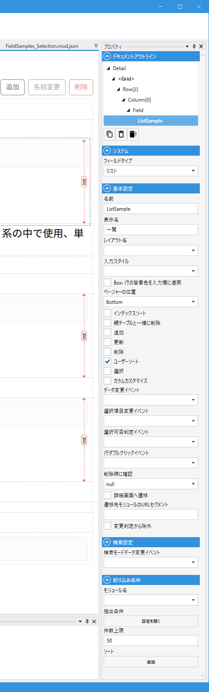
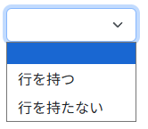

# ListField (リスト)

## これは何か

**複数件のデータを表形式（テーブル）で一覧表示するフィールド**。ページング・ソート・追加・編集・削除が標準で動きます。

## いつ使うか

- 一覧画面で複数件のデータを表で並べる
- 詳細画面の中で**親子関係**（1:N）の子データを表示する
- 検索結果を表形式で見せる

カード形式なら [DetailList](DetailList.md)、タイル状なら [TileList](TileList.md) を使います。

---

## デザイナでの設定



### プロパティ一覧

#### システム

| C#名 | 日本語表示名 | 説明 |
|---|---|---|
| - | フィールドタイプ | `リスト` 固定 |

#### 基本設定

| C#名 | 日本語表示名 | 型 | 既定値 | 説明 |
|---|---|---|---|---|
| **Name** | 名前 | string | `""` | フィールド識別子 |
| **DisplayName** | 表示名 | string | `""` | 画面表示用の名前 |
| **LayoutName** | レイアウト名 | string | `""` | 表示に使う List レイアウト名 |
| **FormControlStyle** | 入力スタイル | enum? | null | セル内の入力コントロールのスタイル |
| **ApplyBackgroundToBoxInput** | Box: 行の背景色を入力欄に適用 | bool | `false` | 入力欄にも行背景色を適用 |
| **PagerPosition** | ページャーの位置 | enum | `Top` | ページャーの位置（`Top` / `Bottom`） |
| **UseIndexSort** | インデックスソート | bool | `false` | 表示順を Index として保存 |
| **DeleteTogether** | 親テーブルと一緒に削除 | bool | `false` | 親データ削除時に一括削除 |
| **ReplaceMode** | 洗い替え | enum | `None` | 保存時の入れ替え方式（`None` / `All` / `UpdateAsDeleteInsert`）。[下記](#洗い替えreplacemode) 参照 |
| **CanCreate** | 追加 | bool | `false` | 親画面から新規作成を許可 |
| **CanUpdate** | 更新 | bool | `false` | 親画面から編集を許可 |
| **CanDelete** | 削除 | bool | `false` | 親画面から削除を許可 |
| **CanUserSort** | ユーザーソート | bool | `true` | ユーザーが列ヘッダーでソート可能 |
| **CanSelect** | 選択 | bool | `false` | 行選択を許可 |
| **CanCustomizeColumns** | カラムカスタマイズ | bool | `false` | 列表示のユーザーカスタマイズを許可 |
| **OnDataChanged** | データ変更イベント | string | `""` | データ変更時のスクリプト |
| **OnSelectedIndexChanged** | 選択項目変更イベント | string | `""` | 選択行変更時のスクリプト |
| **OnSelectedIndexChanging** | 選択可否判定イベント | string | `""` | 選択行変更前のスクリプト（引数 `int index` → `bool`） |
| **OnDoubleClickRow** | 行ダブルクリックイベント | string | `""` | 行ダブルクリック時のスクリプト（引数 `int index`） |
| **ConfirmBeforeDelete** | 削除時に確認 | bool? | null | 削除前に確認ダイアログを出す（null なら既定挙動） |
| **CanNavigateToDetail** | 詳細画面へ遷移 | bool | `false` | 行クリックで詳細画面に遷移 |
| **NavigateModuleUrlSegment** | 遷移先モジュールのURLセグメント | string | `""` | 詳細遷移先の URL セグメント |
| **IgnoreModification** | 変更判定から除外 | bool | `false` | 変更検知（IsModified）から除外 |

#### 検索設定

| C#名 | 日本語表示名 | 型 | 既定値 | 説明 |
|---|---|---|---|---|
| **OnSearchDataChanged** | 検索モードデータ変更イベント | string | `""` | 検索条件が変更された時のスクリプト |

#### 絞り込み条件（表示データ）

| C#名 | 日本語表示名 | 型 | 既定値 | 説明 |
|---|---|---|---|---|
| **SearchCondition.ModuleName** | モジュール名 | string | `""` | 表示するデータのモジュール |
| **SearchCondition.Condition** | 抽出条件 | MultiMatchCondition | - | 絞り込み条件 |
| **SearchCondition.LimitCount** | 件数上限 | int | `50` | 表示する最大件数 |
| **SearchCondition.SortConditions** | ソート | List | `[]` | ソート順 |

---

## スクリプトから

### プロパティ

| 名前 | 型 | 説明 |
|---|---|---|
| `Rows` | List\<Module\> | 全行のデータ |
| `RowCount` | int | 行数 |
| `SelectedIndex` | int | 選択されている行のインデックス（未選択時 -1） |
| `Page` | int | 現在のページ |
| `PageCount` | int | 総ページ数 |
| `TotalCount` | int | 総件数 |
| `Limit` | int? | ページあたりの件数（`SearchCondition.LimitCount`） |
| `AllowLoad` | bool | ロードの可否 |
| `IsValid` | bool | List 自身が `SetError` されておらず、かつ**全行の全 Field が IsValid** のとき true |
| `SearchComparison` | MatchComparison? | 検索比較（`Exists` / `NotExists`） |

### メソッド

| 名前 | 戻り値 | 説明 |
|---|---|---|
| `AddRow()` | Task\<Module\> | 空行を末尾に追加 |
| `AddRow(Module)` | Task\<Module\> | 指定行を末尾に追加 |
| `AddRow(ModuleData)` | Task\<Module\> | ModuleData を末尾に追加 |
| `AddRows(int count)` | Task\<List\<Module\>\> | 指定件数だけ空行追加 |
| `AddRows(List<Module>)` / `AddRows(List<ModuleData>)` | Task\<List\<Module\>\> | まとめて追加 |
| `InsertRow(int, Module)` | Task\<Module\> | 指定位置に挿入 |
| `InsertRows(int, List<Module>)` / `InsertRows(int, List<ModuleData>)` | Task\<List\<Module\>\> | 指定位置にまとめて挿入 |
| `UpdateRow(int, Module)` | Task | 指定位置を更新 |
| `DeleteRow(Module)` | Task | 指定行を削除 |
| `DeleteAllRows()` | Task | 全行削除 |
| `Reload()` | Task | データを再取得 |
| `SetAdditionalCondition(ModuleSearcher)` | Task | 検索条件を追加 |
| `SetSelectedIndexAsync(int)` | Task | 選択行を変更 |
| `SetSearchComparisonAsync(MatchComparison?)` | Task | 検索比較を設定 |
| `ShowCustomDialog()` | Task | 独自のダイアログを表示 |

共通プロパティは [Field 共通プロパティ](common_properties.md) を参照。

### よく使う例

```csharp
// 選択行に応じて別の処理を走らせる
void List_OnSelectedIndexChanged()
{
    var selected = List.Rows[List.SelectedIndex];
    DetailPanel.SetValue(selected.Id.Value);
}

// 条件を追加してリロード
var cond = new ModuleSearcher<Order>();
cond.AddEquals(o => o.CustomerId.Value, CurrentCustomer.Id.Value);
await List.SetAdditionalCondition(cond);
await List.Reload();

// プログラム的に行追加
var newRow = await List.AddRow();
newRow.Name.Value = "新規";
```

---

## 洗い替え（ReplaceMode）

保存（Submit）時の挙動を「差分の追加/更新/削除」から**入れ替え**に切り替えるプロパティです。

| 値 | 挙動 |
|---|---|
| `None`（既定） | 通常の追加/更新/削除 |
| `All` | `SearchCondition` に一致する DB 上のデータを**全件削除**し、現在の行を**すべて新規行として追加**し直す（完全洗い替え） |
| `UpdateAsDeleteInsert` | **変更行だけ**を「削除してから新規追加」に置き換える。未変更行はそのまま、新規行は通常どおり追加、UI で削除した行は削除 |

- `All` は取込データの総入れ替えや構成明細の確定保存に。削除範囲は `SearchCondition`（親 Id で絞った条件）に一致する分だけで、他の親の明細には影響しません。条件が空のときは全件削除を防ぐためサーバー側でエラーになります
- `UpdateAsDeleteInsert` は一意制約のある列（座席番号・表示順など）の**値の入れ替え**が UPDATE だと制約違反になるのを、削除が先に実行されることで回避します
- どちらも作り直された行の **Id は振り直され**、`CreatedAt` 等の予約システムフィールドは新規としてセットし直されます

具体的な作り方は [洗い替えパターン](../patterns/replace_mode.md) を参照。

---

## 検索での挙動

ListField を**検索レイアウトに配置**すると、「親レコードを、関連する子レコードの有無で絞り込む」検索 UI として機能します。

例: 顧客モジュールに注文を表示する `Orders` という ListField があるとき、顧客の検索画面に `Orders` を置くと、「注文を持っている顧客」「注文を持っていない顧客」を絞り込めます。

### 検索 UI



ドロップダウンが 1 つだけ出ます。選択肢は次の 3 つ:

| 選択肢 | 挙動 |
|---|---|
| **（空欄）** | この条件で絞り込まない |
| **行を持つ** | 関連する子レコードが**1 件以上ある**親レコードのみ表示（SQL の `EXISTS` 相当） |
| **行を持たない** | 関連する子レコードが**1 件もない**親レコードのみ表示（SQL の `NOT EXISTS` 相当） |

### 子レコードの絞り込み条件

「どのレコードを子と見なすか」は、ListField のプロパティ **`SearchCondition.Condition`** で指定した条件で決まります。通常は親と子を結ぶ外部キー関係（`Orders.CustomerId == Customer.Id` 等）を設定しておきます。

`SearchCondition.Condition` に追加の条件（例: `Status == "有効"`）を入れると、それも子の絞り込みに反映されます。例えば「**有効な**注文を持っている顧客だけ表示」という検索になります。

### スクリプトから

検索 UI の状態は `SearchComparison` プロパティで読み書きできます。

```csharp
// 検索条件をプログラム的に設定
await Orders.SetSearchComparisonAsync(MatchComparison.Exists);

// 解除
await Orders.SetSearchComparisonAsync(null);
```

`SearchComparison` に設定できる値は `Exists` / `NotExists` / `null` のみです。

検索全体の仕組みは [SearchField](Search.md#検索の仕組み) / [モジュール検索設定](../module/module_search.md) を参照。

---

## 関連項目

- [Field 共通プロパティ](common_properties.md)
- [DetailList](DetailList.md) — カード形式で表示
- [TileList](TileList.md) — タイル形式で表示
- [ListNumber](ListNumber.md) — 行番号列
- [チュートリアル: モジュール連携](../tutorials/tutorial_modules.md)
