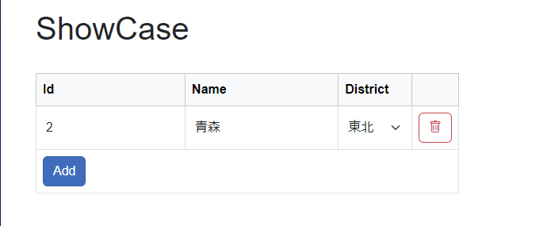
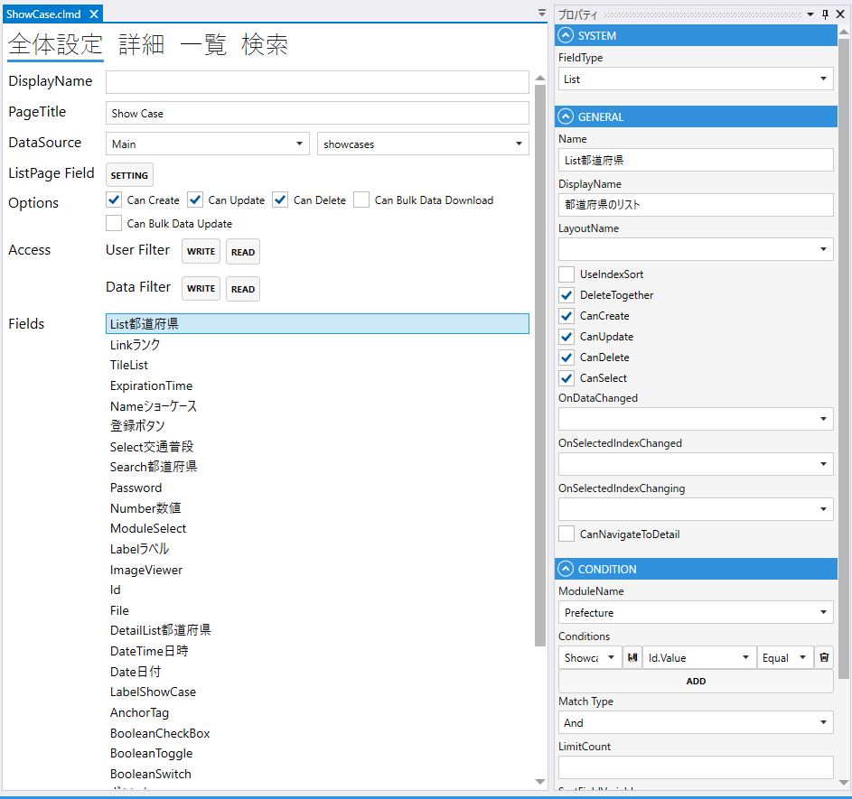
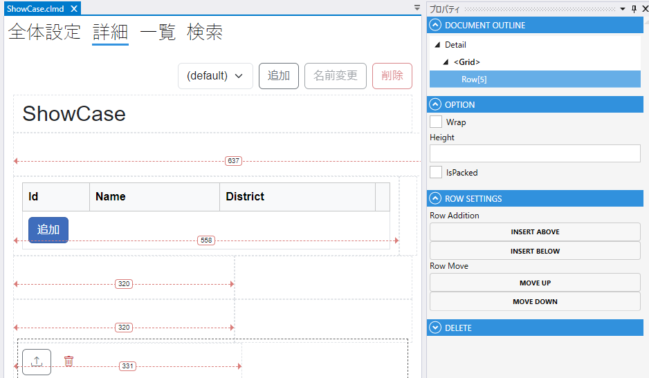

# ListField

## これは何か

**複数件のデータを表形式（テーブル）で一覧表示するフィールド**。ページング・ソート・追加・編集・削除が標準で動きます。



## いつ使うか

- 一覧画面で複数件のデータを表で並べる
- 詳細画面の中で**親子関係**（1:N）の子データを表示する
- 検索結果を表形式で見せる

カード形式なら [DetailList](DetailList.md)、タイル状なら [TileList](TileList.md) を使います。

---

## デザイナでの設定



### 固有プロパティ

| プロパティ | 型 | 既定値 | 説明 |
|---|---|---|---|
| **LayoutName** | string | `""` | 表示に使う List レイアウト名 |
| **FormControlStyle** | enum? | null | フォームコントロールのスタイル |
| **ApplyBackgroundToBoxInput** | bool | `false` | 入力欄背景を適用 |
| **PagerPosition** | enum | `Top` | ページャーの位置 |
| **UseIndexSort** | bool | `false` | 表示順を Index として保存 |
| **DeleteTogether** | bool | `false` | 親データ削除時に一括削除 |
| **CanCreate** | bool | `false` | 親画面から新規作成を許可 |
| **CanUpdate** | bool | `false` | 親画面から編集を許可 |
| **CanDelete** | bool | `false` | 親画面から削除を許可 |
| **CanUserSort** | bool | `true` | ユーザーが列ヘッダーでソート可能 |
| **CanSelect** | bool | `false` | 行選択を許可 |
| **CanCustomizeColumns** | bool | `false` | 列表示のユーザーカスタマイズを許可 |
| **CanNavigateToDetail** | bool | （条件依存） | 行クリックで詳細画面に遷移 |
| **NavigateModuleUrlSegment** | string | `""` | 遷移先 URL セグメント |
| **OnDataChanged** | string | `""` | データ変更時のスクリプト |
| **OnSelectedIndexChanged** | string | `""` | 選択行変更時のスクリプト |
| **OnSelectedIndexChanging** | string | `""` | 選択行変更前のスクリプト（引数 index → bool） |
| **OnDoubleClickRow** | string | `""` | 行ダブルクリック時のスクリプト（引数 index） |
| **ConfirmBeforeDelete** | bool? | null | 削除前に確認ダイアログを出す |

共通プロパティは [Field 共通プロパティ](common_properties.md) を参照。

### CONDITION（表示データの絞り込み）

`SearchCondition` の中身で指定します:

- **ModuleName** — 表示するデータのモジュール
- **Conditions** — 絞り込み条件
- **MatchType** — 条件の結合（`And` / `Or`）
- **LimitCount** — 表示する最大件数
- **SortFieldVariable** — ソートに使う Field
- **SortOrder** — ソート順（`Asc` / `Desc`）



---

## スクリプトから

### プロパティ

| 名前 | 型 | 説明 |
|---|---|---|
| `Rows` | List\<Module\> | 全行のデータ |
| `RowCount` | int | 行数 |
| `SelectedIndex` | int | 選択されている行のインデックス（未選択時 -1） |
| `Page` | int | 現在のページ |
| `PageCount` | int | 総ページ数 |
| `TotalCount` | int | 総件数 |
| `Limit` | int? | ページあたりの件数（`SearchCondition.LimitCount`） |
| `AllowLoad` | bool | ロードの可否 |
| `SearchComparison` | MatchComparison? | 検索比較（`Exists` / `NotExists`） |

### メソッド

| 名前 | 戻り値 | 説明 |
|---|---|---|
| `AddRow()` | Task\<Module\> | 空行を末尾に追加 |
| `AddRow(Module)` | Task\<Module\> | 指定行を末尾に追加 |
| `AddRow(ModuleData)` | Task\<Module\> | ModuleData を末尾に追加 |
| `AddRows(int count)` | Task\<List\<Module\>\> | 指定件数だけ空行追加 |
| `AddRows(List<Module>)` / `AddRows(List<ModuleData>)` | Task\<List\<Module\>\> | まとめて追加 |
| `InsertRow(int, Module)` | Task\<Module\> | 指定位置に挿入 |
| `InsertRows(int, List<Module>)` / `InsertRows(int, List<ModuleData>)` | Task\<List\<Module\>\> | 指定位置にまとめて挿入 |
| `UpdateRow(int, Module)` | Task | 指定位置を更新 |
| `DeleteRow(Module)` | Task | 指定行を削除 |
| `DeleteAllRows()` | Task | 全行削除 |
| `Reload()` | Task | データを再取得 |
| `SetAdditionalCondition(ModuleSearcher)` | Task | 検索条件を追加 |
| `SetSelectedIndexAsync(int)` | Task | 選択行を変更 |
| `SetSearchComparisonAsync(MatchComparison?)` | Task | 検索比較を設定 |
| `ShowCustomDialog()` | Task | 独自のダイアログを表示 |

共通プロパティは [Field 共通プロパティ](common_properties.md) を参照。

### よく使う例

```csharp
// 選択行に応じて別の処理を走らせる
void List_OnSelectedIndexChanged()
{
    var selected = List.Rows[List.SelectedIndex];
    DetailPanel.SetValue(selected.Id.Value);
}

// 条件を追加してリロード
var cond = new ModuleSearcher<Order>();
cond.AddEquals(o => o.CustomerId.Value, CurrentCustomer.Id.Value);
List.SetAdditionalCondition(cond);
await List.Reload();

// プログラム的に行追加
var newRow = await List.AddRow();
newRow.Name.Value = "新規";
```

---

## 関連項目

- [Field 共通プロパティ](common_properties.md)
- [DetailList](DetailList.md) — カード形式で表示
- [TileList](TileList.md) — タイル形式で表示
- [ListNumber](ListNumber.md) — 行番号列
- [チュートリアル: モジュール連携](../tutorials/tutorial_modules.md)
