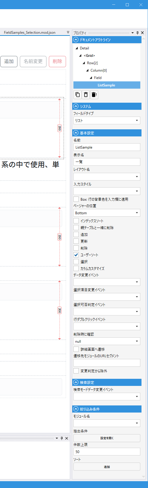
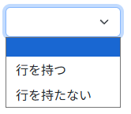

# ListField (リスト)

## これは何か

**複数件のデータを表形式（テーブル）で一覧表示するフィールド**。ページング・ソート・追加・編集・削除が標準で動きます。

## いつ使うか

- 一覧画面で複数件のデータを表で並べる
- 詳細画面の中で**親子関係**（1:N）の子データを表示する
- 検索結果を表形式で見せる

カード形式なら [DetailList](DetailList.md)、タイル状なら [TileList](TileList.md) を使います。

---

## デザイナでの設定



### プロパティ一覧

#### システム

| C#名 | 日本語表示名 | 説明 |
|---|---|---|
| - | フィールドタイプ | `リスト` 固定 |

#### 基本設定

| C#名 | 日本語表示名 | 型 | 既定値 | 説明 |
|---|---|---|---|---|
| **Name** | 名前 | string | `""` | フィールド識別子 |
| **DisplayName** | 表示名 | string | `""` | 画面表示用の名前 |
| **LayoutName** | レイアウト名 | string | `""` | 表示に使う List レイアウト名 |
| **FormControlStyle** | 入力スタイル | enum? | null | セル内の入力コントロールのスタイル |
| **ApplyBackgroundToBoxInput** | Box: 行の背景色を入力欄に適用 | bool | `false` | 入力欄にも行背景色を適用 |
| **PagerPosition** | ページャーの位置 | enum | `Top` | ページャーの位置（`Top` / `Bottom`） |
| **IsInMemoryPaging** | 全件ロードしてメモリ内でページング | bool | `false` | 全件を読み込み、画面内でページを切り替える。[下記](#全件ロードしてメモリ内でページングisinmemorypaging) 参照 |
| **ConfirmBeforePageChange** | ページ切り替え時に未保存変更の確認を出す | bool | `true` | 一覧に未保存の変更があるときにページを切り替えると、変更が失われる旨の確認を出す |
| **FixedColumnCount** | 固定列数 | int | `0` | 横スクロール時に左から指定列数を固定表示する。1 行構成（セル結合なし）の List レイアウトで、固定する列すべてに幅が指定されている場合に有効 |
| **UseIndexSort** | インデックスソート | bool | `false` | 表示順を Index として保存 |
| **DeleteTogether** | 親テーブルと一緒に削除 | bool | `false` | 親データ削除時に一括削除 |
| **ReplaceMode** | 洗い替え | enum | `None` | 保存時の入れ替え方式（`None` / `All` / `UpdateAsDeleteInsert`）。[下記](#洗い替えreplacemode) 参照 |
| **CanCreate** | 追加 | bool | `false` | 親画面から新規作成を許可 |
| **CanUpdate** | 更新 | bool | `false` | 親画面から編集を許可 |
| **CanDelete** | 削除 | bool | `false` | 親画面から削除を許可 |
| **CanUserSort** | ユーザーソート | bool | `true` | ユーザーが列ヘッダーでソート可能 |
| **CanSelect** | 選択 | bool | `false` | 行選択を許可 |
| **CanCustomizeColumns** | カラムカスタマイズ | bool | `false` | 列表示のユーザーカスタマイズを許可 |
| **OnDataChanged** | データ変更イベント | string | `""` | データ変更時のスクリプト |
| **OnSelectedIndexChanged** | 選択項目変更イベント | string | `""` | 選択行変更時のスクリプト |
| **OnSelectedIndexChanging** | 選択可否判定イベント | string | `""` | 選択行変更前のスクリプト（引数 `int index` → `bool`） |
| **OnDoubleClickRow** | 行ダブルクリックイベント | string | `""` | 行ダブルクリック時のスクリプト（引数 `int index`） |
| **ConfirmBeforeDelete** | 削除時に確認 | bool? | null | 削除前に確認ダイアログを出す（null なら既定挙動） |
| **CanNavigateToDetail** | 詳細画面へ遷移 | bool | `false` | 行クリックで詳細画面に遷移 |
| **NavigateModuleUrlSegment** | 遷移先モジュールのURLセグメント | string | `""` | 詳細遷移先の URL セグメント |
| **IgnoreModification** | 変更判定から除外 | bool | `false` | 変更検知（IsModified）から除外 |

#### 検索設定

| C#名 | 日本語表示名 | 型 | 既定値 | 説明 |
|---|---|---|---|---|
| **OnSearchDataChanged** | 検索モードデータ変更イベント | string | `""` | 検索条件が変更された時のスクリプト |

#### 絞り込み条件（表示データ）

| C#名 | 日本語表示名 | 型 | 既定値 | 説明 |
|---|---|---|---|---|
| **SearchCondition.ModuleName** | モジュール名 | string | `""` | 表示するデータのモジュール |
| **SearchCondition.Condition** | 抽出条件 | MultiMatchCondition | - | 絞り込み条件 |
| **SearchCondition.LimitCount** | 件数上限 | int | `50` | 表示する最大件数 |
| **SearchCondition.SortConditions** | ソート | List | `[]` | ソート順 |

---

## スクリプトから

### プロパティ

| 名前 | 型 | 説明 |
|---|---|---|
| `Rows` | List\<Module\> | 保持している行のデータ（通常は表示中ページの行。`IsInMemoryPaging` のときは全ページの行） |
| `RowCount` | int | `Rows` の行数 |
| `SelectedIndex` | int | 選択されている行のインデックス（未選択時 -1）。`List.SelectedIndex = 0;` で選択行を変更 |
| `Page` | int | 現在のページ |
| `PageCount` | int | 総ページ数 |
| `TotalCount` | int | 総件数 |
| `Limit` | int? | ページあたりの件数（`SearchCondition.LimitCount`） |
| `AllowLoad` | bool | ロードの可否 |
| `IsValid` | bool | List 自身が `SetError` されておらず、かつ**全行の全 Field が IsValid** のとき true |
| `SearchComparison` | MatchComparison? | 検索比較（`Exists` / `NotExists`）。代入で設定 |

### メソッド

| 名前 | 戻り値 | 説明 |
|---|---|---|
| `AddRow()` | Task\<Module\> | 空行を末尾に追加 |
| `AddRow(Module)` | Task\<Module\> | 指定行を末尾に追加 |
| `AddRow(ModuleData)` | Task\<Module\> | ModuleData を末尾に追加 |
| `AddRows(int count)` | Task\<List\<Module\>\> | 指定件数だけ空行追加 |
| `AddRows(List<Module>)` / `AddRows(List<ModuleData>)` | Task\<List\<Module\>\> | まとめて追加 |
| `InsertRow(int, Module)` | Task\<Module\> | 指定位置に挿入 |
| `InsertRows(int, List<Module>)` / `InsertRows(int, List<ModuleData>)` | Task\<List\<Module\>\> | 指定位置にまとめて挿入 |
| `UpdateRow(int, Module)` | Task | 指定位置を更新 |
| `DeleteRow(Module)` | Task | 指定行を削除 |
| `DeleteAllRows()` | Task | 全行削除 |
| `Reload()` | Task | データを再取得 |
| `SetAdditionalCondition(ModuleSearcher)` | Task | 検索条件を追加 |
| `ShowCustomDialog()` | Task | 独自のダイアログを表示 |

共通プロパティは [Field 共通プロパティ](common_properties.md) を参照。

### よく使う例

```csharp
// 選択行に応じて別の処理を走らせる
void List_OnSelectedIndexChanged()
{
    var selected = List.Rows[List.SelectedIndex];
    DetailPanel.SetValue(selected.Id.Value);
}

// 条件を追加してリロード
var cond = new ModuleSearcher<Order>();
cond.AddEquals(o => o.CustomerId.Value, CurrentCustomer.Id.Value);
List.SetAdditionalCondition(cond);
List.Reload();

// プログラム的に行追加
var newRow = List.AddRow();
newRow.Name.Value = "新規";
```

### サマリー行・セル結合・ヘッダー文字

合計行・小計行の追加、同じ値が続くセルの縦結合、ヘッダーの結合や文字の差し替えをスクリプトで行えます。いずれも**表示だけ**のもので、データとしては保存されません。集計値の計算はスクリプトで行い、ソートやページ切り替え・データ変更で並びが変わっても自動では追従しないため、`OnDataChanged` などで作り直します。表形式の List で表示されます。

| 名前 | 戻り値 | 説明 |
|---|---|---|
| `AddSummaryRow()` | ListSummaryRow | 表の末尾に合計行を追加（表の下端に固定表示）。複数追加すると追加順に並ぶ |
| `InsertSummaryRow(int afterRowIndex)` | ListSummaryRow | 指定したデータ行の直後に小計行を挿入 |
| `ClearSummaryRows()` | void | 合計行・小計行をすべて消す |
| `MergeRows(string fieldName, int startIndex, int rowCount)` | void | 指定列の `startIndex` 行目から `rowCount` 行を縦に結合（表示は先頭行の値） |
| `MergeSameRows(string fieldName)` | void | 指定列で隣り合う同じ値のセルをまとめて縦に結合（呼んだ時点の並びで結合） |
| `ClearRowMerges()` | void | 縦結合をすべて解除 |
| `MergeHeaderColumns(string fieldName, int columnCount)` | void | 指定列から右へ `columnCount` 列分のヘッダーを結合（表示は起点列のラベル） |
| `MergeHeaderColumns(string fieldName, int columnCount, string? text)` | void | 同上。結合したヘッダーに `text` を表示 |
| `ClearHeaderMerges()` | void | ヘッダーの結合をすべて解除 |
| `SetHeaderText(string fieldName, string? text)` | void | 指定列のヘッダー文字を差し替える（`null` で元に戻す） |
| `ClearHeaderTexts()` | void | ヘッダー文字の差し替えをすべて解除 |

- 縦結合・ヘッダー結合は 1 行構成（セル結合なし）の List レイアウトで有効です。縦結合は閲覧表示の列だけに効き、編集できる列は結合されません。小計行をまたぐ縦結合はその位置で分かれます
- ヘッダー結合・サマリー行の列結合は、`FixedColumnCount` の固定列の境界をまたぐと無効です。結合したヘッダーはソート・列幅変更・列カスタマイズの操作対象になりません

`ListSummaryRow`（`AddSummaryRow` / `InsertSummaryRow` の戻り値）のメンバー:

| 名前 | 型・戻り値 | 説明 |
|---|---|---|
| `Color` | string | 行全体の文字色 |
| `BackgroundColor` | string | 行全体の背景色 |
| `SetText(string fieldName, string? text)` | void | 指定列のセルに文字を表示（空文字 / `null` で消す） |
| `GetText(string fieldName)` | string | 指定列のセルの文字 |
| `SetColor(string fieldName, string? color)` | void | 指定列のセルの文字色（行全体の指定より優先） |
| `SetBackgroundColor(string fieldName, string? color)` | void | 指定列のセルの背景色（行全体の指定より優先） |
| `SetHorizontalAlignment(string fieldName, HorizontalAlignment alignment)` | void | 指定列のセルの横位置（`Start` / `Center` / `End`。`Stretch` で列の設定に戻す） |
| `MergeColumns(string fieldName, int columnCount)` | void | 指定列から右へ `columnCount` 列分のセルを結合 |

```csharp
// 明細の合計行を作り直す（OnDataChanged から呼ぶ）
void Items_OnDataChanged()
{
    Items.ClearSummaryRows();
    var total = 0;
    foreach (var row in Items.Rows)
    {
        if (row.Amount.Value != null) total = total + row.Amount.Value;
    }
    var sum = Items.AddSummaryRow();
    sum.MergeColumns("Code", 2);
    sum.SetText("Code", "合計");
    sum.SetText("Amount", total.ToString("#,0"));
    sum.BackgroundColor = "#FFF8E1";
}

// ヘッダーを「項目」にまとめ、同じ分類が続くセルを縦に結合する
Items.MergeHeaderColumns("Category", 2, "項目");
Items.MergeSameRows("Category");
```

---

## 全件ロードしてメモリ内でページング（IsInMemoryPaging）

通常のページングは、ページを切り替えるたびにそのページのデータを読み込み直します。`IsInMemoryPaging` を `true` にすると、**条件に合うデータを最初に全件読み込み**、ページの切り替えは読み込み直さずに画面内で行います。

| | 通常（`false`） | メモリ内ページング（`true`） |
|---|---|---|
| 読み込み | 表示中のページの分だけ | 全件 |
| `SearchCondition.LimitCount` | 1 ページの件数（読み込み件数） | 1 ページの表示件数 |
| ページ切り替え | 読み込み直す（未保存の変更は失われる） | 読み込み直さない（編集中の内容はページをまたいで残る） |
| `Rows` / `RowCount` | 表示中のページの行 | 全ページの行 |
| 行のインデックス（`SelectedIndex`・`OnDoubleClickRow` の `index` など） | 表示中のページ内の位置 | 全行の通し番号 |
| `TotalCount` | 条件に合う総件数 | 保持している行数（行の追加・削除に追従） |
| `Limit` | 1 ページの件数 | 1 ページの表示件数 |
| ヘッダークリックのソート | 読み込み直す | 保持している行を画面内で並べ替える（DB の並び順と一致しないことがある） |

- 明細を複数ページにまたがって編集し、まとめて保存したい一覧に向きます。全件を読み込むので、件数が多い一覧には向きません
- 行を追加するとその行のページへ、入力エラーがあると最初のエラー行のページへ移動します
- `ConfirmBeforePageChange` の確認は出ません（ページを切り替えても変更が失われないため）

---

## 洗い替え（ReplaceMode）

保存（Submit）時の挙動を「差分の追加/更新/削除」から**入れ替え**に切り替えるプロパティです。

| 値 | 挙動 |
|---|---|
| `None`（既定） | 通常の追加/更新/削除 |
| `All` | `SearchCondition` に一致する DB 上のデータを**全件削除**し、現在の行を**すべて新規行として追加**し直す（完全洗い替え） |
| `UpdateAsDeleteInsert` | **変更行だけ**を「削除してから新規追加」に置き換える。未変更行はそのまま、新規行は通常どおり追加、UI で削除した行は削除 |

- `All` は取込データの総入れ替えや構成明細の確定保存に。削除範囲は `SearchCondition`（親 Id で絞った条件）に一致する分だけで、他の親の明細には影響しません。条件が空のときは全件削除を防ぐためサーバー側でエラーになります
- `UpdateAsDeleteInsert` は一意制約のある列（座席番号・表示順など）の**値の入れ替え**が UPDATE だと制約違反になるのを、削除が先に実行されることで回避します
- どちらも作り直された行の **Id は振り直され**、`CreatedAt` 等の予約システムフィールドは新規としてセットし直されます

具体的な作り方は [洗い替えパターン](../patterns/replace_mode.md) を参照。

---

## 検索での挙動

ListField を**検索レイアウトに配置**すると、「親レコードを、関連する子レコードの有無で絞り込む」検索 UI として機能します。

例: 顧客モジュールに注文を表示する `Orders` という ListField があるとき、顧客の検索画面に `Orders` を置くと、「注文を持っている顧客」「注文を持っていない顧客」を絞り込めます。

### 検索 UI



ドロップダウンが 1 つだけ出ます。選択肢は次の 3 つ:

| 選択肢 | 挙動 |
|---|---|
| **（空欄）** | この条件で絞り込まない |
| **行を持つ** | 関連する子レコードが**1 件以上ある**親レコードのみ表示（SQL の `EXISTS` 相当） |
| **行を持たない** | 関連する子レコードが**1 件もない**親レコードのみ表示（SQL の `NOT EXISTS` 相当） |

### 子レコードの絞り込み条件

「どのレコードを子と見なすか」は、ListField のプロパティ **`SearchCondition.Condition`** で指定した条件で決まります。通常は親と子を結ぶ外部キー関係（`Orders.CustomerId == Customer.Id` 等）を設定しておきます。

`SearchCondition.Condition` に追加の条件（例: `Status == "有効"`）を入れると、それも子の絞り込みに反映されます。例えば「**有効な**注文を持っている顧客だけ表示」という検索になります。

### スクリプトから

検索 UI の状態は `SearchComparison` プロパティで読み書きできます。

```csharp
// 検索条件をプログラム的に設定
Orders.SearchComparison = MatchComparison.Exists;

// 解除
Orders.SearchComparison = null;
```

`SearchComparison` に設定できる値は `Exists` / `NotExists` / `null` のみです。

検索全体の仕組みは [SearchField](Search.md#検索の仕組み) / [モジュール検索設定](../module/module_search.md) を参照。

---

## 関連項目

- [Field 共通プロパティ](common_properties.md)
- [DetailList](DetailList.md) — カード形式で表示
- [TileList](TileList.md) — タイル形式で表示
- [ListNumber](ListNumber.md) — 行番号列
- [ListPaging](ListPaging.md) — ページャーを別の場所に置く
- [RecordPaging](RecordPaging.md) — 詳細画面で一覧の並びのまま前後のレコードへ移動
- [ListUpDownButton](ListUpDownButton.md) — 行を上下に移動するボタン
- [チュートリアル: モジュール連携](../tutorials/tutorial_modules.md)
