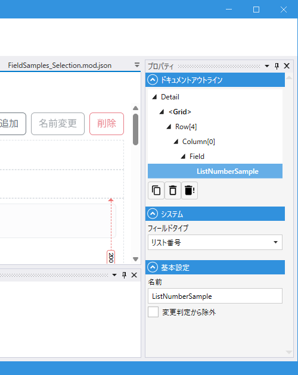

# ListNumberField (リスト番号)

## これは何か

**一覧の中で行番号（No.）を表示する専用フィールド**。[List](List.md) / [DetailList](DetailList.md) / [TileList](TileList.md) が参照するモジュール（= 各行の 1 件分モジュール）に配置し、その行の番号を自動で受け取ります。

> **親画面（List を置いた側）に直接配置しても機能しません**。必ずリスト内の 1 件分を表す**子モジュール側**に配置してください。List が行描画のたびに子モジュールの `ListNumberField.Value` を更新する仕組みです。

## いつ使うか

- 一覧（List / DetailList / TileList）に行番号列を追加したい時

---

## 使い方

### 配置場所

1. リスト表示の対象となる**モジュール**（例: `Order`）を開く
2. そのモジュールに ListNumberField を配置（詳細レイアウトか一覧レイアウトに）
3. 親画面では、いつも通り `List` / `DetailList` / `TileList` でそのモジュールを指定

これで各行に自動で 1 始まりの番号が入ります。

### 番号の付け方

- ページ 1 ページ目: 1, 2, 3, ...
- ページ 2 ページ目（LimitCount = 50 の場合）: 51, 52, 53, ...

**ページをまたいでも連番**（`Page * LimitCount + index + 1` が各行の Value）。

---

## デザイナでの設定

### プロパティ一覧

#### システム

| C#名 | 日本語表示名 | 説明 |
|---|---|---|
| - | フィールドタイプ | `リスト番号` 固定 |

#### 基本設定

| C#名 | 日本語表示名 | 型 | 既定値 | 説明 |
|---|---|---|---|---|
| **Name** | 名前 | string | `""` | フィールド識別子 |
| **IgnoreModification** | 変更判定から除外 | bool | `false` | 変更検知（IsModified）から除外 |

> 固有のプロパティはほぼありません。値は親の List 系 Field が自動で設定します。

---

## スクリプトから

### プロパティ

| 名前 | 型 | 説明 |
|---|---|---|
| `Value` | int | 行番号（1 始まり、親 List が自動で設定）。スクリプトからは取得のみ |

共通プロパティは [Field 共通プロパティ](common_properties.md) を参照。

---

## 関連項目

- [List](List.md) / [DetailList](DetailList.md) / [TileList](TileList.md)
- [Field 共通プロパティ](common_properties.md)
