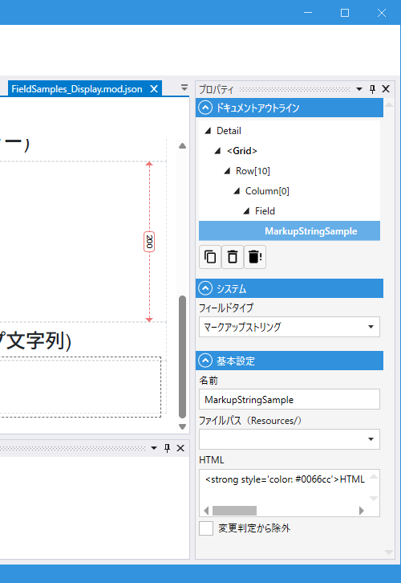

# MarkupStringField (マークアップストリング)

## これは何か

**HTML を直接表示するフィールド**。リッチテキスト（書式付き文字列）や定型 HTML を画面に埋め込めます。

## いつ使うか

- 複雑な書式（見出し・太字・色付き）を含む説明文の表示
- リソースファイルから HTML を読み込んで表示
- Label では表現しきれないマークアップを使いたい場合

> 任意の入力を HTML として埋め込むと XSS の原因になります。**ユーザー入力をそのまま流し込まない**でください。

---

## デザイナでの設定



### プロパティ一覧

#### システム

| C#名 | 日本語表示名 | 説明 |
|---|---|---|
| - | フィールドタイプ | `マークアップストリング` 固定 |

#### 基本設定

| C#名 | 日本語表示名 | 型 | 既定値 | 説明 |
|---|---|---|---|---|
| **Name** | 名前 | string | `""` | フィールド識別子 |
| **ResourcePath** | ファイルパス（Resources/） | string | `""` | HTML を外部リソースから読み込む場合のパス |
| **RawHtml** | HTML | string | `""` | HTML を直接書く場合の内容（複数行可） |
| **IgnoreModification** | 変更判定から除外 | bool | `false` | 変更検知（IsModified）から除外 |

> `ファイルパス（Resources/）` と `HTML` はどちらか片方を使います。両方設定した場合は `HTML` が優先されます。
> MarkupStringField は値を持たないため、`表示名` / `必須` / `DBカラム` などはありません。

---

## スクリプトから

### プロパティ

| 名前 | 型 | 説明 |
|---|---|---|
| `ResourcePath` | string | リソースパスの取得・設定 |
| `RawHtml` | string | HTML 文字列の取得・設定 |

共通プロパティは [Field 共通プロパティ](common_properties.md) を参照。

### よく使う例

```csharp
// 状態によって HTML を切り替える
Notice.RawHtml = IsWarning.Value
    ? "<strong style='color:red'>警告</strong>"
    : "<span style='color:green'>正常</span>";
```

---

## 関連項目

- [Field 共通プロパティ](common_properties.md)
- [Label](Label.md) — プレーンテキストの表示
- [AnchorTag](AnchorTag.md) — リンクだけなら
