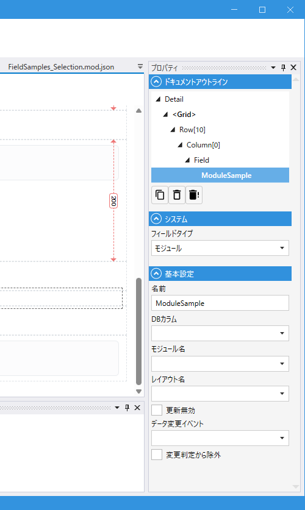

# ModuleField (モジュール)

## これは何か

**他のモジュールの 1 レコードを画面内に詳細フォームとして埋め込むフィールド**。親モジュールの一部のフィールドだけを別モジュールに切り出して、画面上では 1 つのフォームに見せたい時に使います。

埋め込まれた子モジュールは、親モジュールの保存処理と一緒に保存されます (1 トランザクション)。

## いつ使うか

- 「住所」「連絡先」「請求先情報」のように **まとまったフィールド群を別モジュールに分けて管理**したい
- 同じ詳細レイアウトを **複数の親モジュールから使い回し**たい
- 親レコードと **1:1 で関連するデータを画面内で同時編集**したい
- ダイアログやダッシュボード等で **スクリプトで動的にモジュールを差し替え**たい (テンポラリ用途)

複数件を扱うなら [List](List.md) / [DetailList](DetailList.md) / [TileList](TileList.md)、選択だけなら [Link](Link.md) を使います。

---

## 動作モード

ModuleField は **永続化モード** と **テンポラリモード** の 2 つの使い方があります。プロパティの設定の組合せでモードが決まります。

| モード | DbColumn | ModuleName | LayoutName | 用途 |
|---|---|---|---|---|
| **永続化モード** | 設定 | 設定 | 設定 (省略可) | 親テーブルに FK 列を持ち、特定の子モジュール 1 件を関連付ける |
| **テンポラリモード** | 空 | 空 | 空 | スクリプトで `SetModule` して動的に埋め込み内容を切り替える (保存なし) |

> `DbColumn` を設定する場合は **`ModuleName` も必須** です (どのモジュールを参照するか確定しないため)。デザイナのデザインチェックで検出されます。

### 永続化モードの動き

- 親テーブルの `DbColumn` で指定した列に **子モジュールの Id (FK)** が保存される
- 親レコードの読込時、FK 経由で子モジュールのデータも **JOIN でまとめて取得**される (件数が多くてもクエリは増えない)
- 親モジュールの **Submit ボタンを押すと**、親と子が **1 トランザクションで保存**される (子側の Add/Update/Delete が親の Submit に乗る)
- 親レコードが新規 (まだ保存されていない) 場合、子側も新規として一緒に Insert される

### テンポラリモードの動き

- 3 つのプロパティすべて空の状態で配置
- 初期状態では何も表示されない (子モジュールが未確定)
- スクリプトから `SetModule("対象モジュール名", "レイアウト名")` を呼ぶとその場で子モジュールが組み上がる
- **DB に保存されない** (FK 列が無いため)
- セッション内のみ有効。画面リロードや別ページからの遷移で初期状態に戻る

---

## デザイナでの設定



### プロパティ一覧

#### システム

| C#名 | 日本語表示名 | 説明 |
|---|---|---|
| - | フィールドタイプ | `モジュール` 固定 |

#### 基本設定

| C#名 | 日本語表示名 | 型 | 既定値 | 説明 |
|---|---|---|---|---|
| **Name** | 名前 | string | `""` | フィールド識別子 |
| **DbColumn** | DBカラム | string | `""` | 親テーブルの FK 列名 (子モジュールの Id を保存)。テンポラリモードでは空 |
| **ModuleName** | モジュール名 | string | `""` | 埋め込む子モジュール名。テンポラリモードでは空 |
| **LayoutName** | レイアウト名 | string | `""` | 子モジュールの Detail レイアウト名。空時は既定レイアウト |
| **IsUpdateProtected** | 更新無効 | bool | `false` | 更新時に FK 列を変更できないようにする |
| **OnDataChanged** | データ変更イベント | string | `""` | 子モジュールの値が変わった時に発火するスクリプト |
| **IgnoreModification** | 変更判定から除外 | bool | `false` | 親モジュールの変更検知 (IsModified) から除外 |

> ModuleField には **表示名 / 必須** の設定はありません (埋め込み先のモジュール側で制御します)。

---

## 使い方の流れ

### 永続化モード

1. 子モジュール (例: `Address`) の **Detail レイアウト**を用意する
2. 親モジュール (例: `Customer`) のテーブルに、子モジュールの Id を保存する FK 列 (例: `address_id`) を追加する
3. 親モジュールに ModuleField を配置し、`DbColumn = "address_id"` / `ModuleName = "Address"` / `LayoutName = ""` (default) を設定する
4. 親モジュールの Detail レイアウトに ModuleField を置く
5. 画面では親と子のフォームが 1 つに見え、Submit ボタンで両方が保存される

### テンポラリモード

1. ModuleField を配置するが **3 つのプロパティすべて空**にする (`DbColumn`, `ModuleName`, `LayoutName` すべて未設定)
2. 親モジュールの Detail レイアウトに ModuleField を置く (初期状態は空で何も表示されない)
3. スクリプトで `MyField.SetModule("SomeModule", "")` を呼ぶと、その場で子モジュールが組み上がって表示される

---

## スクリプトから

### プロパティ・メソッド

| 名前 | 型・戻り値 | 説明 |
|---|---|---|
| `ChildModule` | Module? | 埋め込まれた子モジュールのインスタンス。子の各 Field にここからアクセス |
| `ModuleName` | string | 現在埋め込んでいるモジュール名 (`SetModule` で上書き済なら上書き値、未上書きなら Design 値) |
| `ModuleLayoutName` | string | 現在使っているレイアウト名 (同上) |
| `SetModule(moduleName, layoutName)` | Task | 埋め込むモジュール／レイアウトを動的に変更 (制約あり、後述) |

共通プロパティは [Field 共通プロパティ](common_properties.md) を参照。

### 子モジュールの値にアクセス

```csharp
// 子モジュールの Field を直接参照
Address.ChildModule.PostalCode.Value = "100-0001";

// 親の Field と組み合わせて使う
void Name_OnDataChanged()
{
    // Customer.Name が変わったら住所欄を初期化
    Address.ChildModule.AddressLine.Value = "";
}
```

### SetModule の制約

`SetModule(moduleName, layoutName)` には **使える場面が限定**されています。デザイナで設定した値と異なる切替をしようとすると例外になります。

| 状況 | 動作 |
|---|---|
| `SetModule` の引数が現在の `ModuleName` / `ModuleLayoutName` と一致 | **no-op** (何もしない。idempotent) |
| Design 側で `DbColumn` / `ModuleName` / `LayoutName` のいずれかが設定済 | **例外** (固定された ModuleField の中身は変えられない) |
| Design 側 3 つすべて空 (テンポラリモード) かつ引数が現在と異なる | **切替実行** (`ChildModule` が新しく作り直される) |

#### よくある例

```csharp
// テンポラリモードの ModuleField を動的に切り替える
if (UserType.Value == "admin")
{
    await ProfilePanel.SetModule("AdminProfile", "");
}
else
{
    await ProfilePanel.SetModule("UserProfile", "");
}
```

> `SetModule` でモジュールを切り替えると **`ChildModule` は新しく作り直され、編集中のデータは失われます** (同じ引数での再呼出は no-op で残ります)。テンポラリモード以外では使わない想定です。

### OnDataChanged の発火タイミング

`OnDataChanged` イベントは、**子モジュール内のいずれかの Field の値が変わった時**に親モジュール側のスクリプトとして発火します。

```csharp
// Customer.mod.cs (親側)
void Address_OnDataChanged()
{
    // Address (子) のいずれかの Field が変わったら、ここが呼ばれる
    Logger.Log("住所が変更されました");
}
```

> `SetModule` でモジュールを差し替えただけでは発火しません (モジュール構成変更はデータ変更ではない扱い)。

---

## 保存と読込

### 保存 (Submit)

親モジュールの Submit ボタンが押された時:

1. 子モジュールに変更があれば、その差分が親の Submit に組み込まれる
2. **1 トランザクション**で親と子が一緒に保存される
3. 親が新規の場合、子も同時に新規 Insert され、生成された子の Id が親の FK 列に書き込まれる
4. 親の `OnBeforeSubmit` などのスクリプトは親側で動く (子側のイベントは子のモジュールで動く)

子モジュールの **Submit ボタンを子のレイアウト内に配置する必要はありません**。親の Submit に乗ります (置いても害はない)。

### 読込

親レコードを表示する時:

- 親モジュールの SELECT で **JOIN を使って子モジュールのデータも 1 クエリでまとめて取得**される (一覧画面で 100 件の親レコードを表示しても、子モジュール取得用のクエリは増えない)
- 子モジュールに `LinkField` / `SelectField` / 別の `ModuleField` がネストしていれば、それらも続いて取得される

> 取得対象は **Design.LayoutName で指定した Detail レイアウトに置かれているフィールド** だけです。レイアウト外の Field の値が必要な場合はスクリプトで明示的に取得が必要です。

---

## デザイン検証

デザイナで以下のチェックが行われ、エラーがあれば一覧に表示されます。

- `DbColumn` が指定されているが対応する DB 列が存在しない
- `ModuleName` が存在しないモジュールを指している
- `LayoutName` が `ModuleName` のモジュールに存在しないレイアウトを指している
- `OnDataChanged` で指定したスクリプト関数が存在しない
- **`DbColumn` が指定されているのに `ModuleName` が未設定** (永続化モードのためには両方必須)

---

## 関連項目

- [Field 共通プロパティ](common_properties.md)
- [Link](Link.md) — 参照だけで埋め込みは不要な場合
- [List](List.md) / [DetailList](DetailList.md) / [TileList](TileList.md) — 1:多の関連 (複数件) を扱う場合
- [モジュール](../module/module.md) — モジュールの基本
