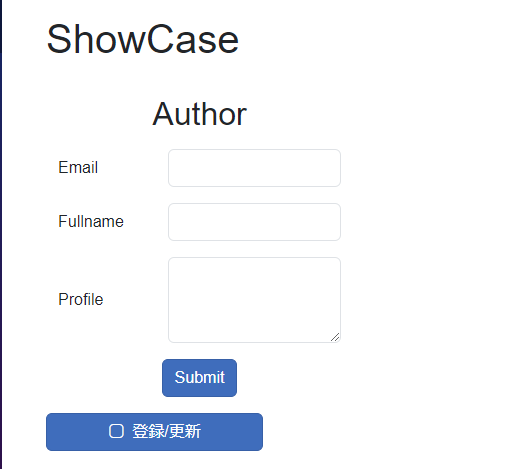
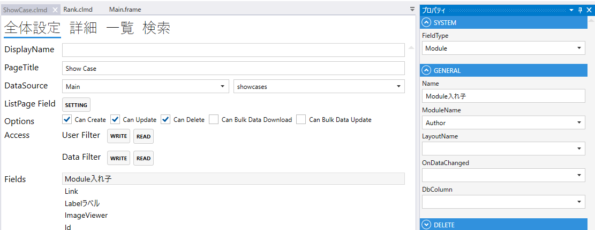
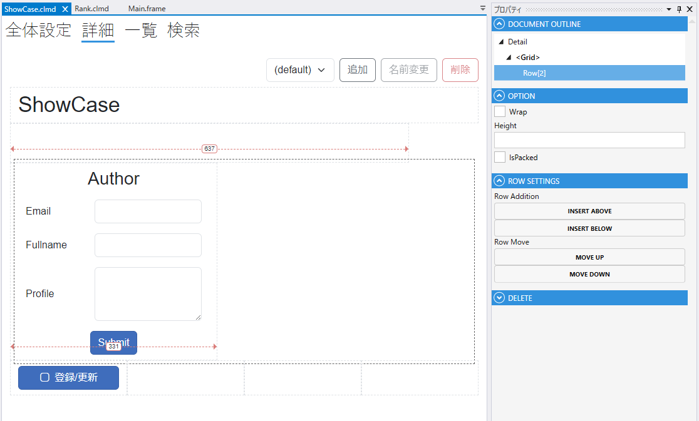

# ModuleField

## これは何か

**他のモジュールを画面内に埋め込むフィールド**。1 件のデータ（詳細）を別モジュールの画面としてその場に展開できます。



## いつ使うか

- 親モジュールに「住所」や「連絡先」などまとまった部分を別モジュールとして持たせたい
- 同じ詳細レイアウトを複数の親で使い回したい
- 1:1 の関連を持つデータを画面内で同時編集したい

複数件を扱うなら [List](List.md) / [DetailList](DetailList.md) / [TileList](TileList.md)、選択だけなら [Link](Link.md) を使います。

---

## デザイナでの設定



### 固有プロパティ

| プロパティ | 型 | 既定値 | 説明 |
|---|---|---|---|
| **DbColumn** | string | `""` | 対応する DB 列名（子モジュールの Id を保存） |
| **ModuleName** | string | `""` | 埋め込むモジュール名 |
| **LayoutName** | string | `""` | 使用する Detail レイアウト名 |
| **IsUpdateProtected** | bool | `false` | 更新不可にする |
| **OnDataChanged** | string | `""` | データ変更時のスクリプト |

共通プロパティは [Field 共通プロパティ](common_properties.md) を参照。



---

## スクリプトから

### プロパティ・メソッド

| 名前 | 型・戻り値 | 説明 |
|---|---|---|
| `ChildModule` | Module? | 埋め込まれたモジュールのインスタンス（未初期化時は null） |
| `ModuleName` | string | 現在埋め込んでいるモジュール名 |
| `ModuleLayoutName` | string | 現在使っているレイアウト名 |
| `SetModule(moduleName, layoutName)` | Task | 埋め込むモジュール／レイアウトを動的に変更 |

共通プロパティは [Field 共通プロパティ](common_properties.md) を参照。

### よく使う例

```csharp
// 埋め込み先のモジュールの Field にアクセス
Address.ChildModule.PostalCode.Value = "100-0001";

// 動的にモジュール・レイアウトを切り替え
if (UserType.Value == "admin")
{
    await ProfilePanel.SetModule("AdminProfile", "default");
}
else
{
    await ProfilePanel.SetModule("UserProfile", "default");
}
```

---

## 関連項目

- [Field 共通プロパティ](common_properties.md)
- [Link](Link.md) — 参照だけで埋め込みは不要な場合
- [List](List.md) — 複数件を扱う場合
