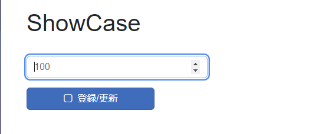
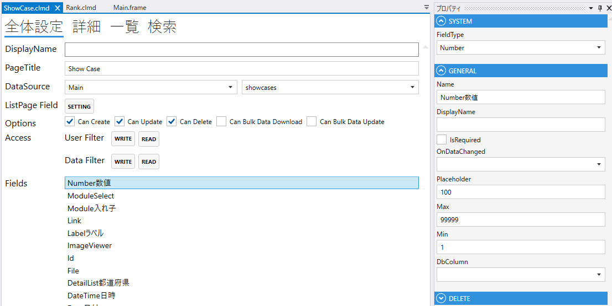
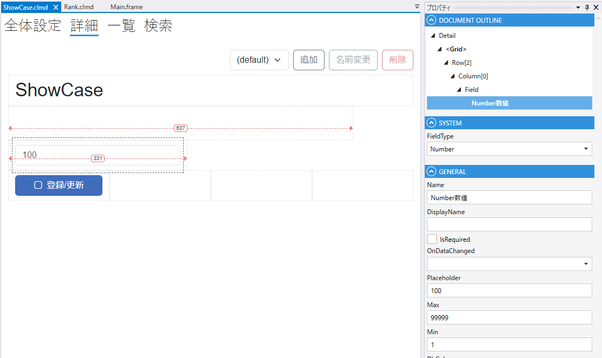

# Number

数値を表すField

1. FieldType
    - Numberを設定する
2. Name
    - フィールド名の設定. 全体設定時に表示される.
3. DisplayName
    - TBD
4. IsRequired
    - 登録時，必須にする
5. Max
    - 最大値の設定
6. Min
    - 最小値の設定
7. DbColumn
    - テーブルのカラムの設定

## スクリプト
| プロパティ名          | 型        | 説明             |
|-----------------|----------|----------------|
| BackgroundColor | string?  | Fieldの背景色      | 
| Color           | string?  | Fieldの色        |
| DisplayText     | string?  | Fieldの色        |
| IsEnabled       | bool     | Fieldの有効/無効    |
| IsModified      | bool     | Fieldが変更されたどうか |
| IsVisible       | bool     | Fieldの表示/非表示   |
| IsViewOnly      | bool     | Fieldの編集可/編集不可 |
| SearchMax       | decimal? | 検索条件の数値の最大値    |
| SearchMin       | decimal? | 検索条件の数値の最大値    |
| Value           | string   | Fieldの値        |

