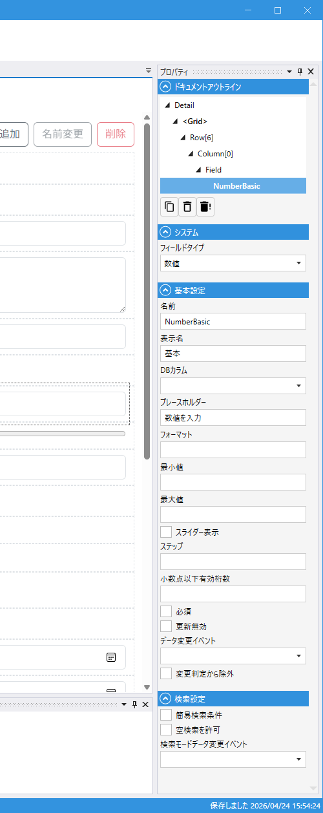

# NumberField (数値)

## これは何か

**数値を入力・表示するフィールド**。整数・小数に対応し、スライダー表示にもできます。

## いつ使うか

- 金額・数量・割合などの数値入力
- 最小・最大を制限した数値入力
- 小数点以下の桁数制限が必要な場合
- DB 数値カラムの表示・編集

---

## デザイナでの設定



### プロパティ一覧

#### システム

| C#名 | 日本語表示名 | 説明 |
|---|---|---|
| - | フィールドタイプ | `数値` 固定 |

#### 基本設定

| C#名 | 日本語表示名 | 型 | 既定値 | 説明 |
|---|---|---|---|---|
| **Name** | 名前 | string | `""` | フィールド識別子 |
| **DisplayName** | 表示名 | string | `""` | 画面表示用の名前 |
| **DbColumn** | DBカラム | string | `""` | 対応する DB 列名 |
| **Placeholder** | プレースホルダー | string | `""` | 未入力時の案内文 |
| **Format** | フォーマット | string | `""` | 表示フォーマット（例: `#,##0`, `0.00`） |
| **Min** | 最小値 | decimal? | null | 最小値 |
| **Max** | 最大値 | decimal? | null | 最大値 |
| **IsSlider** | スライダー表示 | bool | `false` | スライダーで表示する |
| **Step** | ステップ | decimal? | null | 増減単位 |
| **MaxFractionDigits** | 小数点以下有効桁数 | int? | null | 小数点以下の最大桁数 |
| **IsRequired** | 必須 | bool | `false` | 入力必須 |
| **IsUpdateProtected** | 更新無効 | bool | `false` | 更新時に値を変更できないようにする |
| **OnDataChanged** | データ変更イベント | string | `""` | 値変更時のスクリプトイベント |
| **IgnoreModification** | 変更判定から除外 | bool | `false` | 変更検知（IsModified）から除外 |

#### 検索設定

| C#名 | 日本語表示名 | 型 | 既定値 | 説明 |
|---|---|---|---|---|
| **IsSimpleSearchParameter** | 簡易検索条件 | bool | `false` | 簡易検索の対象にする |
| **AllowEmptySearch** | 空検索を許可 | bool | `false` | 空での検索を許可する |
| **OnSearchDataChanged** | 検索モードデータ変更イベント | string | `""` | 検索条件が変更された時のスクリプトイベント |

---

## スクリプトから

### プロパティ

| 名前 | 型 | 説明 |
|---|---|---|
| `Value` | decimal? | 入力値 |
| `SearchMin` | decimal? | 検索の最小値 |
| `SearchMax` | decimal? | 検索の最大値 |
| `SearchIsEmpty` | bool? | 「空」を検索条件にする |

共通プロパティは [Field 共通プロパティ](common_properties.md) を参照。

### よく使う例

```csharp
// 値を取得して計算
var subtotal = Price.Value * Quantity.Value;
Total.Value = subtotal;

// 範囲チェック
if (Price.Value < 0)
{
    Price.SetError("価格は 0 以上で入力してください");
}

// 検索の最小値・最大値を動的に設定
await Price.SetSearchMinAsync(1000);
await Price.SetSearchMaxAsync(10000);
```

---

## バリエーション

### 基本（通常の数値入力）

特別な設定なし。整数・小数どちらも入力可能。

### スライダー表示（`IsSlider: true`, `Min/Max/Step` 指定）

0〜100 のような範囲を視覚的に選びたい場合。`Min`・`Max`・`Step` をセットで指定する。

### フォーマット表示（`Format: "#,##0"`, `MaxFractionDigits: 0`）

金額など、カンマ区切り・桁数制限つきで表示する場合。
`Format` は C# の数値フォーマット文字列に準拠（例: `#,##0` / `0.00` / `P0` など）。

---

## 検索での挙動

数値の検索は **範囲（下限 ～ 上限）** が基本です。簡易／詳細でモード切替の有無が変わります。

### 簡易検索（`IsSimpleSearchParameter=true`）

入力欄が 1 つだけ表示されます。入力した値**以上**（`≥`）のデータが対象。

> 「ちょうどこの値」を検索したい場合は詳細にして範囲の下限と上限に同じ値を入れる必要があります。

### 詳細検索（`IsSimpleSearchParameter=false`）

下限 ～ 上限の **2 入力欄** と、間に **モード切替（`～` ボタン）** が出ます。

| モード | 挙動 |
|---|---|
| **範囲（既定）** | 下限・上限のうち入っている方の制約を適用（`>=` / `<=` / 範囲）<br>例: 下限 1000 のみ → `≥ 1000` / 下限 1000 + 上限 5000 → `1000 ≤ x ≤ 5000` |
| **空白** | `NULL` のデータ（`AllowEmptySearch=true` の時） |
| **空白でない** | 何か値があるデータ（`AllowEmptySearch=true` の時） |

> モード切替ボタンは `AllowEmptySearch=true` でないと「範囲」固定になります（切替メニューが出ません）。

### スクリプトから検索条件を操作

```csharp
// 下限を設定（≥）
await Price.SetSearchMinAsync(1000m);

// 上限を設定（≤）
await Price.SetSearchMaxAsync(5000m);

// 「空白」モードに切り替え
await Price.SetSearchIsEmptyAsync(true);   // 空白
await Price.SetSearchIsEmptyAsync(false);  // 空白でない
await Price.SetSearchIsEmptyAsync(null);   // 通常モードに戻す
```

検索全体の仕組み（検索レイアウト・AND/OR・URL パラメータなど）は [SearchField](Search.md#検索の仕組み) を参照。

---

## 関連項目

- [Field 共通プロパティ](common_properties.md)
- [SearchField](Search.md) — 検索全体の仕組み
- [スクリプト概要](../overview/script.md)
