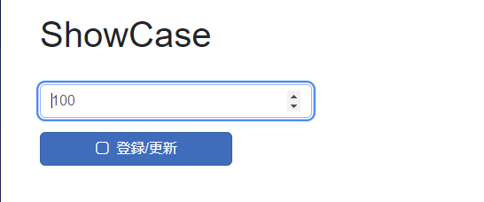
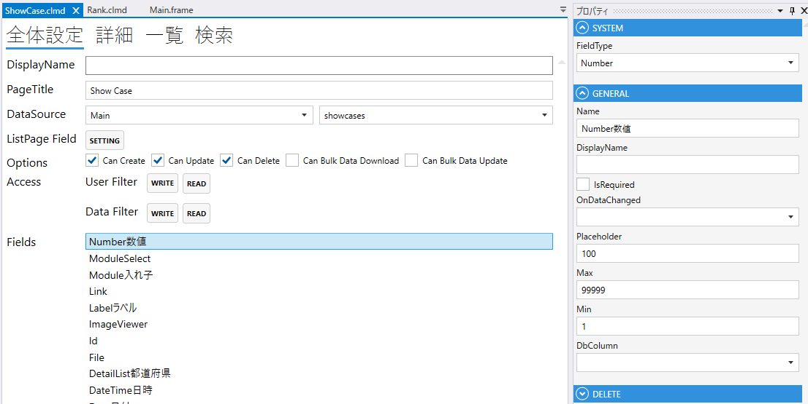
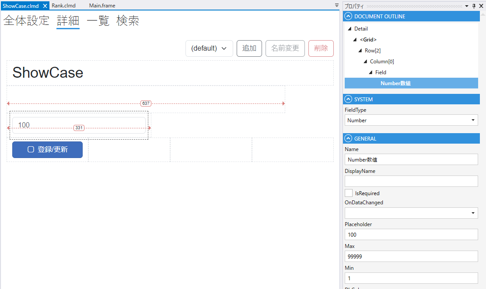

# NumberField

## これは何か

**数値を入力・表示するフィールド**。整数・小数に対応し、スライダー表示にもできます。



## いつ使うか

- 金額・数量・割合などの数値入力
- 最小・最大を制限した数値入力
- 小数点以下の桁数制限が必要な場合
- DB 数値カラムの表示・編集

---

## デザイナでの設定



### 固有プロパティ

| プロパティ | 型 | 既定値 | 説明 |
|---|---|---|---|
| **DbColumn** | string | `""` | 対応する DB 列名 |
| **Placeholder** | string | `""` | 未入力時の案内文 |
| **Format** | string | `""` | 表示フォーマット（例: `#,##0`, `0.00`） |
| **Min** | decimal? | null | 最小値 |
| **Max** | decimal? | null | 最大値 |
| **IsSlider** | bool | `false` | スライダーで表示する |
| **Step** | decimal? | null | 増減単位 |
| **MaxFractionDigits** | int? | null | 小数点以下の最大桁数 |

共通プロパティ（Name, DisplayName, IsRequired, OnDataChanged など）は [Field 共通プロパティ](common_properties.md) を参照。



---

## スクリプトから

### プロパティ

| 名前 | 型 | 説明 |
|---|---|---|
| `Value` | decimal? | 入力値 |
| `SearchMin` | decimal? | 検索の最小値 |
| `SearchMax` | decimal? | 検索の最大値 |
| `SearchIsEmpty` | bool? | 「空」を検索条件にする |

共通プロパティは [Field 共通プロパティ](common_properties.md) を参照。

### よく使う例

```csharp
// 値を取得して計算
var subtotal = Price.Value * Quantity.Value;
Total.Value = subtotal;

// 範囲チェック
if (Price.Value < 0)
{
    Price.SetError("価格は 0 以上で入力してください");
}

// 検索の最小値・最大値を動的に設定
await Price.SetSearchMinAsync(1000);
await Price.SetSearchMaxAsync(10000);
```

---

## 関連項目

- [Field 共通プロパティ](common_properties.md)
- [スクリプト概要](../overview/script.md)
