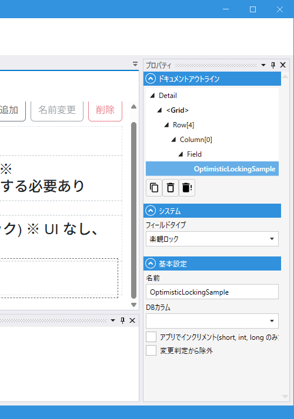

# OptimisticLockingField (楽観ロック)

## これは何か

**楽観ロック**を実現する System Field。データ更新時に「自分が読み取った時点から、他の人が変更していないか」をチェックします。

UI は持たず、**値の保持と送受信**のみを行います。スクリプトから操作することもほぼありません。

## いつ使うか

- 同じデータを複数ユーザーが同時に編集し得る業務アプリ
- 更新の競合検知が必要な場合

この Field を Module に追加し、DB 側の「更新のたびに値が変わる列」にマッピングするだけで、自動的に楽観ロックが働きます。

---

## デザイナでの設定

### プロパティ一覧

#### システム

| C#名 | 日本語表示名 | 説明 |
|---|---|---|
| - | フィールドタイプ | `楽観ロック` 固定 |

#### 基本設定

| C#名 | 日本語表示名 | 型 | 既定値 | 説明 |
|---|---|---|---|---|
| **Name** | 名前 | string | `""` | フィールド識別子 |
| **DbColumn** | DBカラム | string | `""` | ロックに使う DB 列名 |
| **IncrementVersion** | アプリでインクリメント(short, int, long のみ) | bool | `false` | 保存時にアプリ側で値を +1 する（列型が `short` / `int` / `long` の場合のみ有効） |
| **IgnoreModification** | 変更判定から除外 | bool | `false` | 変更検知（IsModified）から除外 |

---

## 動作の仕組み

1. データを読み込むと、現在の OptimisticLocking 値が記憶される
2. 更新時、DB 側の現在値と記憶した値を比較
3. 一致しなければ「他の人が更新しています」エラーとなり、更新は失敗する

### DB 側の選択肢

| 選択肢 | 設定 |
|---|---|
| **DB 自身が自動で値を変える列** | `IncrementVersion: false`。例: PostgreSQL `xmin`、SQL Server `rowversion`、または UPDATE トリガで時刻列を更新 |
| **アプリ側でインクリメント** | `IncrementVersion: true`。DB 側に自動変更の仕組みがないとき。列型は `short` / `int` / `long` のみ |

---

## スクリプトから

UI を持たないため、スクリプトから積極的に操作するシーンはありません。
保持している値 (`Value`) は内部用で、スクリプトからはアクセスできません（`[ScriptHide]`）。

共通プロパティは [Field 共通プロパティ](common_properties.md) を参照。

---

## 関連項目

- [Field 共通プロパティ](common_properties.md)
- [Field 全体（System Field の一覧）](field.md)
- [Module 全体設定](../module/module_general.md)
