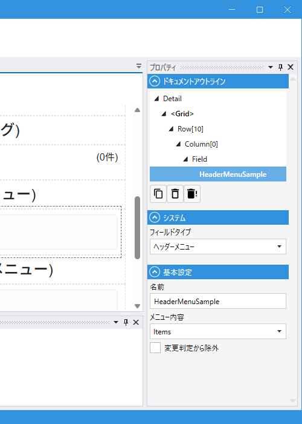
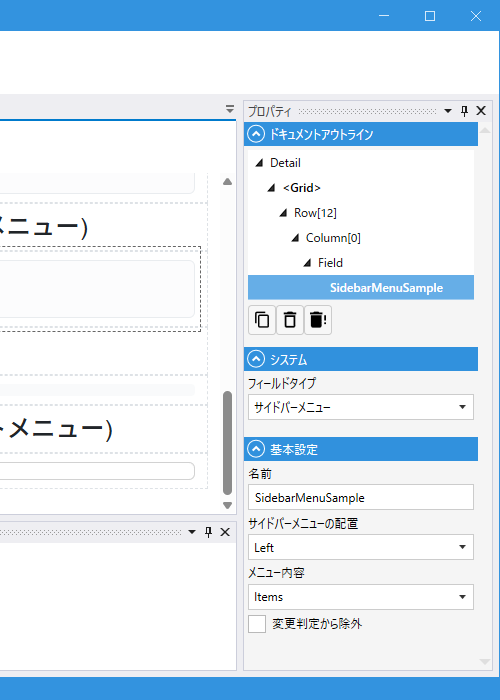

# HeaderMenuField / SidebarMenuField (ヘッダーメニュー・サイドバーメニュー)

## これは何か

**[PageFrame](../designer/page_frame.md) のヘッダーやサイドバーを独自モジュールに置き換えた時に、標準のメニュー機能（ホーム / メニュー項目 / ユーザー名 / ログアウト）をそのモジュール内に埋め込むための Field**。

- **HeaderMenuField**: ヘッダーに表示するメニューを独自モジュールで組む時に使用
- **SidebarMenuField**: サイドバー（左／右）に表示するメニューを独自モジュールで組む時に使用

どちらも共通して、PageFrame 側で定義してあるメニュー情報（`Header` / `Left` / `Right` の `Home` / `Links`）や、ログインユーザー情報・ログアウト操作を、この Field を通して取り込みます。

> 通常は PageFrame の `Header` / `Left` / `Right` 設定だけでメニューを構築できます。これらの Field を使うのは、**カスタムモジュールで独自のヘッダー／サイドバー UI を組む**ケースです。PageFrame の `Header.ModuleName` / `Left.ModuleName` / `Right.ModuleName` に代替モジュールを指定した時に、この Field を通じて標準メニュー機能を取り込みます。

## いつ使うか

- ヘッダー／サイドバーのレイアウトを独自に組みたい（アイコン配置・独自ボタン・検索ボックスなどを挟みたい）
- 標準では出せないタイミング・条件でユーザー名やログアウトを表示したい
- サイドバーに独自のパーツ（ウィジェット・お知らせ・検索など）を挟みたい
- Placement（左／右）と組み合わせて、右サイドバーにも独自 UI を出したい

---

## デザイナでの設定（HeaderMenuField）

### プロパティ一覧

#### システム

| C#名 | 日本語表示名 | 説明 |
|---|---|---|
| - | フィールドタイプ | `ヘッダーメニュー` 固定 |

#### 基本設定

| C#名 | 日本語表示名 | 型 | 既定値 | 説明 |
|---|---|---|---|---|
| **Name** | 名前 | string | `""` | フィールド識別子 |
| **Type** | メニュー内容 | enum | `Items` | どの標準パーツを表示するか |
| **IgnoreModification** | 変更判定から除外 | bool | `false` | 変更検知から除外 |

---

## デザイナでの設定（SidebarMenuField）

### プロパティ一覧

#### システム

| C#名 | 日本語表示名 | 説明 |
|---|---|---|
| - | フィールドタイプ | `サイドバーメニュー` 固定 |

#### 基本設定

| C#名 | 日本語表示名 | 型 | 既定値 | 説明 |
|---|---|---|---|---|
| **Name** | 名前 | string | `""` | フィールド識別子 |
| **Placement** | サイドバーメニューの配置 | enum | `Left` | 左右どちらのサイドバーを対象にするか（`Left` / `Right`） |
| **Type** | メニュー内容 | enum | `Items` | どの標準パーツを表示するか |
| **IgnoreModification** | 変更判定から除外 | bool | `false` | 変更検知から除外 |

---

## Type（メニュー内容）の選択肢

両 Field で共通です。参照先が `Header` か `Left` / `Right` かの違いのみです。

| 値 | 描画される内容 |
|---|---|
| **Home** | PageFrame の `Header.Home` / `Left.Home` / `Right.Home` の内容（テキスト / アイコン / 画像） |
| **Items** | PageFrame の `Header.Links` / `Left.Links` / `Right.Links` のメニュー項目群 |
| **UserName** | ログイン中のユーザー名 |
| **Logout** | ログアウトボタン |

同じモジュール内に複数配置すれば、それぞれの要素を別々の位置に並べられます。

---

## スクリプトから

スクリプト公開メンバーは共通プロパティのみ。[Field 共通プロパティ](common_properties.md) を参照。

---

## 関連項目

- [PageFrame](../designer/page_frame.md)
- [Field 共通プロパティ](common_properties.md)
