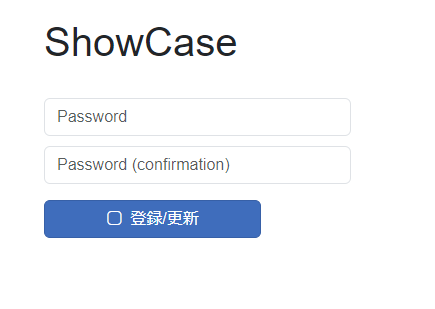
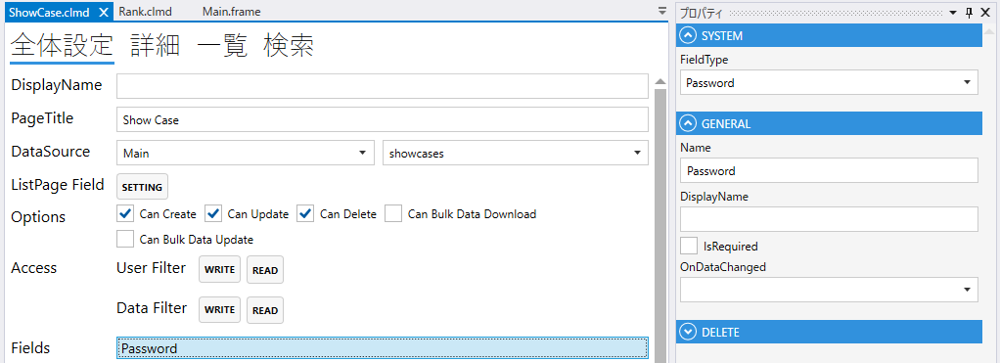
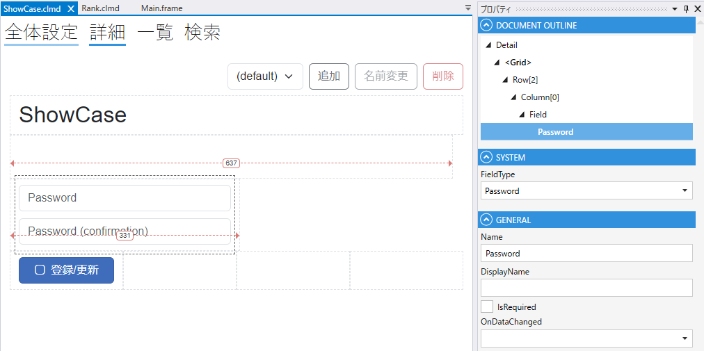

# Password

Passwordを表すField

1. FieldType
    - Passwordを設定する
2. Name
    - フィールド名の設定. 全体設定時に表示される.
3. DisplayName
    - TBD
4. IsRequired
    - 登録時，必須にする
5. DbColumn
    - テーブルのカラムの設定
6. OnDataChanged
    - 変更時のスクリプト

## スクリプト
| プロパティ名          | 型        | 説明             |
|-----------------|----------|----------------|
| BackgroundColor | string?  | Fieldの背景色      | 
| Color           | string?  | Fieldの色        |
| IsEnabled       | bool     | Fieldの有効/無効    |
| IsModified      | bool     | Fieldが変更されたどうか |
| IsVisible       | bool     | Fieldの表示/非表示   |
| IsViewOnly      | bool     | Fieldの編集可/編集不可 |
| Value           | string   | Fieldの値        |

| メソッド名           | 戻り値  | 説明                                        |
|-----------------|------|-------------------------------------------|
| CheckPassword() | bool | パスワードが入力されているか，パスワードと確認用パスワードが一致するかチェックする |
| Clear()         | なし   | パスワード，確認用パスワードをクリアする                      |

