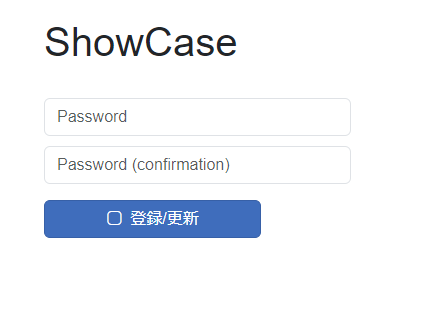
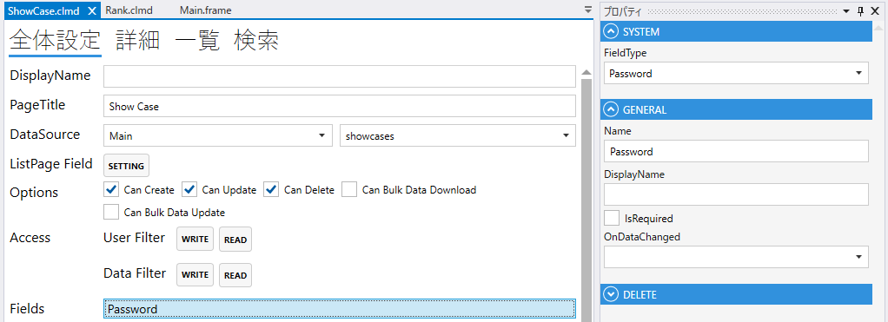
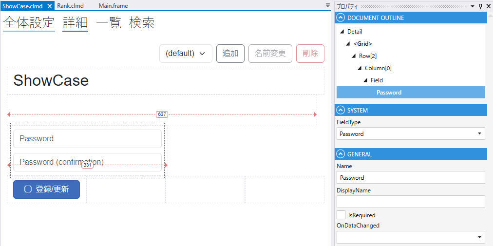

# PasswordField

## これは何か

**パスワード入力用のフィールド**。入力内容は伏せ字で表示され、確認入力との一致チェック機構も備えています。



## いつ使うか

- ユーザー登録時のパスワード入力
- パスワード変更画面
- 再入力（確認）との一致チェック

---

## デザイナでの設定



### 固有プロパティ

PasswordField 固有のプロパティはありません。
共通プロパティ（Name, DisplayName, IsRequired, OnDataChanged）は [Field 共通プロパティ](common_properties.md) を参照。

> **DB 保存について**: PasswordField は DB 列に直接マッピングされません。保存先はユーザーコード側で制御します（通常はハッシュ化して保存）。



---

## スクリプトから

### プロパティ・メソッド

| 名前 | 型・戻り値 | 説明 |
|---|---|---|
| `Value` | string? | パスワード値 |
| `ConfirmPassword` | string? | 確認入力の値 |
| `CheckPassword()` | bool | 本入力と確認入力が一致するか |
| `Clear()` | void | 入力をクリア |

共通プロパティは [Field 共通プロパティ](common_properties.md) を参照。

### よく使う例

```csharp
// 登録時にパスワードと確認入力が一致するかチェック
void SaveButton_OnClick()
{
    if (!Password.CheckPassword())
    {
        Password.SetError("確認入力と一致しません");
        return;
    }

    if (await Submit())
    {
        Password.Clear();
        Toaster.Success("登録しました");
    }
}
```

---

## 関連項目

- [Field 共通プロパティ](common_properties.md)
- [Text](Text.md) — 通常の文字入力
- [認証・認可](../authorization/authorization.md)
