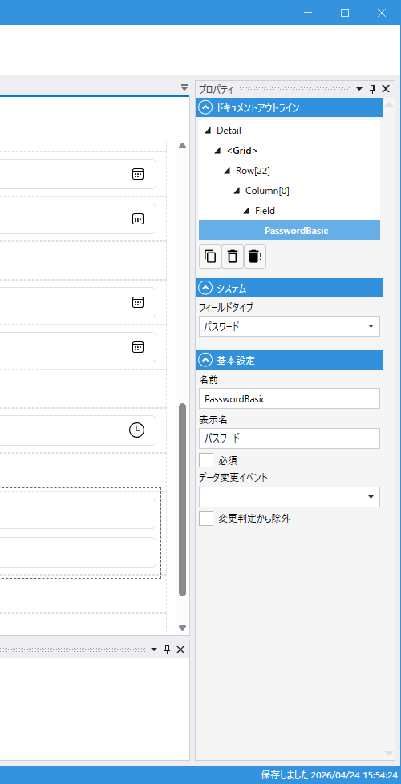

# PasswordField (パスワード)

## これは何か

**パスワード入力用のフィールド**。入力内容は伏せ字で表示され、確認入力との一致チェック機構も備えています。

> **重要**: PasswordField は単体では DB に保存されません。**PasswordHashField** と組み合わせて、ハッシュ化された値を DB に書き込む仕組みになっています。詳細は [PasswordHashField との組み合わせ](#passwordhashfield-との組み合わせ) を参照。

## いつ使うか

- ユーザー登録時のパスワード入力
- パスワード変更画面
- 再入力（確認）との一致チェック

---

## デザイナでの設定



### プロパティ一覧

#### システム

| C#名 | 日本語表示名 | 説明 |
|---|---|---|
| - | フィールドタイプ | `パスワード` 固定 |

#### 基本設定

| C#名 | 日本語表示名 | 型 | 既定値 | 説明 |
|---|---|---|---|---|
| **Name** | 名前 | string | `""` | フィールド識別子 |
| **DisplayName** | 表示名 | string | `""` | 画面表示用の名前 |
| **IsRequired** | 必須 | bool | `false` | 入力必須 |
| **OnDataChanged** | データ変更イベント | string | `""` | 値変更時のスクリプトイベント |
| **IgnoreModification** | 変更判定から除外 | bool | `false` | 変更検知（IsModified）から除外 |

> `DbColumn` は PasswordField にはありません。保存は次章の PasswordHashField が担います。

---

## スクリプトから

### プロパティ・メソッド

| 名前 | 型・戻り値 | 説明 |
|---|---|---|
| `Value` | string? | パスワード値 |
| `CheckPassword()` | bool | 画面上の本入力と確認入力欄の値が一致するかを返す |
| `Clear()` | Task | 本入力・確認入力の両方をクリア |

> 確認入力欄の値（内部の `ConfirmPassword`）はスクリプトから直接参照できません。`CheckPassword()` を通じて一致判定だけ行えます。

共通プロパティは [Field 共通プロパティ](common_properties.md) を参照。

### よく使う例

```csharp
// 登録時にパスワードと確認入力が一致するかチェック
void SaveButton_OnClick()
{
    if (!Password.CheckPassword())
    {
        Password.SetError("確認入力と一致しません");
        return;
    }

    if (await Submit())
    {
        Password.Clear();
        Toaster.Success("登録しました");
    }
}
```

---

## PasswordHashField との組み合わせ

PasswordField が扱うのは**画面での入力**のみで、DB への保存・検証は別に用意された **PasswordHashField** と、ユーザーコード側の **CustomizedModuleDataIO** / **PasswordHashHelper** で行われます。

この構成は Visual Studio テンプレートで **Cookie 認証バリアント**を選んで新規作成すると自動で出力されます。

> **他のバリアント（Normal / MultiTenant 等）でも PasswordHashField 自体はテンプレートから出力されますが、認証フローと結び付いていないため、そのまま使っても意味はありません。** 自前の認証と繋ぎ込むか、Cookie 認証テンプレートから再作成してください。

### 仕組み

```
画面                    Module                          DB
──────                  ─────────────────               ────────────────
[ パスワード入力 ]  ──▶  PasswordField.Value  ──┐
                                               │
                                               ├──▶ PasswordHashHelper
                                               │    ・ Salt をランダム生成（32byte）
                                               │    ・ PBKDF2 + SHA256 で 10 万回ハッシュ化
                                               │
                                               ▼
                        PasswordHashField ──────────▶  DbColumnHash (Hash)
                                              ──────▶  DbColumnSalt (Salt)
```

保存時の流れ:

1. ユーザーが PasswordField に入力
2. Submit → サーバー側の `CustomizedModuleDataIO.AddAsync` / `UpdateAsync` が呼ばれる
3. `PasswordHashHelper.ApplyPasswordHash` が Module 内の `PasswordHashField` を走査
4. 対応する PasswordField の値をハッシュ化して `PasswordHashField` に格納
5. PasswordHashField が Hash / Salt を DB に書き込む

### 配置手順

1. Module に **PasswordField** を配置（画面入力用）
2. 同じ Module に **PasswordHashField** を配置（DB 保存用、画面には表示されない）
3. PasswordHashField のプロパティで:
   - `PasswordFieldName` — 対応する PasswordField の名前（例: `Password`）
   - `DbColumnHash` — ハッシュ値を保存する DB 列
   - `DbColumnSalt` — ソルトを保存する DB 列
4. ユーザーコード側で `CustomizedModuleDataIO` が登録されていることを確認（テンプレート出力のまま OK）

### ログイン時の検証

パスワードの検証は `PasswordHashHelper.VerifyHash(password, hash, salt)` を使います。
Cookie 認証テンプレートのログイン処理に組み込まれているので、通常は追加実装不要です。

### 独自認証に差し替える場合

- PasswordHashField と CustomizedModuleDataIO の仕組みをそのまま使える場合はそのままで OK
- 独自のハッシュアルゴリズムを使いたい場合は、`CustomizedModuleDataIO.AddAsync` / `UpdateAsync` と `PasswordHashHelper` を書き換えます

---

## 関連項目

- [Field 共通プロパティ](common_properties.md)
- [Text](Text.md) — 通常の文字入力
- [認証・認可](../authorization/authorization.md)
- [チュートリアル: 認証を有効にする](../tutorials/tutorial_auth.md)
