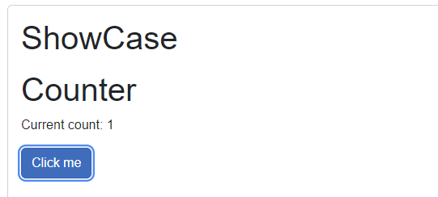
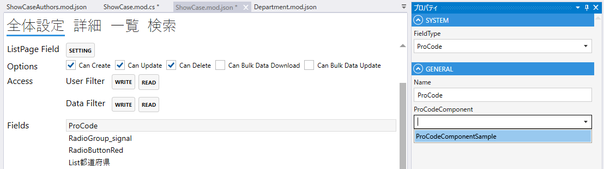

# ProCode

ProCode(任意に作成できるUI+ロジック)をあらわすフィールド．

- ProCodeは`Client.Shared`に作成された`ProCodeComponentBase`を継承したBlazorから選択する．
- 作成後にBuildして，デザイナーに表示される．

```csharp
@using Codeer.LowCode.Blazor.ProCode
@inherits ProCodeComponentBase

<h1>Counter</h1>

<p role="status">Current count: @_currentCount</p>

<button class="btn btn-primary" @onclick="IncrementCount">Click me</button>

@code {
    private int _currentCount = 0;

    private void IncrementCount()
    {
        _currentCount++;
    }
}
```





## プロパティ

| プロパティ名           | 説明                    |
|------------------|-----------------------| 
| FieldType        | RadioButtonを設定する      |
| Name             | フィールド名を設定する           |
| ProCodeComponent | ProCodeのコンポーネントを設定する. |


## スクリプト
| プロパティ名          | 型       | 説明             |
|-----------------|---------|----------------|
| BackgroundColor | string? | Fieldの背景色      | 
| Color           | string? | Fieldの色        |
| Focus           | string? | フォーカスする        |
| IsEnabled       | bool    | Fieldの有効/無効    |
| IsViewOnly      | bool    | Fieldの編集可/編集不可 |
| IsVisible       | bool    | Fieldの表示/非表示   |
