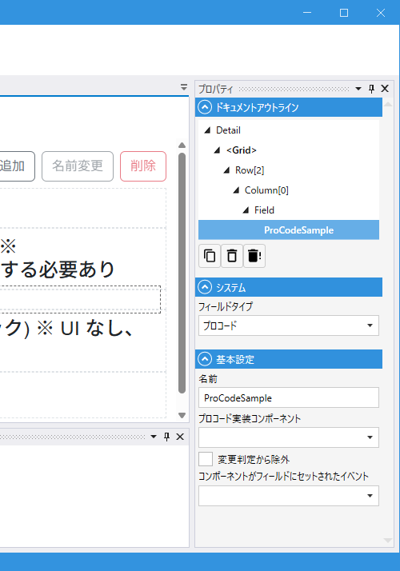

# ProCodeField (プロコード)

## これは何か

**独自の Blazor コンポーネントを画面に埋め込むフィールド**。標準 Field では実現できない UI・ロジックを C# / Razor で書いて組み込めます。

## いつ使うか

- サードパーティ UI ライブラリ（MudBlazor / Radzen など）のコンポーネントを埋め込む
- 独自のカスタム UI（グラフ・エディタ・プレイヤーなど）を入れる
- 標準 Field では届かない細かい制御が必要な時

---

## 作り方

### 1. `Client.Shared` に Razor コンポーネントを作る

`ProCodeComponentBase` を継承します。

```razor
@using Codeer.LowCode.Blazor.ProCode
@inherits ProCodeComponentBase

<h1>Counter</h1>

<p role="status">Current count: @_currentCount</p>

<button class="btn btn-primary" @onclick="IncrementCount">Click me</button>

@code {
    private int _currentCount = 0;

    private void IncrementCount()
    {
        _currentCount++;
    }
}
```

### 2. ビルド

ビルドすると、デザイナで ProCodeField の「プロコード実装コンポーネント」ドロップダウンにこのコンポーネントが出てきます。

### 3. デザイナで配置して「プロコード実装コンポーネント」に選択

---

## デザイナでの設定



### プロパティ一覧

#### システム

| C#名 | 日本語表示名 | 説明 |
|---|---|---|
| - | フィールドタイプ | `プロコード` 固定 |

#### 基本設定

| C#名 | 日本語表示名 | 型 | 既定値 | 説明 |
|---|---|---|---|---|
| **Name** | 名前 | string | `""` | フィールド識別子 |
| **ProCodeComponent** | プロコード実装コンポーネント | string | `""` | 埋め込む ProCodeComponentBase 継承クラスの型名 |
| **OnComponentSet** | コンポーネントがフィールドにセットされたイベント | string | `""` | コンポーネントがフィールドに結び付いた時のスクリプト |
| **IgnoreModification** | 変更判定から除外 | bool | `false` | 変更検知（IsModified）から除外 |

---

## スクリプトから

### プロパティ

| 名前 | 型 | 説明 |
|---|---|---|
| `Component` | ProCodeComponentBase? | 埋め込まれたコンポーネントのインスタンス |

共通プロパティは [Field 共通プロパティ](common_properties.md) を参照。

`Component` を通じて、埋め込んだコンポーネント固有のメソッド・プロパティを呼び出せます（アクセス可能にしたいメソッドはコンポーネント側で public にしておく）。

### よく使う例

```csharp
// OnComponentSet で参照を掴んで独自メソッドを呼ぶ
void MyProCode_OnComponentSet()
{
    if (MyProCode.Component is MyCounterComponent counter)
    {
        counter.Reset();
    }
}
```

---

## 関連項目

- [Field 共通プロパティ](common_properties.md)
- [プロコード概要](../overview/procode.md)
- [ユーザーコード](../user_code/user_code.md)
