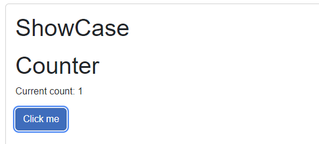
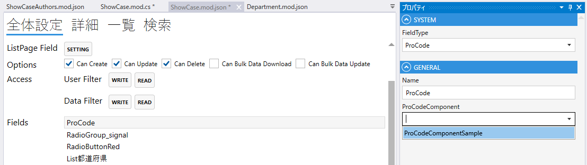

# ProCodeField

## これは何か

**独自の Blazor コンポーネントを画面に埋め込むフィールド**。標準 Field では実現できない UI・ロジックを C# / Razor で書いて組み込めます。



## いつ使うか

- サードパーティ UI ライブラリ（MudBlazor / Radzen など）のコンポーネントを埋め込む
- 独自のカスタム UI（グラフ・エディタ・プレイヤーなど）を入れる
- 標準 Field では届かない細かい制御が必要な時

---

## 作り方

### 1. `Client.Shared` に Razor コンポーネントを作る

`ProCodeComponentBase` を継承します。

```razor
@using Codeer.LowCode.Blazor.ProCode
@inherits ProCodeComponentBase

<h1>Counter</h1>

<p role="status">Current count: @_currentCount</p>

<button class="btn btn-primary" @onclick="IncrementCount">Click me</button>

@code {
    private int _currentCount = 0;

    private void IncrementCount()
    {
        _currentCount++;
    }
}
```

### 2. ビルド

ビルドするとデザイナのツールボックスから ProCodeField を作成する時に、作成済みのコンポーネントが候補として選べるようになります。

### 3. デザイナで配置して `ProCodeComponent` に選択



---

## デザイナでの設定

### 固有プロパティ

| プロパティ | 型 | 既定値 | 説明 |
|---|---|---|---|
| **ProCodeComponent** | string | `""` | 埋め込むコンポーネントの型名 |
| **OnComponentSet** | string | `""` | コンポーネント設定時のスクリプト |

共通プロパティは [Field 共通プロパティ](common_properties.md) を参照。

---

## スクリプトから

### プロパティ

| 名前 | 型 | 説明 |
|---|---|---|
| `Component` | ProCodeComponentBase | 埋め込まれたコンポーネントのインスタンス |

共通プロパティは [Field 共通プロパティ](common_properties.md) を参照。

`Component` を通じて、埋め込んだコンポーネント固有のメソッド・プロパティを呼び出せます。

---

## 関連項目

- [Field 共通プロパティ](common_properties.md)
- [プロコード概要](../overview/procode.md)
- [ユーザーコード](../user_code/user_code.md)
