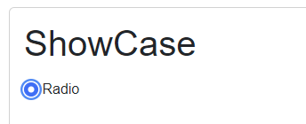
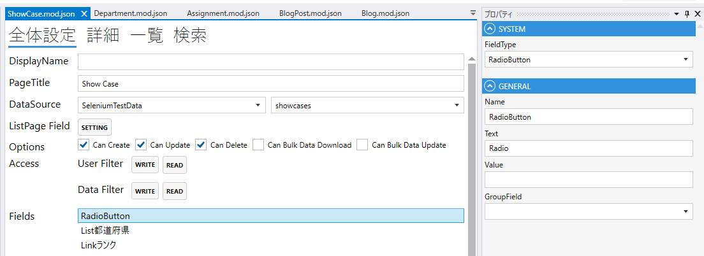

# RadioButton

ラジオボタンをあらわすフィールド．

## プロパティ

| プロパティ名     | 説明                           |
|------------|------------------------------| 
| FieldType  | RadioButtonを設定する             |
| Name       | フィールド名を設定する                  |
| Text       | 表示するテキストを設定する.               |
| Value      | ラジオボタンの値を設定する.               |
| GroupField | 複数のラジオボタンをグループにするフィールドを設定する. |

## スクリプト
| プロパティ名          | 型       | 説明             |
|-----------------|---------|----------------|
| BackgroundColor | string? | Fieldの背景色      | 
| Color           | string? | Fieldの色        |
| Focus           | string? | フォーカスする        |
| IsEnabled       | bool    | Fieldの有効/無効    |
| IsViewOnly      | bool    | Fieldの編集可/編集不可 |
| IsVisible       | bool    | Fieldの表示/非表示   |
| Value           | bool?   | Fieldの値        |
