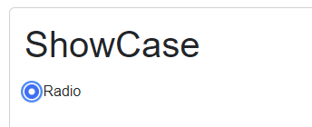
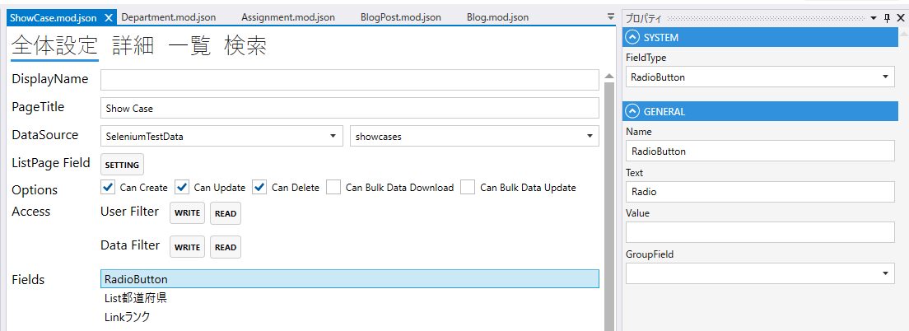

# RadioButtonField

## これは何か

**1 つのラジオボタン**。単独で使うことはなく、[RadioGroup](RadioGroup.md) の配下に配置して使います。



## いつ使うか

- [RadioGroup](RadioGroup.md) と組み合わせて、選択肢の 1 つを表すボタンとして

> 候補数が決まっていて自動生成したい場合は、RadioGroupField の `PopulateRadioButtons` を使う方法もあります。

---

## デザイナでの設定



### 固有プロパティ

| プロパティ | 型 | 既定値 | 説明 |
|---|---|---|---|
| **Text** | string | `"Radio"` | ラジオボタンの表示文字（= DisplayName） |
| **Value** | string | `""` | このラジオが選択された時にグループに設定される値 |
| **GroupField** | string | `""` | 親の RadioGroupField の Name |

共通プロパティは [Field 共通プロパティ](common_properties.md) を参照。

---

## スクリプトから

### プロパティ・メソッド

| 名前 | 型・戻り値 | 説明 |
|---|---|---|
| `Value` | bool | このラジオが選択されているか（親の値と一致すれば true） |
| `SetCheck()` | void | このラジオをプログラム的に選択する |
| `GetRadioGroupField()` | RadioGroupField | 親の RadioGroupField を取得 |

共通プロパティは [Field 共通プロパティ](common_properties.md) を参照。

### よく使う例

```csharp
// 条件に応じて特定のラジオを選択
if (someCondition)
{
    HighRank.SetCheck();
}
```

---

## 関連項目

- [Field 共通プロパティ](common_properties.md)
- [RadioGroup](RadioGroup.md) — 親のコンテナ
