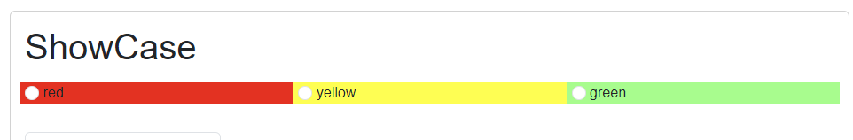
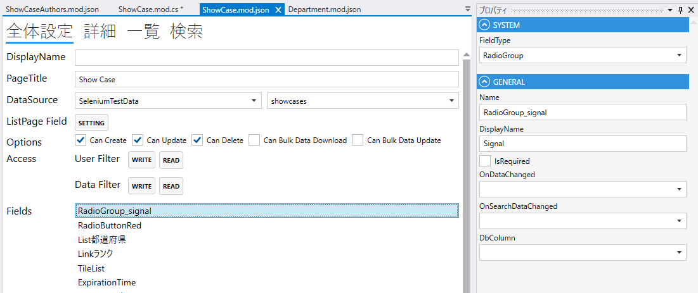

# RadioGroup

ラジオボタンをあらわすフィールド．

## プロパティ

| プロパティ名              | 説明                           |
|---------------------|------------------------------| 
| FieldType           | RadioButtonを設定する             |
| Name                | フィールド名を設定する                  |
| DisplayName         | 表示名を設定する                     |
| IsRequired          | 必須/任意を設定する                   |
| OnDataChanged       | 変更時の振る舞いを設定する                |
| OnSearchDataChanged | 検索時の変更の振る舞いを設定する             |
| DbCoumn             | DBの列を設定する.                   |

## スクリプト
| プロパティ名          | 型       | 説明             |
|-----------------|---------|----------------|
| BackgroundColor | string? | Fieldの背景色      | 
| Color           | string? | Fieldの色        |
| Focus           | string? | フォーカスする        |
| IsEnabled       | bool    | Fieldの有効/無効    |
| IsViewOnly      | bool    | Fieldの編集可/編集不可 |
| IsVisible       | bool    | Fieldの表示/非表示   |
| SearchValue     | string  | 検索Fieldの値      |
| Value           | string  | Fieldの値        |
